# MynahUI Config

You can set the config from the constructor parameters while creating a new instance of `mynah-ui`.

_**Note:** You cannot set it on runtime. It is getting used just once during the initialization._

```typescript
...
interface ConfigModel {
    // Do not forget that you have to provide all of them
    // Config allows partial set of texts
    texts: {
        mainTitle?: string;
        feedbackFormTitle?: string;
        feedbackFormDescription?: string;
        feedbackFormOptionsLabel?: string;
        feedbackFormCommentLabel?: string;
        feedbackThanks?: string;
        feedbackReportButtonLabel?: string;
        codeSuggestions?: string;
        files?: string;
        insertAtCursorLabel?: string;
        copy?: string;
        showMore?: string;
        save?: string;
        cancel?: string;
        submit?: string;
        pleaseSelect?: string;
        stopGenerating?: string;
        copyToClipboard?: string;
        noMoreTabsTooltip?: string;
        codeSuggestionWithReferenceTitle?: string;
        spinnerText?: string;
        tabCloseConfirmationMessage?: string;
        tabCloseConfirmationKeepButton?: string;
        tabCloseConfirmationCloseButton?: string;
        noTabsOpen: string; // Supports markdown
        openNewTab: string;
        commandConfirmation: string;
        pinContextHint: string;
        dragOverlayText: string;
    };
    // Options to show up on the overlay feedback form
    // after user clicks to downvote on a chat item
    // and clicks 'Report' again
    feedbackOptions: Array<{
        label: string;
        value: string;
    }>;
    tabBarButtons?: TabBarMainAction[]; // Tab bar buttons will be shown on the right of the tab
    maxUserInput: number; // max number of chars for the input field
    userInputLengthWarningThreshold: number; // The amount of characters in the input field necessary for the character limit warning to show
    codeInsertToCursorEnabled?: boolean; // show or hide copy buttons on code blocks system wide
    codeCopyToClipboardEnabled?: boolean; // show or hide insert to cursor buttons on code blocks system wide
    autoFocus: boolean; // auto focuses to input panel after every action
    maxTabs: number; // set 1 to hide tabs panel
    showPromptField: boolean; // shows prompt field (default: true)
    dragOverlayIcon?: MynahIcons | MynahIconsType | CustomIcon; // icon displayed in the overlay when a file is dragged into the chat area
    enableSearchKeyboardShortcut?: boolean; // if true, calls onSearchShortcut on Command + f or Ctrl + f (default: false)
}
...
```
---

<p><br/></p>


# `tabBarButtons`

You can put buttons on the right of the tab bar also with some inner buttons inside a menu. You can do it in two different ways. If you want the buttons globally available for every tab you can use the `tabBarButtons` in the config. If you want them set individually for different tabs check the **[DATAMODEL Documentation](./DATAMODEL.md#tabbarbuttons)**.

```typescript
const mynahUI = new MynahUI({
    ...
    config: {
      ...
      tabBarButtons: [
        {
          id: 'clear',
          description: 'Clear messages in this tab',
          icon: MynahIcons.REFRESH,
        },
        {
          id: 'multi',
          icon: MynahIcons.ELLIPSIS,
          items: [
            {
              id: 'menu-action-1',
              text: 'Menu action 1!',
              icon: MynahIcons.CHAT,
            },
            {
              id: 'menu-action-2',
              text: 'Menu action 2!',
              icon: MynahIcons.CODE_BLOCK,
            },
            {
              id: 'menu-action-3',
              text: 'Menu action 3!'
            }
          ]
        }
      ]
    }
    ...
});
```

<p align="center">
  
  <br/>
  
</p>

---


# `texts`
All static texts will be shown on UI. 
Please take a look at each image to identify which text belongs to which item on UI.

## mainTitle
Default tab title text if it is not set through store data for that tab.

<p align="center">
  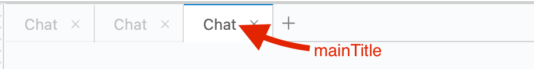
</p>

---

## feedbackFormTitle, feedbackFormDescription, feedbackFormOptionsLabel, feedbackFormCommentLabel, submit, cancel
<p align="center">
  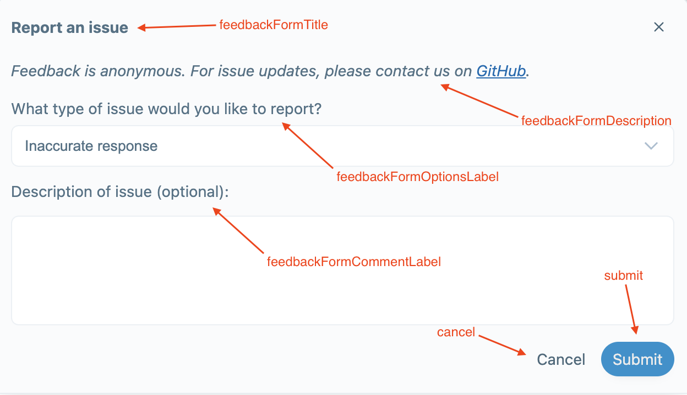
</p>


---

## fileTreeTitle, rootFolderTitle, feedbackFormCommentLabel, submit, cancel
<p align="center">
  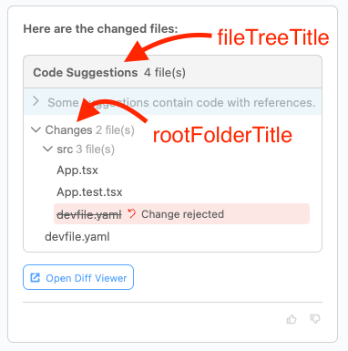
</p>


---

## pleaseSelect
<p align="center">
  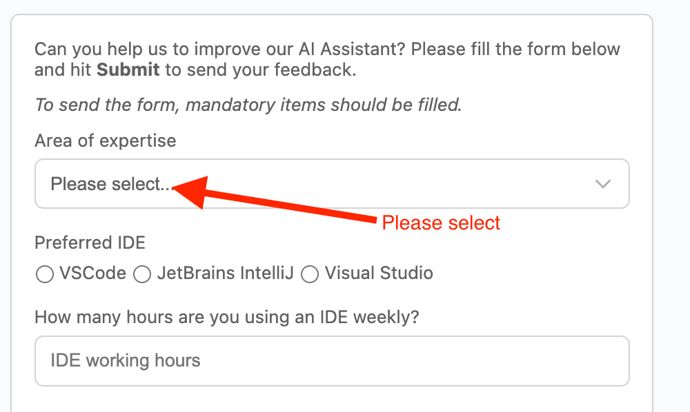
</p>

---

## feedbackThanks, feedbackReportButtonLabel, showMore
<p align="center">
  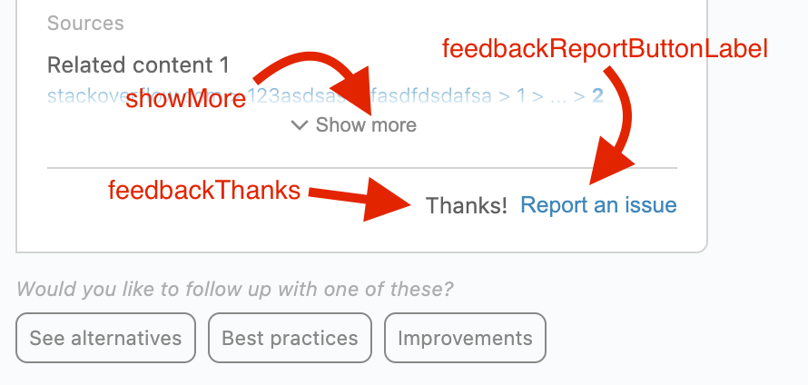
</p>

---

## stopGenerating
<p align="center">
  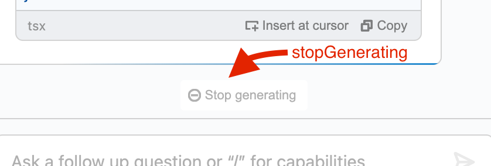
</p>

---

## insertAtCursorLabel, copy
<p align="center">
  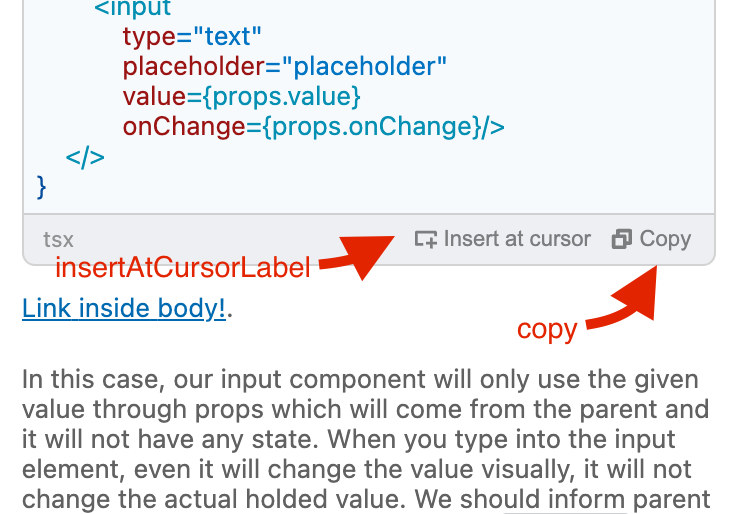
</p>

---

## codeSuggestions, files, codeSuggestionWithReferenceTitle
<p align="center">
  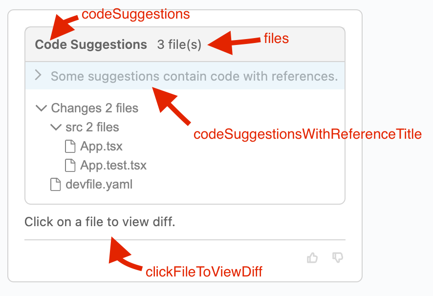
</p>

---

## spinnerText
<p align="center">
  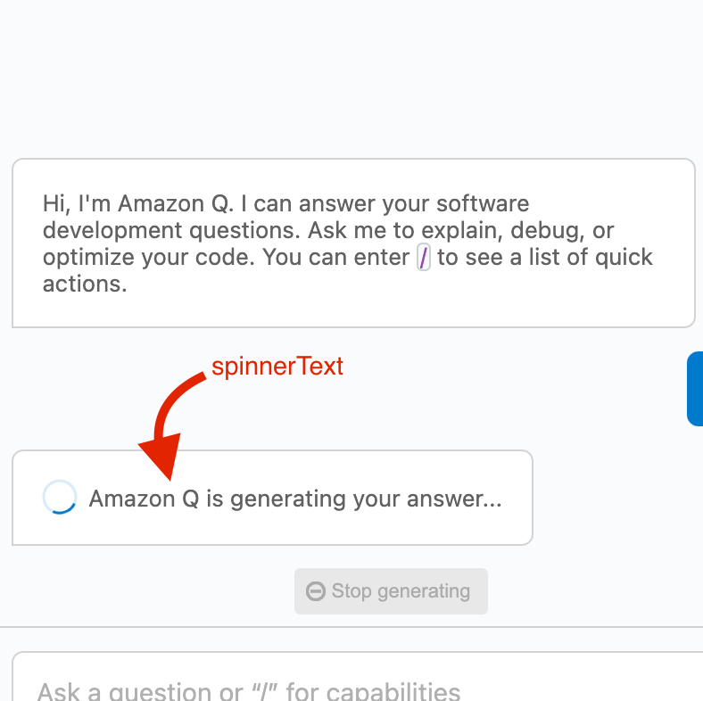
</p>

---

## tabCloseConfirmationMessage, tabCloseConfirmationKeepButton, tabCloseConfirmationCloseButton
<p align="center">
  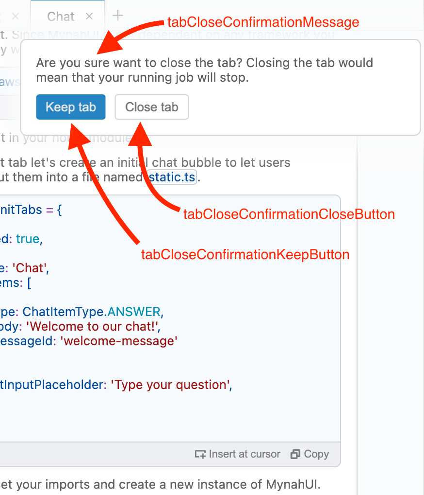
</p>

---

## noMoreTabsTooltip
<p align="center">
  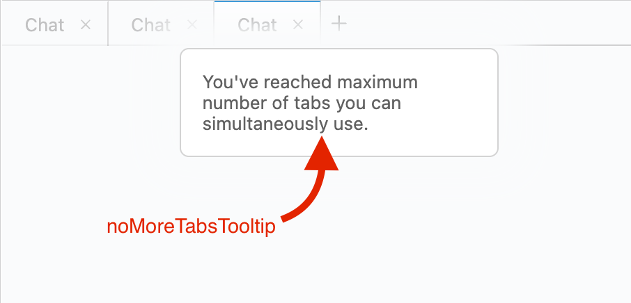
</p>

---

## noTabsOpen, openNewTab
<p align="center">
  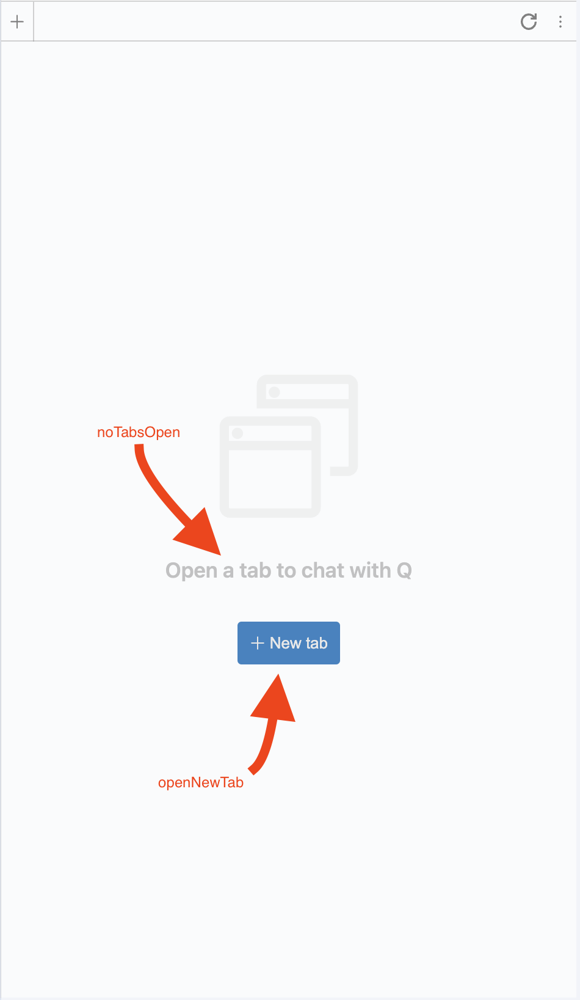
</p>

---

## commandConfirmation
<p align="center">
  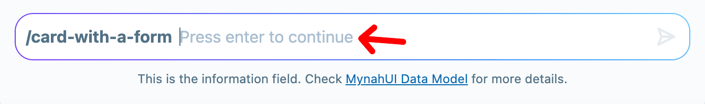
</p>

## pinContextHint
<p align="center">
  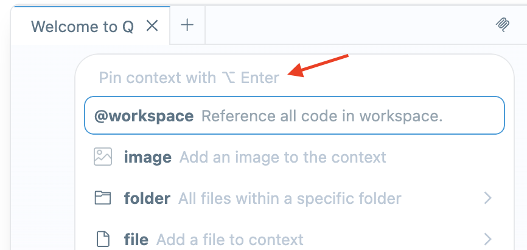
</p>
---

## dragOverlayText
<p align="center">
  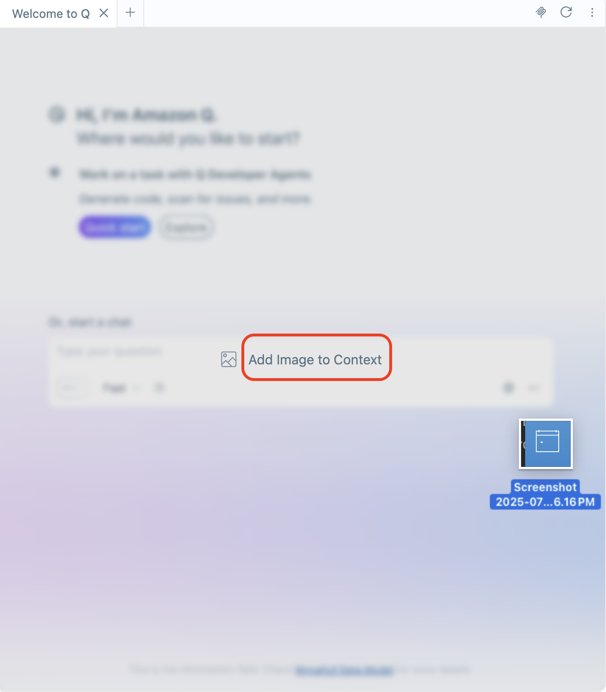
</p>
---

<p><br/></p>

# `feedbackOptions`

Feedback type options to be shown on feedback form.
defaults:
```typescript
...
feedbackOptions: [
    {
      value: 'inaccurate-response',
      label: 'Inaccurate response',
    },
    {
      value: 'harmful-content',
      label: 'Harmful content'
    },
    {
      value: 'overlap',
      label: 'Overlaps with existing content'
    },
    {
      value: 'incorrect-syntax',
      label: 'Incorrect syntax'
    },
    {
      value: 'buggy-code',
      label: 'Buggy code'
    },
    {
      value: 'low-quality',
      label: 'Low quality'
    },
    {
      value: 'other',
      label: 'Other'
    }
  ],
...
```

<p align="center">
  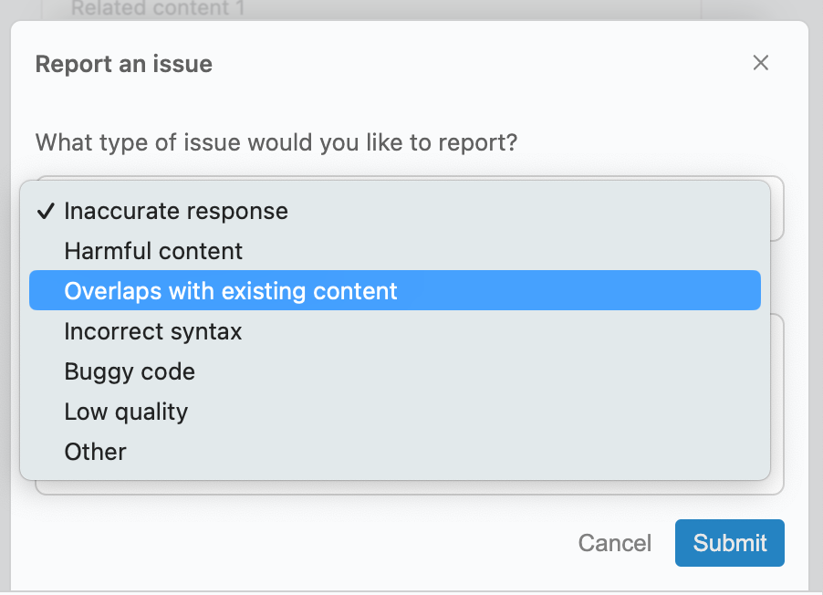
</p>

---

<p><br/></p>

# `maxTabs`
Maximum number of tabs user/system can open in a single instance of `mynah-ui`.

default: `1000`

An important note here is that if you provide **`1`** to maxTabs, it will not show the tab bar at all. However you still need to add a tab then initially to show a content.

And finally, if you try to add tabs more than given `maxTabs` amount while initializing the MynahUI with [Constructor Properties](./PROPERTIES.md), it will only generate the tabs till it reaches the `maxTabs` limit.

_Assume that you've provided `1` for `maxTabs`._


<p align="center">
  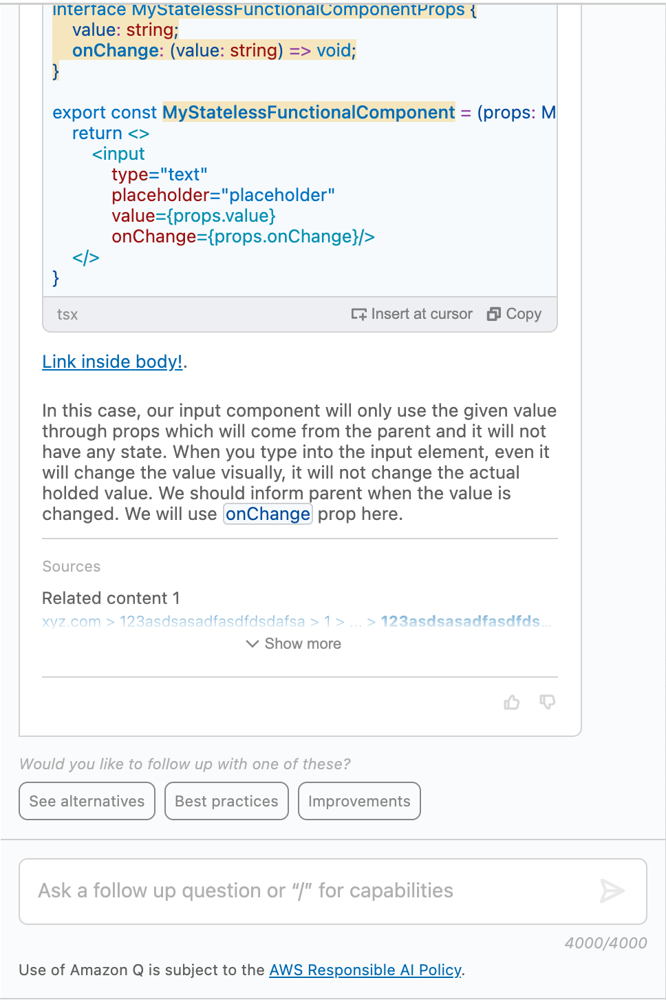
</p>

---

<p><br/></p>

# `autoFocus`
Just auto focus to prompt input field after every response arrival or initialization.

default: `true`

---
<p align="center">
  
</p>
<p><br/></p>

# `userInputLengthWarningThreshold`
The amount of characters in the prompt input necessary for the character limit warning overlay to show up.
> [!NOTE]
> In older versions, the character count used to always show underneath the input, but this was changed in a recent release.

default: `3500`

<p align="center">
  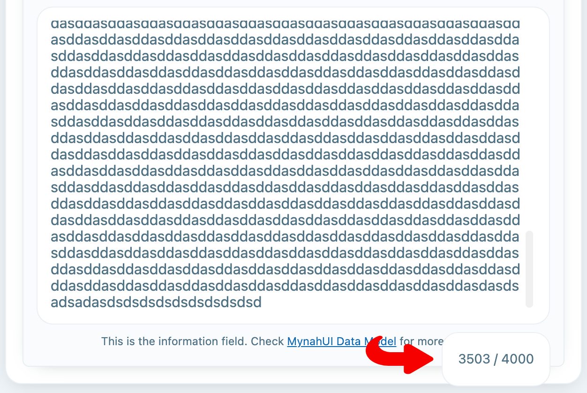
</p>

---

<p><br/></p>

# `maxUserInput`
Max number of chars user can insert into the prompt field. But, as might know you can also add code attachments under the prompt field. A treshold of `96` chars will be automatically reduced from the `maxUserInput`.

**So beware that if you want 4000 chars exact, you need to give 4096 to the config.**

default: `4096`

---

## `codeInsertToCursorEnabled` and `codeCopyToClipboardEnabled` (default: true)
These two parameters allow you to make copy and insert buttons disabled system wide. If you want to disable it specifically for a message you can do it through `ChatItem` object. Please see [DATAMODEL Documentation](./DATAMODEL.md#codeinserttocursorenabled-and-codecopytoclipboardenabled-default-true).

<p align="center">
  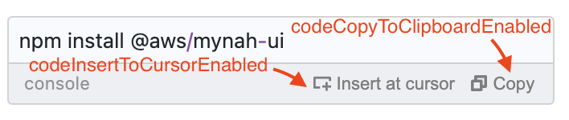
</p>

---

## `codeBlockActions`
With this parameter, you can add global code block actions to the code blocks. But, you can override them through [ChatItem Data Model](./DATAMODEL.md#codeBlockActions). 

### Note
If you want to show that action only for certain coding languages, you can set the array for `acceptedLanguages` parameter. Keep in mind that it will check an exact mathc. If the incoming language is same with one of the acceptedLanguages list, it will show the action.

#### flash
You can also make the code block actions flash once or foverer when user hovers the the containing card. Until user hovers to the action itself, whenever they hover to the card it will flash the code block action. It you set it to `once` it will only flash once for every hover to the container card, if you set it to `infinite` it will keep flashing forever every 3 seconds until user hovers to the action itself. Whe user hovers to the action, it will not flash again.

#### By default, we add `copy` and `insert to cursor position` ones:

```typescript
{
  codeBlockActions: {
    ...(codeCopyToClipboardEnabled !== false
      ? {
          copy: {
            id: 'copy',
            label: texts.copy,
            icon: MynahIcons.COPY
          }
        }
      : {}),
    ...(codeInsertToCursorEnabled !== false
      ? {
          'insert-to-cursor': {
            id: 'insert-to-cursor',
            label: texts.insertAtCursorLabel,
            icon: MynahIcons.CURSOR_INSERT
          }
        }
      : {}),
  }
}
```

<p align="center">
  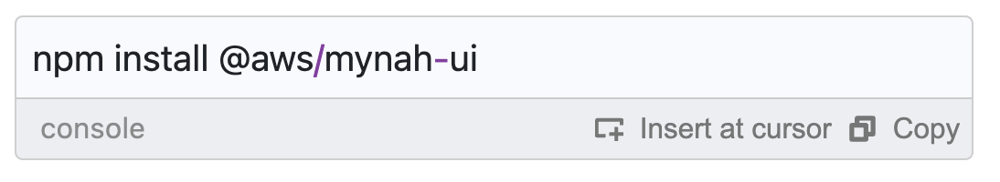
</p>

---

<p><br/></p>

# `showPromptField`
Show or hide the prompt input field completely. You may want to hide the prompt field by setting `showPromptField` to `false` to make the chat work one way only. Just to provide answers or information.

default: `true`

_If you set `showPromptField` to `false`_

<p align="center">
  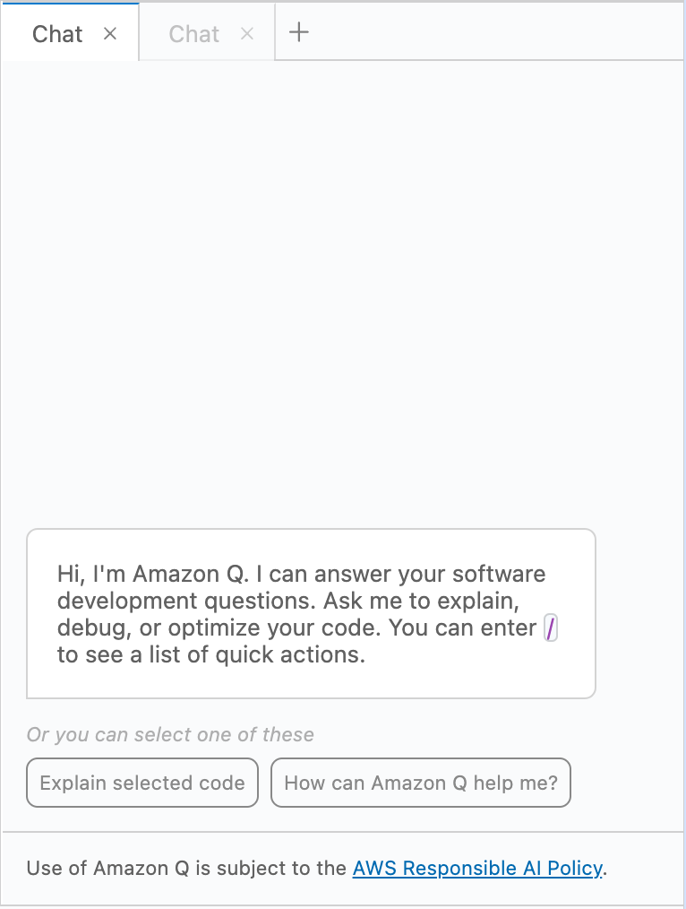
</p>

---

## dragOverlayIcon

**Type:** `MynahIcons | MynahIconsType | CustomIcon`

**Description:**
Specifies the icon to display in the drag-and-drop overlay for adding files (such as images) to the chat context. This allows consumers to customize the overlay icon.

**Default:** `MynahIcons.IMAGE`

<p align="center">
  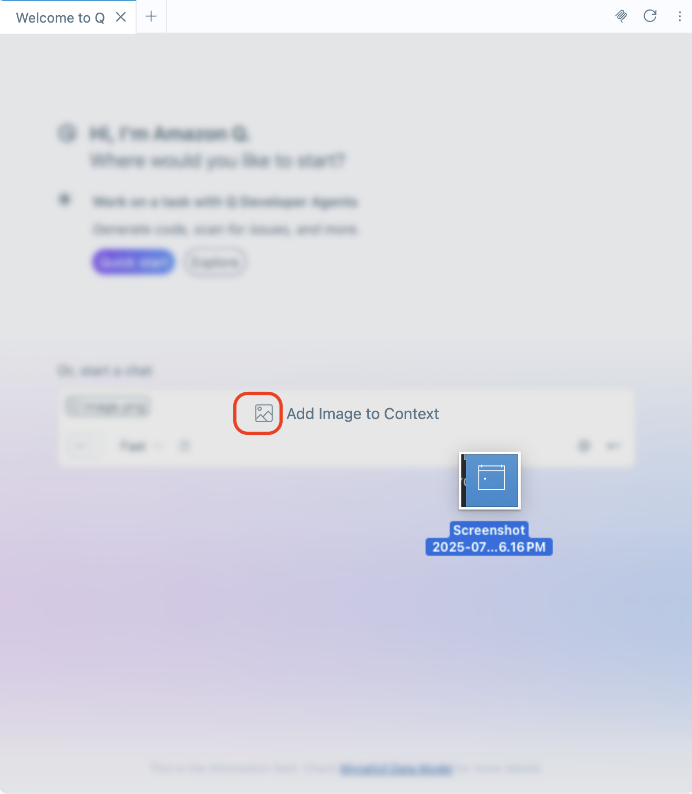
</p>

## enableSearchKeyboardShortcut

**Type:** `boolean`

When set to `true`, this option enables capturing the search keyboard shortcut. When enabled, pressing Command+F (Mac) or Ctrl+F (Windows/Linux) will trigger the `onSearchShortcut` event instead of the browser's default search behavior. This allows implementing custom search functionality within the chat interface.

Default: `false`