# MynahUI Data Model (with how the things appear on screen)

There are a number of models for the various items on the screen for MynahUI. Let's start from the top and go in detail one-by-one.

## Tab Data Store

All information you can set related to a tab. 

```typescript
interface MynahUIDataModel {
  /**
   * Tab title
   * */
  tabTitle?: string;
  /**
   * Tab icon
   * */
  tabIcon?: MynahIcons | MynahIconsType | null;
  /**
   * is tab pinned
   * */
  pinned?: boolean;
  /**
   * Tab title
   * */
  tabBackground?: boolean;
  /**
   * If tab is running an action (loadingChat = true) this markdown will be shown before close in a popup
   */
  tabCloseConfirmationMessage?: string | null;
  /**
   * Keep tab open button text
   */
  tabCloseConfirmationKeepButton?: string | null;
  /**
   * Close tab button text
   */
  tabCloseConfirmationCloseButton?: string | null;
  /**
   * Chat screen loading animation state (mainly use during the stream or getting the initial answer)
   */
  loadingChat?: boolean;
  /**
   * Show chat avatars or not
   * */
  showChatAvatars?: boolean;
  /**
   * Show cancel button while loading the chat
   * */
  cancelButtonWhenLoading?: boolean;
  /**
  * Quick Action commands to show when user hits / to the input initially
  */
  quickActionCommands?: QuickActionCommandGroup[];
  /**
  * Context commands to show when user hits @ to the input any point
  */
  contextCommands?: QuickActionCommandGroup[];
  /**
  * Placeholder to be shown on prompt input
  */
  promptInputPlaceholder?: string;
  /**
  * Prompt input text
  */
  promptInputText?: string;
  /**
    * Label to be shown on top of the prompt input
    */
  promptInputLabel?: string | null;
  /**
    * Label to be shown on top of the prompt input
    */
  promptInputVisible?: boolean;
  /**
  * Info block to be shown under prompt input
  */
  promptInputInfo?: string;
  /**
  * A sticky chat item card on top of the prompt input
  */
  promptInputStickyCard?: Partial<ChatItem> | null;
  /**
  * Prompt input field disabled state, set to tru to disable it
  */
  promptInputDisabledState?: boolean;
  /**
  * Prompt input progress field
  */
  promptInputProgress?: ProgressField | null;
  /**
  * Prompt input options/form items
  */
  promptInputOptions?: FilterOption[] | null;
  /**
  * Prompt input button items
  */
  promptInputButtons?: ChatItemButton[] | null;
  /**
  * List of chat item objects to be shown on the web suggestions search screen
  */
  chatItems?: ChatItem[];
  /**
   * Attached code under the prompt input field
   */
  selectedCodeSnippet?: string;
  /**
   * Tab bar buttons next to the tab items
   */
  tabBarButtons?: TabBarMainAction[];
  /**
   * Tab content compact mode which keeps everything in the middle
   */
  compactMode?: boolean;
  /**
   * Tab content header details, only visibile when not null / undefined
   */
  tabHeaderDetails?: TabHeaderDetails | null;
  /**
   * A lightweight key-value store for essential tab-specific primitive metadata.
   * Not intended for storing large amounts of data - use appropriate
   * application state management for that purpose.
   */
  tabMetadata?: { [key: string]: string | boolean | number };
  /**
   * Custom context commands to be inserted into the prompt input.
   */
  customContextCommand: []
}
```

You can set tab data with this model for `defaults`, initial `tabs` which can be set through [Constructor Properties](./PROPERTIES.md) or update a tab on runtime by using `mynahUI.updateStore(...)`.

Let's see which items is what.

### `tabTitle` (default: `"AWS Q"`)
Basically it is the tab title.

```typescript
const mynahUI = new MynahUI({
    tabs: {
        'tab-1': {
            ...
        }
    }
});

mynahUI.updateStore('tab-1', {
    tabTitle: 'Chat'
})
```

### `tabIcon` (default: undefined)
Basically it is an icon you can give to the tab.

```typescript
const mynahUI = new MynahUI({
    tabs: {
        'tab-1': {
            ...
        }
    }
});

mynahUI.updateStore('tab-1', {
    tabTitle: '',
    tabIcon: MynahIcons.MENU,
    pinned: true
})
```

### 

<p align="center">
  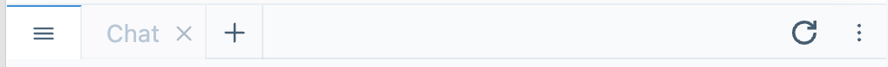
</p>


### `pinned` (default: `false`)
You can pin the tabs to the beginning. But when you pin a tab, end user cannot close them anymore. It will disable the middle mouse click to close a tab and remove the close button too. The tab will be basically pinned.

```typescript
const mynahUI = new MynahUI({
    tabs: {
        'tab-1': {
            ...
        }
    }
});

mynahUI.updateStore('tab-1', {
    tabTitle: '',
    tabIcon: MynahIcons.MENU,
    pinned: true
})
```

### 

<p align="center">
  
</p>

### `tabBackground` (default: `false`)
Shows or hides the gradient background on the tab.

```typescript
const mynahUI = new MynahUI({
    tabs: {
        'tab-1': {
            ...
        }
    }
});

mynahUI.updateStore('tab-1', {
    tabBackground: true
})
```


### 

<p align="center">
  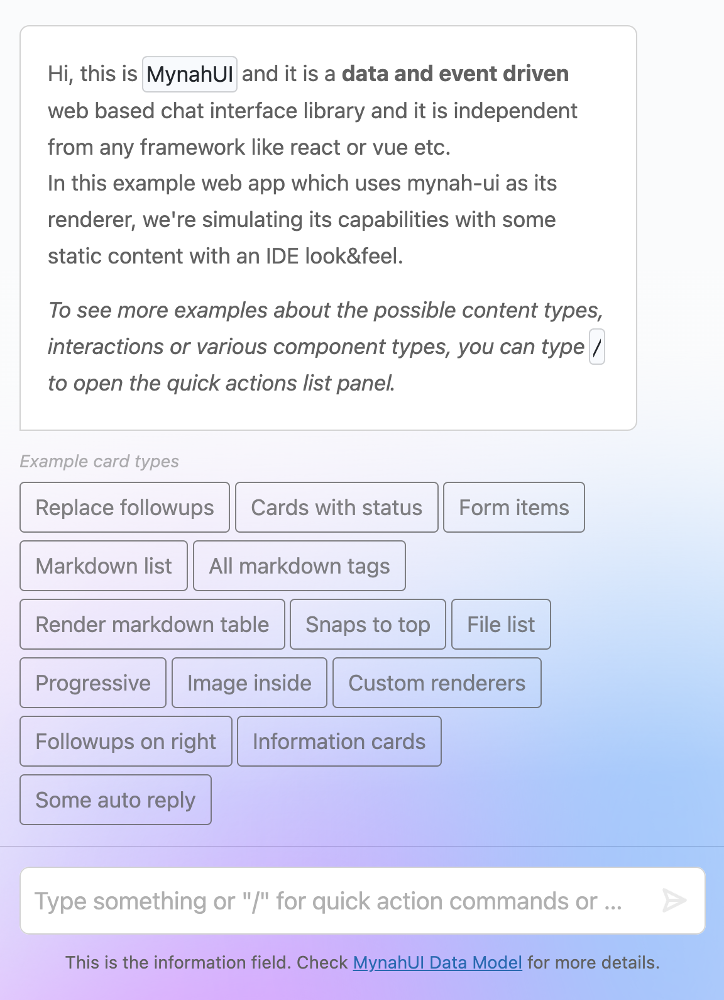
</p>

---

### `tabCloseConfirmationMessage`, `tabCloseConfirmationKeepButton` and `tabCloseConfirmationCloseButton`

Custom texts for each tab for the message and the buttons of the popup to confirm the tab close. Check **[Config/TEXTS](./CONFIG.md#texts)** for defaults. 

<p align="center">
  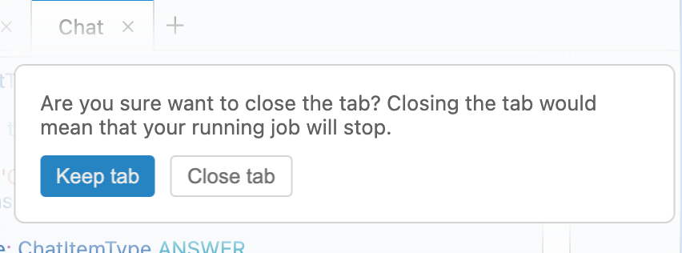
</p>

---

### `loadingChat` (default: `false`)
Basically it is the tab title.

```typescript
const mynahUI = new MynahUI({
    tabs: {
        'tab-1': {
            ...
        }
    }
});

mynahUI.updateStore('tab-1', {
    loadingChat: true
})
```
When you set `loadingChat` to true, if there is a streaming card it will start to animate the spinner in two different way. If the card body is empty it will show the `spinnerText` from the texts inside the config right next to a spinning circle. If the card has a body (after it is updated for example) it will show a sliding colored bottom border animation. 

In addition to the spinner, if `onStopChatResponse` is attached globally through MynahUI main class constructor properties _(see [Constructor properties](./PROPERTIES.md) for details)_ and `cancelButtonWhenLoading` is not set to false specifically for that tab it will show the stop generating button too.

<p align="center">
  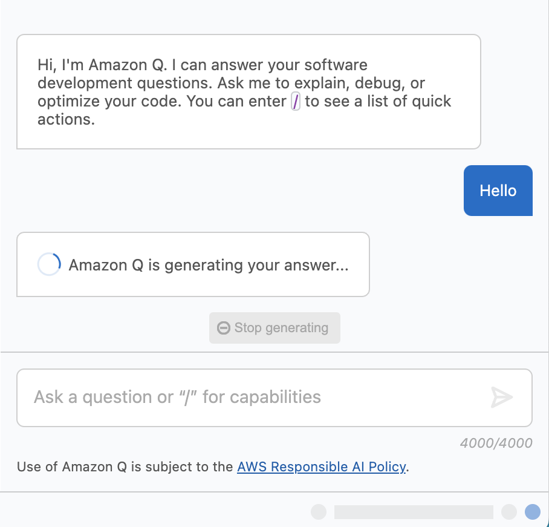
</p>
<p align="center">
  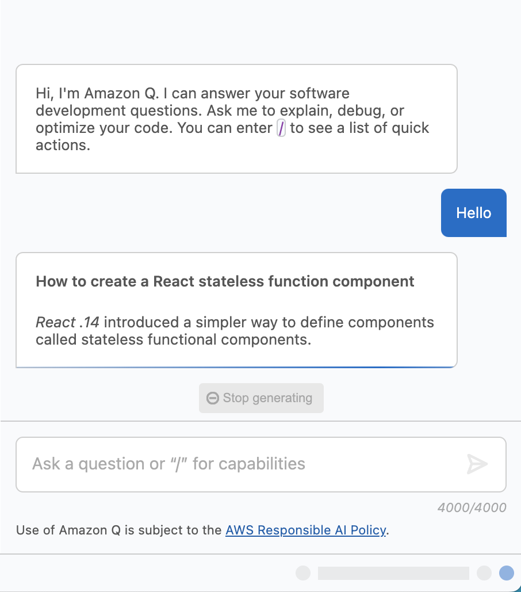
</p>

---


### `cancelButtonWhenLoading` (default: `true`)
If `onStopChatResponse` is attached globally through `MynahUI` main class constructor properties _(see [Constructor properties](./PROPERTIES.md) for details)_ it will show a stop generating button to let the user cancel the ongoing action.

```typescript
const mynahUI = new MynahUI({
    tabs: {
        'tab-1': {
            ...
        }
    }
});

mynahUI.updateStore('tab-1', {
    loadingChat: true,
    cancelButtonWhenLoading: true
})
```

<p align="center">
  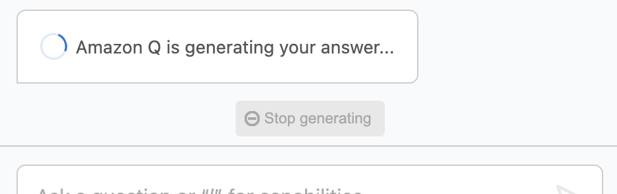
</p>

---


### `quickActionCommands` (default: `[]`)
Quick action commands are the predefined commands which user can pick between. When users hit `/` from their keyboard as the initial char in the input, if there is an available list it will show up as a overlay menu.

If you want a command immediately run after the selection and trigger `onChatPrompt` event (attached to the `MynahUI` main instance through the [Constructor properties](./PROPERTIES.md)) leave the `placeholder` attribute undefined. MynahUI will decide that it doesn't allow additional prompt text for that command and immediately run the trigger. _(See command-2 in the example)_

```typescript
const mynahUI = new MynahUI({
    tabs: {
        'tab-1': {
            ...
        }
    }
});

mynahUI.updateStore('tab-1', {
    quickActionCommands: [
        {
            icon: MynahIcons.CODE,
            groupName: 'Command Group 1',
            commands: [
            {
                command: '/command-1',
                placeholder: 'Command which accepts a prompt after the command selection',
                description: 'Command 1 description',
            },
            {
                command: '/command-2',
                description: 'Command 2 description',
            },
            ],
        },
        {
            groupName: 'Command Group 2',
            commands: [
            {
                command: '/command-3',
                placeholder: 'Command which accepts a prompt after the command selection',
                description: 'Command 3 description',
            },
            ],
        },
        {
            // Command Group without title
            commands: [
            {
                command: '/command-4',
                placeholder: 'Command which accepts a prompt after the command selection',
                description: 'Command 4 description',
            },
            ],
        },
    ]
})
```

<p align="center">
  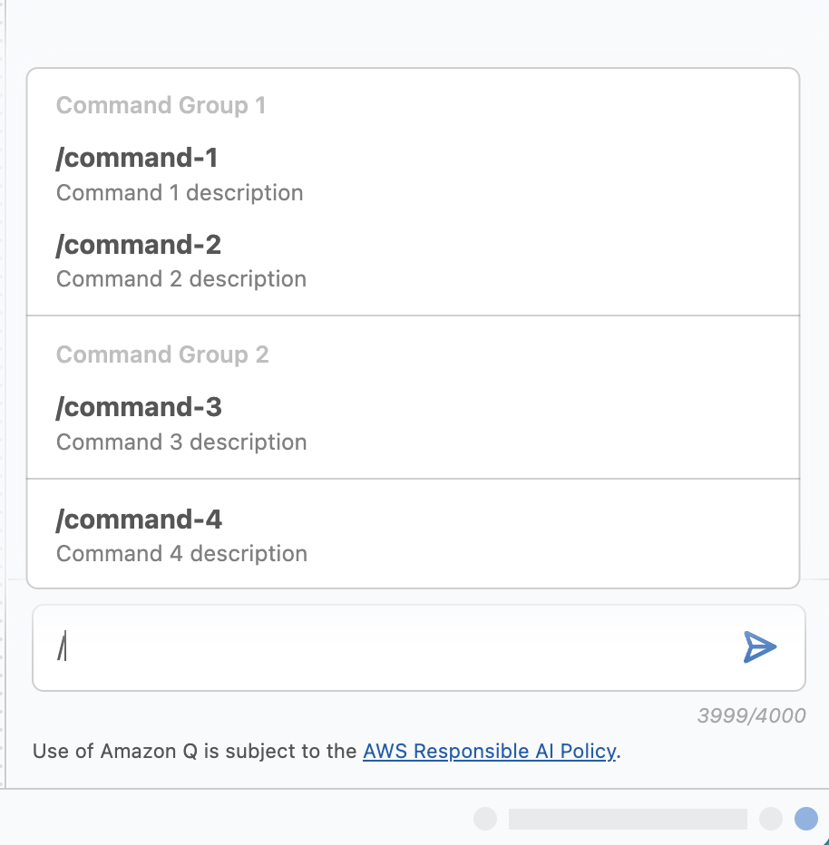
</p>

To handle the incoming command (if there is) check it with the prompt object in the `onChatPrompt` event.

```typescript
const mynahUI = new MynahUI({
    ...
    onChatPrompt: (prompt)=>{
        if(prompt.command !== undefined){
            switch (prompt.command) {
                case '/command-1':
                    console.log(`Command 1 selected with prompt: ${prompt.prompt}`);
                    break;
                case '/command-2':
                    console.log('Command 2 selected');
                    break;
                default:
                    ...
                    break;
                }
        }
    }
});
```

---

### `contextCommands` (default: `[]`)
Context commands are the predefined context items which user can pick between but unlike quick action commands, they can be picked several times at any point in the prompt text. When users hit `@` from their keyboard in the input, if there is an available list of context items provided through store it will show up as an overlay menu.

#### Disabled Commands
Commands can be disabled by setting the `disabled` property to `true`. When a command is disabled, you can optionally provide `disabledText` to display custom text instead of the usual arrow icon for items with children. This is useful for showing status information like "pending".


```typescript
const mynahUI = new MynahUI({
    tabs: {
        'tab-1': {
            ...
        }
    }
});

mynahUI.updateStore('tab-1', {
contextCommands: [
      {
        commands: [
          {
            command: 'workspace',
            icon: MynahIcons.ASTERISK,
            placeholder: 'Yes, you selected workspace :P',
            description: 'Reference all code in workspace.',
            disabled: true,
            disabledText: 'pending' 
          },
          {
            command: 'folder',
            icon: MynahIcons.FOLDER,
            children: [
              {
                groupName: 'Folders',
                commands: [
                  {
                    command: 'src',
                    icon: MynahIcons.FOLDER,
                    children: [
                      {
                        groupName: 'src/',
                        commands: [
                          {
                            command: 'index.ts',
                            icon: MynahIcons.FILE,
                          }
                        ]
                      }
                    ]
                  },
                  {
                    command: 'main',
                    description: './src/',
                    icon: MynahIcons.FOLDER,
                  },
                  {
                    command: 'src',
                    description: './example/',
                    icon: MynahIcons.FOLDER,
                  }
                ]
              }
            ],
            placeholder: 'Mention a specific folder',
            description: 'All files within a specific folder'
          },
          {
            command: 'file',
            icon: MynahIcons.FILE,
            children: [
              {
                groupName: 'Files',
                commands: [
                  {
                    command: 'monarch.ts',
                    description: './src/',
                    icon: MynahIcons.FILE,
                  },
                  {
                    command: '_dark.scss',
                    description: './src/styles/',
                    icon: MynahIcons.FILE,
                  }
                ]
              }
            ],
            placeholder: 'Mention a specific file',
            description: 'Reference a specific file'
          },
          {
            command: 'symbols',
            icon: MynahIcons.CODE_BLOCK,
            children: [
              {
                groupName: 'Symbols',
                commands: [
                  {
                    command: 'DomBuilder',
                    icon: MynahIcons.CODE_BLOCK,
                    description: 'The DomGeneration function in dom.ts file'
                  }
                ]
              }
            ],
            placeholder: 'Select a symbol',
            description: 'After that mention a specific file/folder, or leave blank for full project'
          },
          {
            command: 'prompts',
            icon: MynahIcons.CHAT,
            description: 'Saved prompts, to reuse them in your current prompt',
            children: [
              {
                groupName: 'Prompts',
                actions: [
                  {
                    id: 'add-new-prompt',
                    icon: 'plus',
                    text: 'Add',
                    description: 'Add new prompt'
                  }
                ],
                commands: [
                  {
                    command: 'python_expert',
                    icon: MynahIcons.CHAT,
                    description: 'Expert on python stuff'
                  },
                  {
                    command: 'javascript_expert',
                    icon: MynahIcons.CHAT,
                    description: 'Expert on Javascript and typescript'
                  },
                  {
                    command: 'Add Prompt',
                    icon: MynahIcons.PLUS,
                  }
                ]
              }
            ]
          }
        ]
      }
    ]
})
```

<p align="center">
  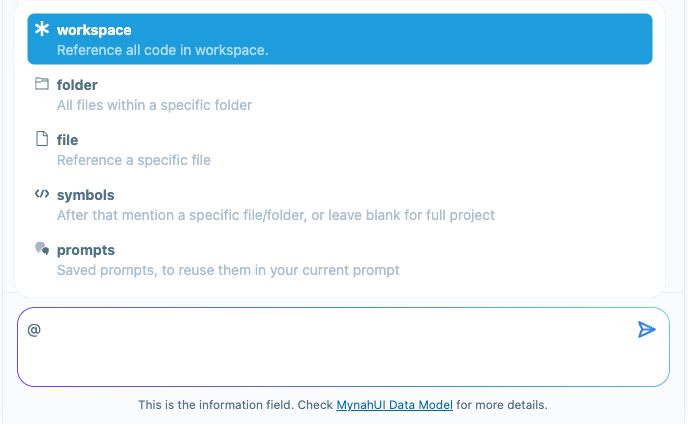
</p>

When hovered, context items will display a tooltip with the same information provided in the context menu list:

<p align="center">
  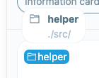
</p>

Groups can have as many children as you'd like, which allows for a tree-like structure. Items with children will display a right-arrow icon when hovered / focused:

<p align="center">
  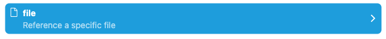
</p>

Groups can have actions (see `add-new-prompt` action in the example code block above), which adds an action button on the top right:

<p align="center">
  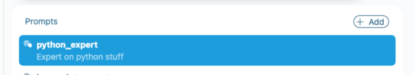
</p>

To see which context is used, check the incoming string array in the prompt object comes with the `onChatPrompt` event.

```typescript
const mynahUI = new MynahUI({
    ...
    onChatPrompt: (prompt)=>{
        if(prompt.context != null && prompt.context.indexOf('@ws') {
          // Use whole workspace!
        }
    }
});
```

---

### `promptInputPlaceholder` (default: `''`)

This is the placeholder text for the prompt input

```typescript
const mynahUI = new MynahUI({
    tabs: {
        'tab-1': {
            ...
        }
    }
});

mynahUI.updateStore('tab-1', {
    promptInputPlaceholder: 'Ask a question or “/” for capabilities'
})
```

<p align="center">
  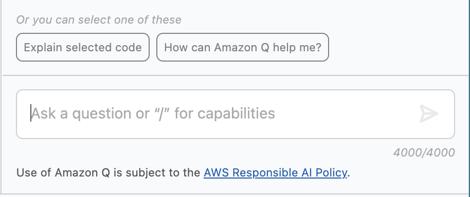
</p>

---
### `promptTopBarTitle` (default: `''`)

This is the title displayed in the prompt top bar. When set, it enables a top bar that can be used for pinned context items.

```typescript
const mynahUI = new MynahUI({
    tabs: {
        'tab-1': {
            ...
        }
    }
});

mynahUI.updateStore('tab-1', {
    promptTopBarTitle: '@Pin Context'
})
```

<p align="center">
  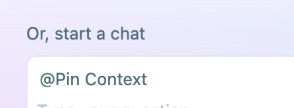
</p>

---

### `promptTopBarContextItems` (default: `[]`)

These are the context items pinned to the prompt top bar. They appear as pills that can be removed by the user. Top bar only appears when `promptTopBarTitle` is not empty.

```typescript
const mynahUI = new MynahUI({
    tabs: {
        'tab-1': {
            ...
        }
    }
});

mynahUI.updateStore('tab-1', {
    promptTopBarContextItems: [
        {
            command: 'ex-dom.ts',
            icon: MynahIcons.FILE,
            description: '.src/helper'
        },
        {
            command: 'main',
            icon: MynahIcons.FOLDER,
            description: '.src/'
        }
    ]
})
```

<p align="center">
  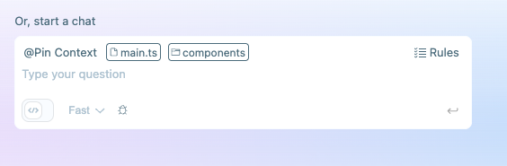
</p>

---

### `promptTopBarButton` (default: `null`)

This is a button displayed at the end of the prompt top bar. Clicking on the button will call onPromptTopBarButtonClick(). Button only appears when `promptTopBarTitle` is not empty.

```typescript
const mynahUI = new MynahUI({
    tabs: {
        'tab-1': {
            ...
        }
    }
});

mynahUI.updateStore('tab-1', {
    promptTopBarButton: {
        id: 'project-rules',
        icon: MynahIcons.CHECK_LIST,
        text: 'Rules'
    }
})
```

<p align="center">
  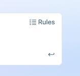
</p>

---

### `promptInputText` (default: `''`)

This is the text inside the prompt input. You can set it anytime, but be careful, it will override what is already written in the text input. 
A nice trick to use it is to open the quick actions command picker too. If you send `"/"` or `"/some-matching-text"` it will open the quick actions command selector automatically and also filter the list with the following text if given.

```typescript
const mynahUI = new MynahUI({
    tabs: {
        'tab-1': {
            ...
        }
    }
});

mynahUI.updateStore('tab-1', {
    promptInputText: '/dev'
})
```

<p align="center">
  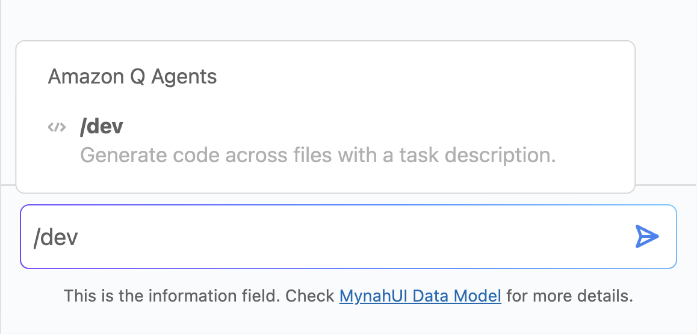
</p>

---

### `promptInputLabel` (default: `''`)

This is label for the prompt input text.

```typescript
const mynahUI = new MynahUI({
    tabs: {
        'tab-1': {
            ...
        }
    }
});

mynahUI.updateStore('tab-1', {
    promptInputLabel: 'Prompt input text label'
})
```

<p align="center">
  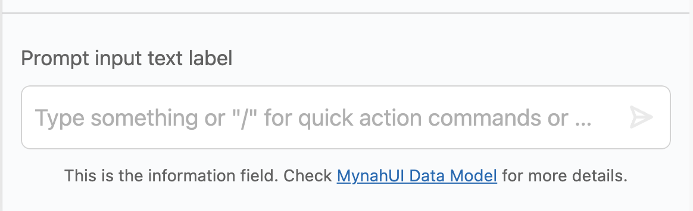
</p>

---

### `promptInputVisible` (default: `true`)

This is a control point for the visibility of the prompt input field. Unlike the `showPromptField` in [global CONFIG](./CONFIG.md#showpromptfield) it allows you to change the visibility of the prompt input field for each individual tab on runtime.

```typescript
const mynahUI = new MynahUI({
    tabs: {
        'tab-1': {
            ...
        }
    }
});

mynahUI.updateStore('tab-1', {
    promptInputVisible: false,
})
```

<p align="center">
  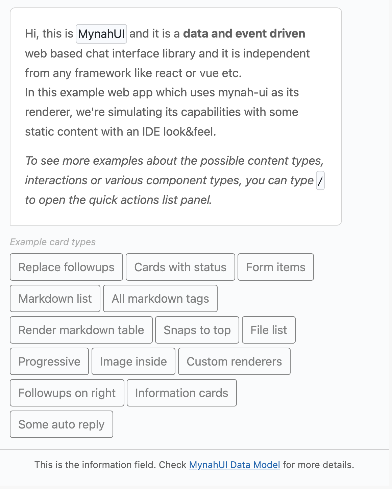
</p>

---

### `promptInputInfo` (default: `''`)

This is a info field under the bottom of the prompt input field, like a footer text

```typescript
const mynahUI = new MynahUI({
    tabs: {
        'tab-1': {
            ...
        }
    }
});

mynahUI.updateStore('tab-1', {
    promptInputInfo: 'Use of Amazon Q is subject to the [AWS Responsible AI Policy](https://aws.com).',
})
```

<p align="center">
  
</p>

---

### `promptInputStickyCard` (default: `null`)

This is a chat item card which will be shown on top of the prompt input field. Main usage scneario for this is to inform the user with a card view, which means that it can also have some actions etc.

```typescript
const mynahUI = new MynahUI({
    tabs: {
        'tab-1': {
            ...
        }
    },
    ...
    onInBodyButtonClicked: (tabId: string, messageId: string, action) => {
      if(messageId === 'sticky-card'){
        // clear the card
        mynahUI.updateStore(tabId, {promptInputStickyCard: null});
      }
      ...
    },
    ...
});

mynahUI.updateStore(tabId, {
    promptInputStickyCard: {
        messageId: 'sticky-card',
        body: `Please read the [terms and conditions change](#) and after that click the **Acknowledge** button below!`,
        status: 'info',
        icon: MynahIcons.INFO,
        buttons: [
            {
                // you can also simply set this to false to remove the card automatically
                keepCardAfterClick: true,
                text: 'Acknowledge',
                id: 'acknowledge',
                status: 'info',
                icon: MynahIcons.OK
            },
        ],
    }
});

```

<p align="center">
  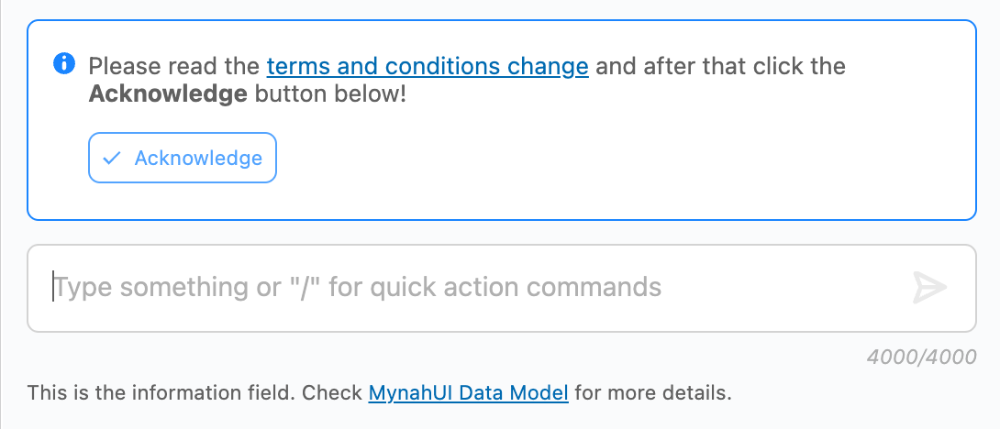
</p>

---

### `promptInputDisabledState` (default: `false`)

This is the disabled state if the prompt input field. When set to true, user cannot focus to the input and cannot click to the send button.

```typescript
const mynahUI = new MynahUI({
    tabs: {
        'tab-1': {
            ...
        }
    }
});

mynahUI.updateStore('tab-1', {
    promptInputDisabledState: true,
})
```

<p align="center">
  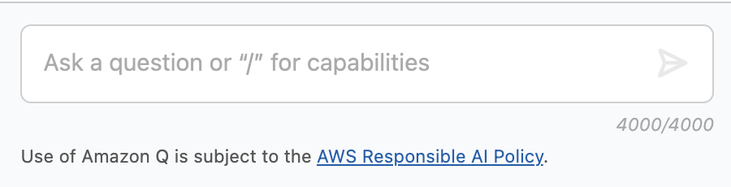
</p>

---

### `promptInputProgress`

This determines whether the progress bar shows up, and what its styling and progress value is. The `value` should be a number representing the progress, and the `valueText` is the text that shows right next to the regular `text` to indicate the progress in the bar. A number of `actions` can be added to dispatch events. Different statuses are available, namely: `default` | `info` | `success` | `warning` | `error`.

**In progress:**
```typescript
mynahUI.updateStore('tab-1', {
  promptInputProgress: {
    status: 'default',
    text: 'Work in progress...',
    value: -1,
    actions: [{
      id: 'cancel-running-task',
      text: 'Cancel',
      icon: MynahIcons.CANCEL,
      disabled: false,
    }]
  }
});
```

**Completed:**
```typescript
mynahUI.updateStore('tab-1', {
  promptInputProgress: {
    status: 'success',
    text: 'Completed...',
    valueText: '',
    value: 100,
    actions: []
  }
});
```

<p align="center">
  
</p>

---

### `promptInputOptions`

Under the prompt input field, it is possible to add form items too for several options. For example a toggle can be placed to let user pick the type of the prompt. To listen the value changes on these options please check [onPromptInputOptionChange in Constructor properties](./PROPERTIES.md#onPromptInputOptionChange) and the see how they are being passed to prompt please check [onChatPrompt in Constructor properties](./PROPERTIES.md#onChatPrompt).

To cleanup, simply set to `null` or an empty array.

```typescript
mynahUI.updateStore('tab-1', {
  promptInputOptions: [
    {
      type: 'toggle',
      id: 'prompt-type',
      value: 'ask',
      options: [{
        value: 'ask',
        icon: MynahIcons.CHAT
      },{
        value: 'do',
        icon: MynahIcons.FLASH
      }]
    }
  ]
});
```

<p align="center">
  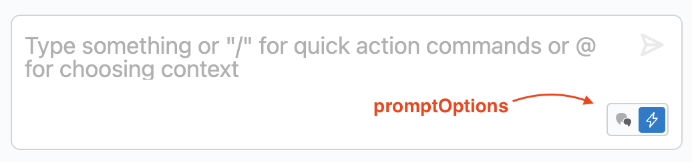
</p>

------

### `promptInputButtons`

Under the prompt input field, it is possible to add buttons too. To listen the click events on these options please check [onPromptInputButtonClick in Constructor properties](./PROPERTIES.md#onPromptInputButtonClick).

To cleanup, simply set to `null` or an empty array.

```typescript
mynahUI.updateStore('tab-1', {
  promptInputButtons: [
    {
      id: 'upgrade-q',
      icon: 'bug',
    }
  ]
});
```

<p align="center">
  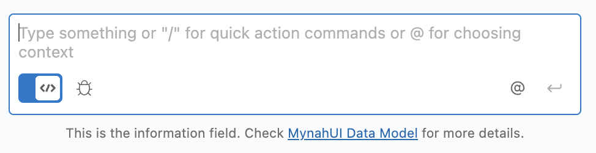
</p>

---

### `selectedCodeSnippet`

This is the attached code block text right under the prompt input field..

```typescript
const mynahUI = new MynahUI({
    tabs: {
        'tab-1': {
            ...
        }
    }
});

mynahUI.updateStore('tab-1', {
    selectedCodeSnippet: `const mynahUI = new MynahUI({
        tabs: {
            'tab-1': {
                isSelected: true,
                .....`,
});
```

<p align="center">
  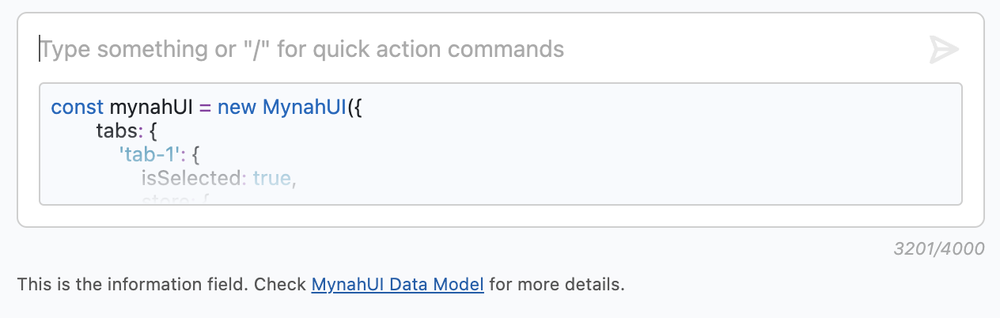
</p>

---

### `tabBarButtons`

You can put buttons on the right of the tab bar also with some inner buttons inside a menu. You can do it in two different ways. If you want the buttons belong to specific tab, you can use the `tabBarButtons` for tab store. If you want them globally available for every tab, check the **[Config Documentation](./CONFIG.md#tabbarbuttons)**.

```typescript
const mynahUI = new MynahUI({
    tabs: {
        'tab-1': {
            ...
        }
    }
});

mynahUI.updateStore('tab-1', {
    tabBarButtons: [
        {
          id: 'clear',
          description: 'Clear messages in this tab',
          icon: MynahIcons.REFRESH,
        },
        {
          id: 'multi',
          icon: MynahIcons.ELLIPSIS,
          items: [
            {
              id: 'menu-action-1',
              text: 'Menu action 1!',
              icon: MynahIcons.CHAT,
            },
            {
              id: 'menu-action-2',
              text: 'Menu action 2!',
              icon: MynahIcons.CODE_BLOCK,
            },
            {
              id: 'menu-action-3',
              text: 'Menu action 3!'
            }
          ]
        }
      ],
})
```

<p align="center">
  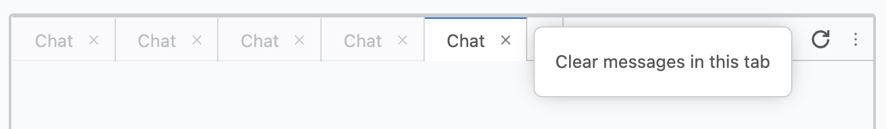
  <br/>
  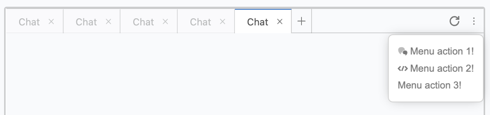
</p>

---

### `compactMode`

You can enable/disable compact mode. In compact mode, there will be more paddings from every edge. In addition to the paddings, the chat content will be middle placed (15% more pushed from the bottom) instead of being stretched to the available height. However, it will not exceed the available height for its own space.
While doing the transition for the compact mode switch, there is also a nice and smooth animation.

```typescript
const mynahUI = new MynahUI({
    tabs: {
        'tab-1': {
            ...
        }
    }
});

mynahUI.updateStore('tab-1', {
    compactMode: true,
})
```

<p align="center">
  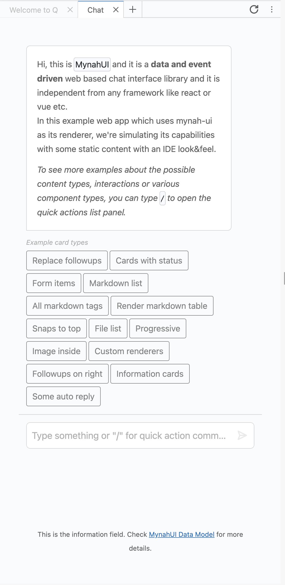
</p>

---

### `tabHeaderDetails` (default: `null`)

There is a chance to add a detailed header on top of the tab content. Which can have an icon, title and the description.
**NOTE:** When you give `tabHeaderDetails` it will also adjust the alignment of the chat items to top. So until the content section reaches the max height available, they'll start to be ordered from top to bottom. Which means that it will also take space as their available content height. This will make the prompt field also moves up under the content. If the content height is more than available space, prompt input will still fit under the bottom of the screen.

**NOTE:** When you provide `tabHeaderDetails` it will also make the chat cards width stretch to full available width of the screen. So they'll not get their width depending on their content and up to 90%. Instead, it will always be 100%.

```typescript
const mynahUI = new MynahUI({
    tabs: {
        'tab-1': {
            ...
        }
    }
});

mynahUI.updateStore('tab-1', {
    tabHeaderDetails: {
      icon: MynahIcons.Q,
      title: "Welcome to Q Developer",
      description: "What kind of questions you have?"
    },
})
```

<p align="center">
  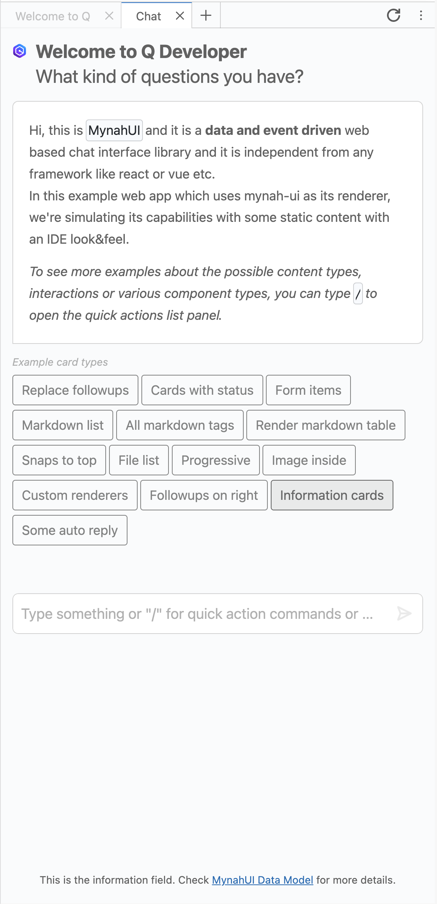
  <br />
  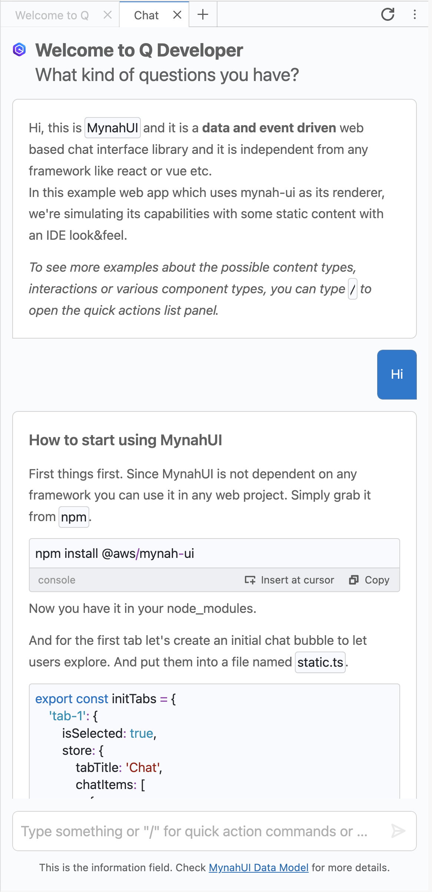
</p>

---

### `tabMetaData` (default: `{}`)

A lightweight key-value store for essential tab-specific metadata. Not intended for storing large amounts of data - use appropriate application state management for that purpose.

```typescript
const mynahUI = new MynahUI({
    tabs: {
        'tab-1': {
            ...
        }
    }
});

mynahUI.updateStore('tab-1', {
    tabMetaData: {
      'test': 'hi'
    }
})
```

---

### `chatItems` (default: `[]`)

This is holding the chat items. If you provide it through the `defaults` or inside a tab item in the initial `tabs` property in the [Constructor properties](./PROPERTIES.md) you can give the whole set.

**BUT** if you will set it through `updateStore` it will append the items in the list to the current chatItems list. In case if you need to update the list with a new one manually on runtime, you need to send an empty list first and than send the desired new list.

```typescript
const mynahUI = new MynahUI({
    tabs: {
        'tab-1': {
            ...
        }
    }
});

mynahUI.updateStore('tab-1', {
    chatItems: [],
})
```

<p><br/></p>

---

<p><br/></p>

# `ChatItem` (and how they appear on screen)

There are basically 2 main types of chat items. One is to show a file list and the other one is for all other items with a body of markdown string content.

Let's start with the model definition:

```typescript
// There can be more types on the ChatItemType enum list
// However those are the only ones getting used by MynahUI
enum ChatItemType {
  CODE_RESULT = 'code-result',
  ANSWER_STREAM = 'answer-stream',
  DIRECTIVE = 'directive',
  ANSWER = 'answer',
  PROMPT = 'prompt',
  SYSTEM_PROMPT = 'system-prompt'
}

interface ChatItemAction extends ChatPrompt {
  type?: string;
  pillText: string;
  disabled?: boolean;
  description?: string;
  status?: 'info' | 'success' | 'warning' | 'error';
  icon?: MynahIcons;
}

interface ChatItemButton {
  keepCardAfterClick?: boolean;
  waitMandatoryFormItems?: boolean;
  text: string;
  id: string;
  disabled?: boolean;
  description?: string;
  status?: 'info' | 'success' | 'warning' | 'error';
  icon?: MynahIcons;
}

type ChatItemFormItem = TextBasedFormItem | DropdownFormItem | RadioGroupFormItem | CheckboxFormItem | ListFormItem | Stars | PillboxFormItem;

export interface ValidationPattern {
  pattern: string | RegExp;
  errorMessage?: string;
}

interface BaseFormItem {
  id: string;
  mandatory?: boolean;
  hideMandatoryIcon?: boolean;
  title?: string;
  placeholder?: string;
  value?: string;
  description?: string;
  tooltip?: string;
  icon?: MynahIcons | MynahIconsType;
  boldTitle?: boolean;
}

export type TextBasedFormItem = BaseFormItem & {
  type: 'textarea' | 'textinput' | 'numericinput' | 'email';
  autoFocus?: boolean;
  checkModifierEnterKeyPress?: boolean;
  validateOnChange?: boolean;
  validationPatterns?: {
    operator?: 'and' | 'or';
    genericValidationErrorMessage?: string;
    patterns: ValidationPattern[];
  };
  disabled?: boolean;
};

type DropdownFormItem = BaseFormItem & {
  type: 'select';
  border?: boolean;
  autoWidth?: boolean;
  options?: Array<{
    value: string;
    label: string;
    description?: string;
  }>;
  disabled?: boolean;
  selectTooltip?: string;
};

type Stars = BaseFormItem & {
  type: 'stars';
  options?: Array<{
    value: string;
    label: string;
  }>;
};

type RadioGroupFormItem = BaseFormItem & {
  type: 'radiogroup' | 'toggle';
  options?: Array<{
    value: string;
    label?: string;
    icon?: MynahIcons | MynahIconsType;
  }>;
  disabled?: boolean;
};

type CheckboxFormItem = BaseFormItem & {
  type: 'switch' | 'checkbox';
  value?: 'true' | 'false';
  label?: string;
  alternateTooltip?: string;
};

export interface ListFormItem {
  type: 'list';
  id: string;
  mandatory?: boolean;
  hideMandatoryIcon?: boolean;
  title?: string;
  description?: string;
  tooltip?: string;
  icon?: MynahIcons | MynahIconsType;
  items: SingularFormItem[];
  value: ListItemEntry[];
  disabled?: boolean;
};

export interface ListItemEntry {
  persistent?: boolean;
  value: Record<string, string>;
}

type PillboxFormItem = BaseFormItem & {
  type: 'pillbox';
  value?: string;
};

interface FileNodeAction {
  name: string;
  label?: string;
  disabled?: boolean;
  description?: string;
  status?: Status;
  icon: MynahIcons | MynahIconsType;
}

interface TreeNodeDetails {
  status?: Status;
  icon?: MynahIcons | MynahIconsType | null;
  iconForegroundStatus?: Status;
  label?: string;
  changes?: {
    added?: number;
    deleted?: number;
    total?: number;
  };
  description?: string;
  clickable?: boolean;
  data?: Record<string, string>;
}

interface SourceLink {
  title: string;
  id?: string;
  url: string;
  body?: string;
  type?: string;
  metadata?: Record<string, SourceLinkMetaData>;
}

interface ReferenceTrackerInformation {
  licenseName?: string;
  repository?: string;
  url?: string;
  recommendationContentSpan?: {
    start: number;
    end: number;
  };
  information: string;
}

interface ChatItemBodyRenderer extends GenericDomBuilderAttributes {
  type: AllowedTagsInCustomRenderer;
  children?: Array<string | ChatItemBodyRenderer> | undefined;
  attributes?: Partial<Record<AllowedAttributesInCustomRenderer, string>> | undefined;
}

interface CodeBlockAction {
  id: 'copy' | 'insert-to-cursor' | string;
  label: string;
  description?: string;
  icon?: MynahIcons;
  data?: any;
  flash?: 'infinite' | 'once';
  acceptedLanguages?: string[];
}
type CodeBlockActions = Record<'copy' | 'insert-to-cursor' | string, CodeBlockAction | undefined | null>;

// ################################# 
interface ChatItemContent {
  header?: (ChatItemContent & {
    icon?: MynahIcons | MynahIconsType | CustomIcon;
    iconStatus?: 'main' | 'primary' | 'clear' | Status;
    iconForegroundStatus?: Status;
    status?: {
      status?: Status;
      position?: 'left' | 'right';
      description?: string;
      icon?: MynahIcons | MynahIconsType;
      text?: string;
    };
  }) | null;
  body?: string | null;
  customRenderer?: string | ChatItemBodyRenderer | ChatItemBodyRenderer[] | null;
  followUp?: {
    text?: string;
    options?: ChatItemAction[];
  } | null;
  relatedContent?: {
    title?: string;
    content: SourceLink[];
  } | null;
  codeReference?: ReferenceTrackerInformation[] | null;
  fileList?: {
    fileTreeTitle?: string;
    rootFolderTitle?: string;
    rootFolderStatusIcon?: MynahIcons | MynahIconsType;
    rootFolderStatusIconForegroundStatus?: Status;
    rootFolderLabel?: string;
    filePaths?: string[];
    deletedFiles?: string[];
    flatList?: boolean;
    folderIcon?: MynahIcons | MynahIconsType | null;
    collapsed?: boolean;
    hideFileCount?: boolean;
    renderAsPills?: boolean; // When true (header only), renders files as inline pills instead of tree
    actions?: Record<string, FileNodeAction[]>;
    details?: Record<string, TreeNodeDetails>;
  } | null;
  buttons?: ChatItemButton[] | null;
  formItems?: ChatItemFormItem[] | null;
  footer?: ChatItemContent | null;
  informationCard?: {
    title?: string;
    status?: {
      status?: Status;
      icon?: MynahIcons | MynahIconsType;
      body?: string;
    };
    description?: string;
    icon?: MynahIcons | MynahIconsType;
    content: ChatItemContent;
  } | null;
  summary?: {
    isCollapsed?: boolean;
    content?: ChatItemContent;
    collapsedContent?: ChatItemContent[];
  } | null;
  tabbedContent?: Array<ToggleOption & {
    content: ChatItemContent;
  }> | null;
  codeBlockActions?: CodeBlockActions | null;
  quickSettings?: DropdownFactoryProps | null;
  fullWidth?: boolean;
  padding?: boolean;
  wrapCodes?: boolean;
  muted?: boolean;
}

interface ChatItem extends ChatItemContent {
  type: ChatItemType;
  messageId?: string;
  snapToTop?: boolean;
  autoCollapse?: boolean;
  contentHorizontalAlignment?: 'default' | 'center';
  canBeVoted?: boolean;
  canBeDismissed?: boolean;
  title?: string;
  icon?: MynahIcons | MynahIconsType | CustomIcon;
  iconForegroundStatus?: Status;
  iconStatus?: 'main' | 'primary' | 'clear' | Status;
  hoverEffect?: boolean;
  status?: Status;
  shimmer?: boolean;
}
// ################################# 
```

Let's see all kind of examples and what parameter reflects to what.

## `type`

### ChatItemType.`ANSWER_STREAM` _(position: left)_
Use for streaming cards. It is better to start with an empty string to let the initial spinner rotate. As far as the `loadingState` is true for the tab which holds this chat item, it will show the spinner (rotating circle for empty state and bottom border for with a body). 

When you add a new chat item with type `ANSWER_STREAM` MynahUI will set it as the streaming card and when you call `updateLastChatAnswer` it will update this.

```typescript
const mynahUI = new MynahUI({
    tabs: {
        'tab-1': {
            ...
        }
    }
});

mynahUI.addChatItem('tab-1', {
    type: ChatItemType.ANSWER_STREAM,
    body: ''
});

// After a moment
mynahUI.updateLastChatAnswer('tab-1', {
    body: `### How to create a React stateless function component

*React .14* introduced a simpler way to define components called stateless functional components.
    `
});
```

<p align="center">
  
</p>

---


### ChatItemType.`DIRECTIVE` _(position: left)_
Use for directions. Those chat item cards will not have a background, will not have a padding and border at all. But they'll support all chatitem functionalities as is.  


```typescript
const mynahUI = new MynahUI({
    tabs: {
        'tab-1': {
            ...
        }
    }
});

mynahUI.addChatItem('tab-1', {
    type: ChatItemType.DIRECTIVE,
    body: '_Starting with a directive_'
});
```

<p align="center">
  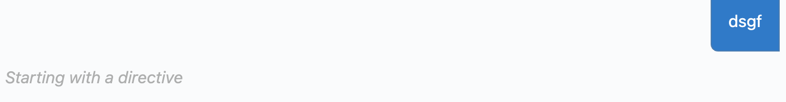
</p>

---

### ChatItemType.`ANSWER` or ChatItemType.`CODE_RESULT` _(position: left)_
Use for all kind of answers. Including the followups etc.

And yes, except the `fileList` you can combine followups and markdown string content chat items at once. Which means that a single chat item can also contain the `followUp` at the same time with `body`.

```typescript
const mynahUI = new MynahUI({
    tabs: {
        'tab-1': {
            ...
        }
    }
});

mynahUI.addChatItem('tab-1', {
    type: ChatItemType.ANSWER,
    body: 'Hi, I\'m Amazon Q. I can answer your software development questions. Ask me to explain, debug, or optimize your code. You can enter `/` to see a list of quick actions.'
    followUp:{
        text: 'Or you can select one of these',
        options: [
            {
                pillText: 'Explain selected code',
            },
            {
                pillText: 'How can Amazon Q help me?',
                prompt: 'How can Amazon Q help me?',
            }
        ],
    }
});
```

<p align="center">
  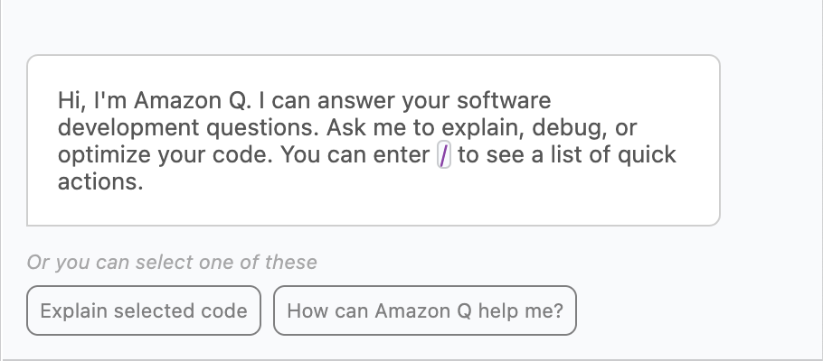
</p>

---

### ChatItemType.`PROMPT` _(position: right)_
Use for user prompts. You can also send followups to let them appear on right. 

```typescript
const mynahUI = new MynahUI({
    tabs: {
        'tab-1': {
            ...
        }
    }
});

mynahUI.addChatItem('tab-1', {
    type: ChatItemType.PROMPT,
    body: 'Who are you?'
});

mynahUI.addChatItem('tab-1', {
    type: ChatItemType.PROMPT,
    followUp:{
        text: 'Or you can select one of these',
        options: [
            {
                pillText: 'Explain selected code',
            },
            {
                pillText: 'How can Amazon Q help me?',
                prompt: 'How can Amazon Q help me?',
            }
        ],
    }
});
```

<p align="center">
  
</p>

---

### ChatItemType.`SYSTEM_PROMPT` _(position: right)_
Use for sysyem prompts. Only difference with `PROMPT` is the color of the chat card. (Depends on your **[Styling Configuration](STYLING.md)**) You can also send followups to let them appear on right. 

```typescript
const mynahUI = new MynahUI({
    tabs: {
        'tab-1': {
            ...
        }
    }
});

mynahUI.addChatItem('tab-1', {
    type: ChatItemType.SYSTEM_PROMPT,
    body: 'This is a system prompt'
});

mynahUI.addChatItem('tab-1', {
    type: ChatItemType.SYSTEM_PROMPT,
    followUp: {
    text: 'Or you can select one of these',
    options: [
        {
            pillText: 'Explain selected code',
        },
        {
            pillText: 'How can Amazon Q help me?',
            prompt: 'How can Amazon Q help me?',
        }
    ],
    }
});
```

<p align="center">
  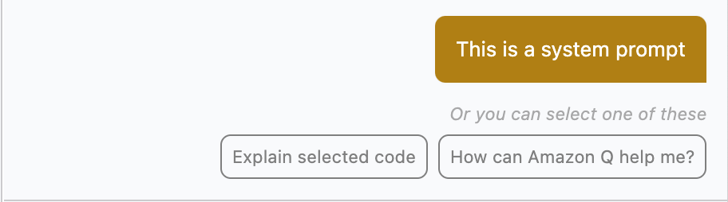
</p>

---

## `header`
With this parameter, you can add a `ChatItem` at the top of a ChatItem, before the body, but still within the card itself.

```typescript
const mynahUI = new MynahUI({
    tabs: {
        'tab-1': {
            ...
        }
    }
});

mynahUI.addChatItem(tabId, {
  type: ChatItemType.ANSWER,
  body: `SOME CONTENT`,
  header: {
    // icon: MynahIcons.CODE_BLOCK;
    // status: {
    //  position: 'right',
    //  status: 'success',
    //  icon: MynahIcons.OK,
    //  text: 'Accepted',
    // },
    fileList: { // For example, want to show which file is used to generate that answer
      rootFolderTitle: undefined,
      fileTreeTitle: '',
      filePaths: ['./src/index.ts'],
      details: {
        './src/index.ts': {
          icon: MynahIcons.FILE,
          description: `SOME DESCRIPTION.`
        }
      }
    }
  }
});
```

<p align="center">
  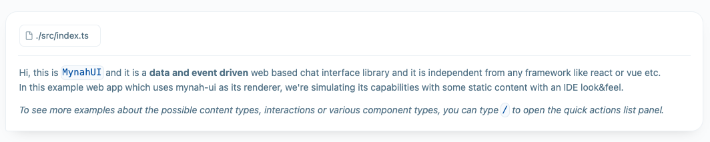
</p>

You can also provide an icon specifically for the header, as well as a separate status section on right or left of the whole header defined by its `position` value with a tooltip too. 

Here's another example for that:

```typescript
mynahUI.addChatItem(tabId, {
  messageId: 'MY_UNIQUE_ID',
  type: ChatItemType.ANSWER,
  fullWidth: true,
  padding: false,
  header: {
    icon: MynahIcons.CODE_BLOCK,
    status: {
      position: 'right',
      icon: MynahIcons.PROGRESS,
      description: 'Hello!',
      text: 'Working',
      status: 'warning'
    },
    buttons: [{
      id: 'stop',
      icon: MynahIcons.CANCEL,
    }],
    fileList: {
      fileTreeTitle: '',
      filePaths: ['package.json'],
      details: {
        'package.json': {
          icon: null,
          label: 'Creating',
          changes: {
            added: 36,
            deleted: 0,
            total: 36
          }
        }
      }
    }
  }
});
```


<p align="center">
  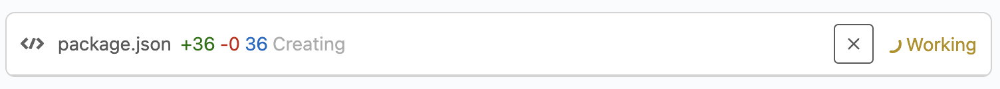
</p>
---

## `body`
Basically the body of the card. Which you can send a full markdown string. Allows code blocks, links etc. 

```typescript
const mynahUI = new MynahUI({
    tabs: {
        'tab-1': {
            ...
        }
    }
});

mynahUI.addChatItem('tab-1', {
    type: ChatItemType.ANSWER,
    body: "## Here'a heading 2\nAnd also here are some code blocks which supports most common languages.\n```typescript\nconst a = 5;\n```\n You can also use some `inline code` items too.\n And also for example [a link](https://aws.com)"
});
```

<p align="center">
  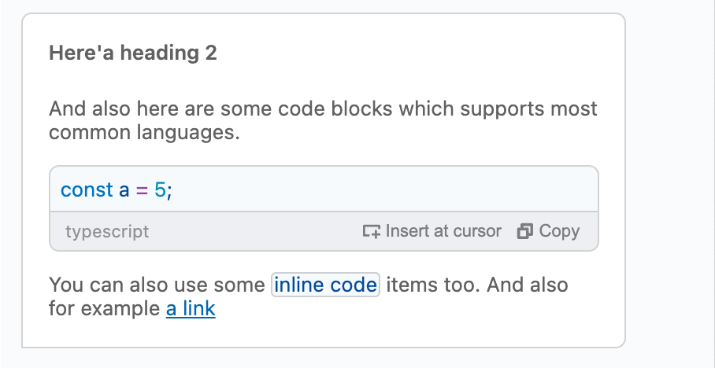
</p>

---

## `customRenderer`
Custom renderers can be provided in 3 different types *(string, ChatItemBodyRenderer object or ChatItemBodyRenderer object array)* and they are here to help you in case you need to create some static content on the client side rather than a data arrived from the backend. Or, maybe it is not possible or so hard to do it just with markdown.

##### Note: It can be combined with `body`, so you don't need to choose one of them.


### Using with `string` type
If you give a string to the `customRenderer` mynah-ui will consider that it as an html markup string and will render it that way.

```typescript
const mynahUI = new MynahUI({
    tabs: {
        'tab-1': {
            ...
        }
    }
});

mynahUI.addChatItem('tab-1', {
    messageId: (new Date().getTime()).toString(),
    type: ChatItemType.ANSWER,
    canBeVoted: true,
    customRenderer: `
        <h3>Custom renderer's with HTML markup string</h3>
        <p>
            Here you will find some custom html rendering examples which may not be available with markdown or pretty hard to generate.
        </p>
        <br />

        <h3>Table (inside a blockqote)</h3>
        <blockquote>
            Most popular JS frameworks
            
            <!-- Divider -->
            <hr />

            <table>
            <tbody>
                <tr>
                    <th align="left">Name</td>
                    <th align="right">Weekly Downloads</td>
                </tr>
                <tr>
                    <td align="left">Vanilla</td>
                    <td align="right"><strong>inf.</strong></td>
                </tr>
                <tr>
                    <td align="left">React</td>
                    <td align="right">24 <small>million</small></td>
                </tr>
                <tr>
                    <td align="left">JQuery</td>
                    <td align="right">10.6 <small>million</small></td>
                </tr>
                <tr>
                    <td align="left">VUE</td>
                    <td align="right">4.75 <small>million</small></td>
                </tr>
            </tbody>
            </table>
        </blockquote>
        <br />

        <!-- Divider -->
        <hr />
        <br />

        <h3>Code block and Links</h3>

        <pre class="language-typescript">
            <code>import { MynahUI } from '@aws/mynah-ui';

            const mynahUI = new MynahUI({});</code>
        </pre>
        <p>
            You can find more information and references
            <strong>
                <a href="https://github.com/aws/mynah-ui">HERE!</a>
            </strong>.
        </p>

        <br />

        <!-- Divider -->
        <hr />
        <br />

        <h3>Embeds and Media elements</h3>

        <h4>Iframe embed (Youtube example)</h4>
        <iframe aspect-ratio="16:9" 
            src="https://www.youtube.com/embed/bZsIPinetV4?si=k2Awd9in_wKgQC09&amp;start=65"
            title="YouTube video player" allow="picture-in-picture;" allowfullscreen>
        </iframe>
        <br />
        
        <h4>Video element</h4>
        <video aspect-ratio="21:9" controls
            poster="https://assets.aboutamazon.com/88/05/0feec6ff47bab443d2c82944bb09/amazon-logo.png">
            <source src="https://www.w3schools.com/tags/movie.mp4" type="video/mp4">
            <source src="https://www.w3schools.com/tags/movie.ogg" type="video/ogg">
            Your browser does not support the video tag.
        </video>
        <br />

        <h4>Audio element</h4>
        <audio controls>
            <source src="https://www.w3schools.com/tags/horse.ogg" type="audio/ogg">
            <source src="https://www.w3schools.com/tags/horse.mp3" type="audio/mpeg">
            Your browser does not support the audio tag.
        </audio>
        <br />

        <h4>Image</h4>
        
        <br />

        <!-- Divider -->
        <hr />
        <br />

        <p>
            There might be infinite number of possible examples with all supported tags and their attributes.
            It doesn't make so much sense to demonstrate all of them here.
            You should go take a look to the 
            <strong>
                <a href="https://github.com/aws/mynah-ui/blob/main/docs/DATAMODEL.md">documentation</a>
            </strong>
            for details and limitations.
        </p>`
});
```

<p align="center">
  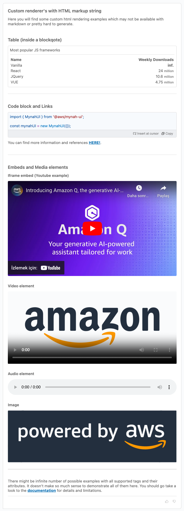
</p>

### Using with `ChatItemBodyRenderer` or `ChatItemBodyRenderer[]` type
Even though you can build exactly the same html elements and node tree with the `string` type, this option will give you more flexibility especially on repeating items. We all know that it is not easy to read code which loops inside a string. **But more importantly, you can also bind events with this option**.

Another `+1` for this option is related with its interface declaration. With an object structure which is properly typed, your IDE should give you the available values list during the code completion. Which means that you don't need to guess or go back and forth between the documentation and your project to see which tags you can use in the `type` attribute (html tag), which attributes are supported for the `attributes` or which events are available for the `events`.

Let's take a look how we write with `ChatItemBodyRenderer[]` interface:

```typescript
const mynahUI = new MynahUI({
    tabs: {
        'tab-1': {
            ...
        }
    }
});

// Lets' use a super dumb array instead of copy pasting the items inside the customRenderer.
const topFrameworks: Record<string, string> = {'Vanilla': 'inf.', 'React': '24', 'JQuery': '10.6', 'VUE': '4.75'};

mynahUI.addChatItem('tab-1', {
    messageId: (new Date().getTime()).toString(),
    type: ChatItemType.ANSWER,
    canBeVoted: true,
    customRenderer: [
      {
        type: 'h3',
        children: ['Custom renderer\'s with JSON dom builder objects']
      },
      {
        type: 'p',
        children: ['Here you will find some custom html rendering examples which may not be available with markdown or pretty hard to generate. But in this examples they are rendered from JSON definitions.']
      },
      {
        type: 'p',
        children: ['There is no difference between using a markup string or a JSON dom. You can create same accepted tags with same accepted attributes.']
      },
      {
        type: 'p',
        children: [
          'Except 1 thing: ', 
          {type: 'strong', children: ['attaching events! Like click or mousemove etc.']}
        ]
      },
      { type: 'br' },
      {
        type: 'h3',
        events: {
          click: (event) => { alert('Why you click to title?'); }
        },
        children: ['Table (inside a blockqote)']
      },
      {
        type: 'p',
        children: ['This is basically the same table one card above with markup strings, but in this one ', {type: 'b', children: ['you can click to the table titles!']}]
      },
      { type: 'br' },
      {
        type: 'blockquote',
        children: [
          'Most popular JS frameworks',
          { type: 'hr' }, // Divider
          {
            type: 'table',
            children: [
              {
                type: 'tr',
                children: [
                  {
                    type: 'th',
                    events: {
                      click: () => { alert('Why you click this title?'); }
                    },
                    attributes: { align: 'left' },
                    children: ['Name']
                  },
                  {
                    type: 'th',
                    events: {
                      click: () => { alert('Why you click to this title?'); }
                    },
                    attributes: { align: 'right' },
                    children: ['Weekly Downloads']
                  }
                ]
              },
              // Mapping our dumb array to create the rows
              ...Object.keys(topFrameworks).map(fw => ({
                  type: 'tr',
                  children: [
                    { type: 'td', children: [fw]},
                    { type: 'td',
                      attributes: { align: 'right' },
                      children: [
                        topFrameworks[fw], 
                        ...(!isNaN(parseFloat(topFrameworks[fw])) ? [{type: 'small', children: [' million']}] : [])
                      ] 
                    }
                  ]
                } as ChatItemBodyRenderer
              )),
            ]
          }
        ]
      },
      { type: 'br' }, // Add more space
      {
        type: 'p',
        children: ['Or you can click below image to remove it!']
      },
      { type: 'br' },
      {
        type: 'img',
        events: {
          click: (event: MouseEvent)=>{
            (event.target as HTMLElement).remove();
          }
        },
        attributes: {
          src: 'https://d1.awsstatic.com/logos/aws-logo-lockups/poweredbyaws/PB_AWS_logo_RGB_stacked_REV_SQ.91cd4af40773cbfbd15577a3c2b8a346fe3e8fa2.png',
          alt: 'Powered by AWS!'
        }
      }
    ]
  });
```

<p align="center">
  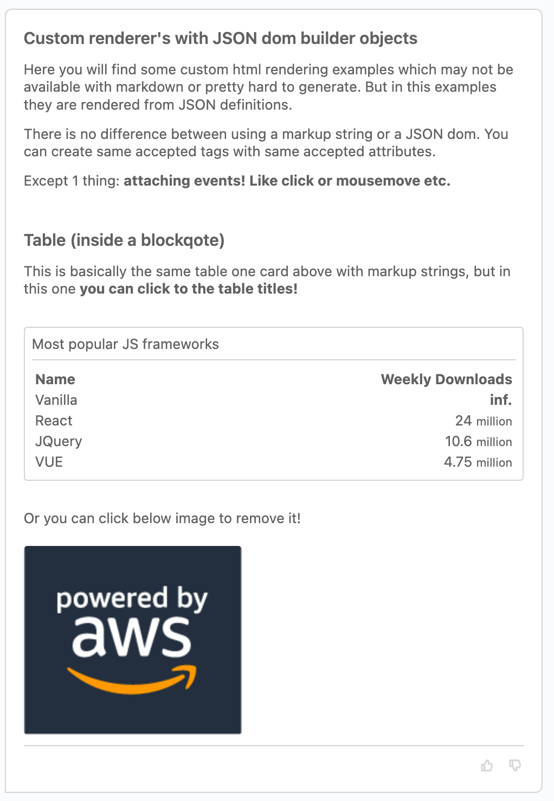
</p>

## BUT: There are some `LIMITATIONS!`

### We know that you're extremely careful while building custom html blocks and you're an expert on CSS. However, we still need to assure that the look & feel of the UI is not broken and it works as expected with all the functionalities. Because of these reasons with the addition of the safety concerns <u>we have to **`sanitize`** the HTML contents you provide</u>.

**And,** the sanitization requirement it is not just limited with the above. We're also automatically applying the functionalities we have on the original chat item body like *highlighting the code syntaxes, adding copy to clipboard and insert at cursor position buttons or adding the event controls for links etc.*. 
For example, you can check how the code blocks provided inside `customRenderer` look like (and do they have the copy buttons?) in the above examples.

**NOTE:** Below limitations are applicable for all of the `string`, `ChatItemBodyRenderer` and `ChatItemBodyRenderer[]` type usages.

### List of available tags:

```
[
  'a', 'audio', 'b', 'blockquote',
  'br', 'hr', 'canvas',
  'code', 'col', 'colgroup',
  'data', 'div', 'em',
  'embed', 'figcaption', 'figure',
  'h1', 'h2', 'h3', 'h4', 'h5', 'h6', 
  'i', 'iframe',
  'img', 'li', 'map',
  'mark', 'object', 'ol',
  'p', 'pre', 'q',
  's', 'small', 'source',
  'span', 'strong', 'sub',
  'sup', 'table', 'tbody',
  'td', 'tfoot', 'th',
  'thead', 'tr', 'track',
  'u', 'ul', 'video',
]
```

**NOTE:** As you can see in the above list, **form items are also not available**. Since this is a chat interface we should keep it as conversational as possible instead of using select/input/click structures to interact if they are not helping the end user. But in case you need some small forms and inputs from the user other than the prompts, you can use the **[`formIems`](#formitems)**.

### List of available attributes:

```
[
    'accept','accept-charset','accesskey',
    'align','allow','allowfullscreen',
    'alt', 'as','async','autocapitalize',
    'autoplay','charset','class',
    'cols','colspan','controls',
    'crossorigin','data','data-*',
    'datetime','decoding','default',
    'dir','download','headers',
    'hidden','high','href',
    'hreflang','id','ismap','
    itemprop','kind','lang',
    'language','loop','low',
    'media','muted','optimum',
    'ping','playsinline','poster',
    'preload','referrerpolicy',
    'rel','reversed','role',
    'rowspan','sandbox','scope',
    'shape','size','sizes','slot',
    'span','spellcheck','src',
    'srcdoc','srclang','srcset',
    'start', 'style', 'target','title',
    'translate','usemap',
    'wrap','aspect-ratio'
]
```

## Important Tips for `customRenderer`

### Tip 1
As you might see there is also no `width` and `height` attributes are available. 
As we've told you above, we know you're so good at styling components but our concern is the HTML itself. Since `mynah-ui` has a responsive design nature, we cannot let you write a static width or height to an `img` for example.

### But you're free to write custom styles for each tag you can create. But don't forget that you're getting the responsibility of a broken UI. So be careful with the styles and try not to be so extreme on that.

It applies to `iframe`s, `video`s and other similar media elements too. 
So, **avoid writing static sizes** and learn **what is the aspect ratio of your media content**.

### Tip 2
In general, those items *(except `img`)* will automatically stretched to 100% width and will stay that way as the max width is 100%. Yes, you cannot use static width and heights, **but** you can define their aspect ratios. Here's an example:

```
<iframe aspect-ratio="16:9" 
    src="https://..." ...>
</iframe>
```
When you provide a value to the `aspect-ratio` attribyte, it will automatically set the `width` of the element to `100%` and apply the aspect ratio for the height.

### Tip 3
So, are you looking for the available `aspect-ratio` values?
Here they are: `16:9`, `9:16`, `21:9`, `9:21`, `4:3`, `3:4`, `3:2`, `2:3`, `1:1`

If you need more aspect-ratios, please raise a feature request.

### Tip 4
**But,** of course we cannot control your imagination and lower down your expertise on html element structures.

For example; you can say that oldies are goldies and still have some emotional connection to the `table`s. How we can understand that you used a `table` and used some `colspan`s for the `td`s to adjust the width as the half of the wrapper card for the element you put inside which will not break the responsive structure... 

```
<table>
  <tr>
    <td colspan="1">
      <iframe ...>
    </td>
    <td colspan="1">
      <video ...>
    </td>
  </tr>
</table>
```
**Or,** since we know that you're expert on css, you can define some `flex-box` structure which have 100% width and also proper item arrangement inside. See the [Tip 6](#tip-6) below.

### Tip 5
For `img` items, it is a bit different. First of all, `img` items doesn't have `width` set to `100%` directly. They will be rendered in their original size (both width and height). However up to **`100%` width max**. 
**But** in case you want to make an image `100%` width and don't want to change its original aspect ratio, just give the `aspect-ratio` attribute without a value. Any of these media and embed items has the `aspect-ratio` without value, they'll get 100% width.
If you want to specify a custom aspect ratio within the available options above, you can also do that for the `img` items too.

### Tip 6
Even though we don't want you to write styles for the components, you might have some real edge cases you have to adjust the styles of your renderer(s). In this case you can use directly `style` attribute with 100% care of it or using an `id` or `class` attributes to define your styles in your style files properly.


That's all!, please also see the **[samples data](https://github.com/aws/mynah-ui/blob/6dd5cfbbb9e9d67fec19c40a2f9fbd7dba4c027c/example/src/samples/sample-data.ts#L544)** of both options we've used in the example app.

---

## `snapToTop`
It gives you the option to snap the card to the top of the scrolling container. By default, if the user already scrolled to the bottom of the container, container will autoscroll whenever the content is updated. 

**BUT:** There is one thing you need to think about, if your card is a streaming one, you may want to give the `snapToTop` value with the last stream part, otherwise after each content update it will snap to top which may cause a flickery view. And also it would be nice to show the content while it is being generated, and when it ends let it snap to top. **If** your chat item type is a strait `ANSWER`, you should give it initially with the data, when it appears on the screen it will be already snapped to top.

```typescript
const mynahUI = new MynahUI({
    tabs: {
        'tab-1': {
            ...
        }
    }
});

mynahUI.addChatItem('tab-1', {
    type: ChatItemType.ANSWER,
    ...
    snapToTop: true,
    body: "Put a very long message to see if it really snaps or still scrolls."
});
```


## `hoverEffect`
It gives you the option to put a hover effect on the card when it is hovered. It will also show the cursor as a pointer. It will make the card pop more than the others when user hovers to that card by adding a shadow and slight upwards movement.

```typescript
const mynahUI = new MynahUI({
    tabs: {
        'tab-1': {
            ...
        }
    }
});

mynahUI.addChatItem('tab-1', {
    type: ChatItemType.ANSWER,
    ...
    hoverEffect: true,
    ...
});
```

<p align="center">
  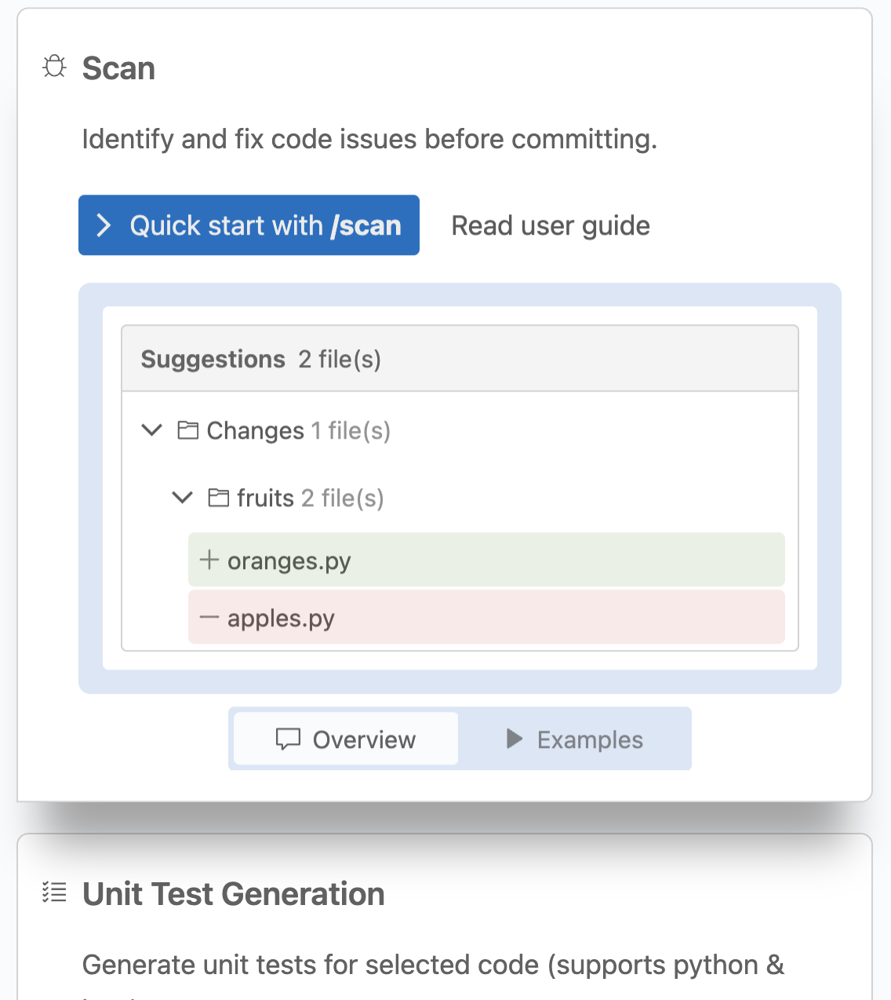
</p>

---

## `canBeVoted`
It enables the up and down vote buttons for that particular chat item. Important thing to remember here is that you have provide a `messageId` together with the `canBeVoted` to let the buttons appear and trigger the `onVote` event which can be binded through [Constructor properties](./PROPERTIES.md).

```typescript
const mynahUI = new MynahUI({
    tabs: {
        'tab-1': {
            ...
        }
    }
});

mynahUI.addChatItem('tab-1', {
    type: ChatItemType.ANSWER,
    messageId: '1', // Should be a unique one,
    canBeVoted: true,
    body: "Here's a message which **can** be voted."
});

mynahUI.addChatItem('tab-1', {
    type: ChatItemType.ANSWER,
    messageId: '2', // Should be a unique one,
    canBeVoted: false,
    body: "Here's another message which **cannot** be voted."
});
```

<p align="center">
  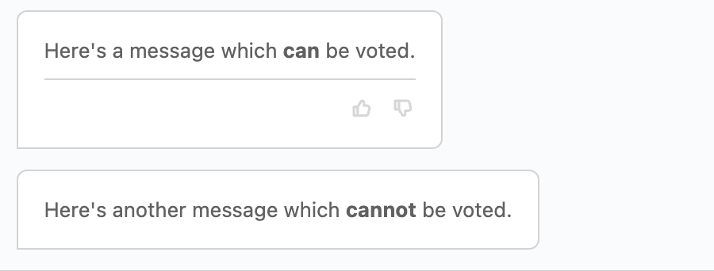
</p>

---

## `fullWidth`
It will make the card full width, in the available horizontal space. So it will not get with up to 95% of the available screen real estate and dynamically to the width of the content. It will be 100% all the time. Including the inner items like fileTree, code blocks etc.

```typescript
mynahUI.addChatItem(tabId, {
  type: ChatItemType.ANSWER,
  fullWidth: true,
  body: "Here's a message with `fullWidth: true`."
});
```

<p align="center">
  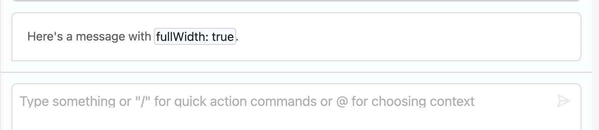
</p>

---

## `shimmer`
It will give the text in the chat item an animated shimmer effect.

```typescript
mynahUI.addChatItem(tabId, {
    type: ChatItemType.ANSWER,
    messageId: new Date().getTime().toString(),
    body: 'Thinking...',
    shimmer: true,
});
```

<p align="center">
  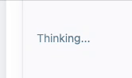
</p>

---

## `padding`
It will allow you to control the padding, by default it is `true`. If you set it to `false`, it will not show any paddings around the contents.

```typescript
mynahUI.addChatItem(tabId, {
  padding: false,
  type: ChatItemType.ANSWER,
  body: `Hello from MynahUI:
\`\`\`bash
mkdir -p src/ lalalaaaa
\`\`\``,
  codeBlockActions: {copy: null, 'insert-to-cursor': null}
});
```

<p align="center">
  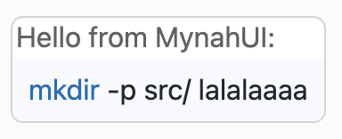
</p>

**Note:** Keep in mind that, if the `padding` is set to `false`, code blocks inside body will not show language if there are also no actions specified for them. So, if you turn of `copy` and `insert-to-cursor` by setting them to `null` in `codeBlockActions`, it will also hide the language bar if the card padding is false.

---

## `summary`
Specifying summary will render a clickable header with collapsible content.

```typescript
mynahUI.addChatItem(tabId, {
  padding: false,
  type: ChatItemType.ANSWER,
  summary: {
      content: {
        // Some ChatItem here
      },
      collapsedContent: [
        // One or multiple ChatItems here
      ]
  }
});
`,
});
```

<p align="center">
  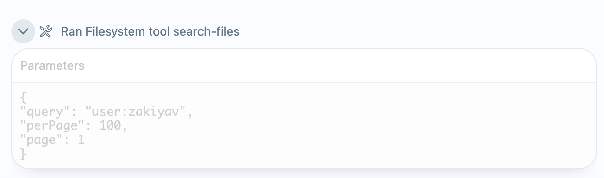
</p>

---

## `autoCollapse`
It will allow you to limit the card height up to 25% of the screen height and give an option to expand/collapse it back.

```typescript
mynahUI.addChatItem(tabId, {
  autoCollapse: true,
  fullWidth: true,
  type: ChatItemType.ANSWER,
  body: `Hello from MynahUI:
  .....
`,
});
```

<p align="center">
  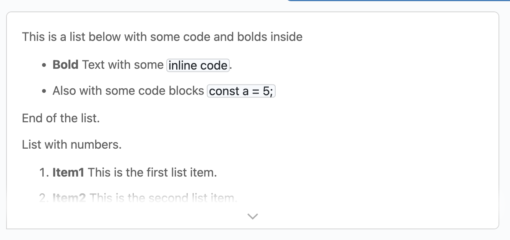
</p>

**Note:** Keep in mind that, when you enable `autoCollapse`, code blocks will not be collapsed by default. To avoid multiple inner collapsed items inside a collapsed item.


---

## `codeBlockActions`
With this parameter, you can add per chatitem code block actions to the code blocks inside that ChatItem. You can also override the actions added through [CONFIG](./CONFIG.md#codeblockactions). 

### Note
If you want to show that action only for certain coding languages, you can set the array for `acceptedLanguages` parameter. Keep in mind that it will check an exact mathc. If the incoming language is same with one of the acceptedLanguages list, it will show the action.

#### flash
You can also make the code block actions flash once or foverer when user hovers the the containing card. Until user hovers to the action itself, whenever they hover to the card it will flash the code block action. It you set it to `once` it will only flash once for every hover to the container card, if you set it to `infinite` it will keep flashing forever every 3 seconds until user hovers to the action itself. Whe user hovers to the action, it will not flash again.

```typescript
const mynahUI = new MynahUI({
    tabs: {
        'tab-1': {
            ...
        }
    }
});

mynahUI.addChatItem(tabId, {
  type: ChatItemType.ANSWER,
  body: `SOME CODE DIFF`,
  codeBlockActions: {
    'copy': undefined, // To override the one comes from the config by default
    'accept-diff': {
      id: 'accept-diff',
      label: 'Accept Diff',
      icon: MynahIcons.OK_CIRCLED,
      data: { // Can be "any"thing
        updatedCode: `SOME CODE DIFF APPLIED`
      },
      acceptedLanguages: ['diff-typescript']
    }
  }
});
```

<p align="center">
  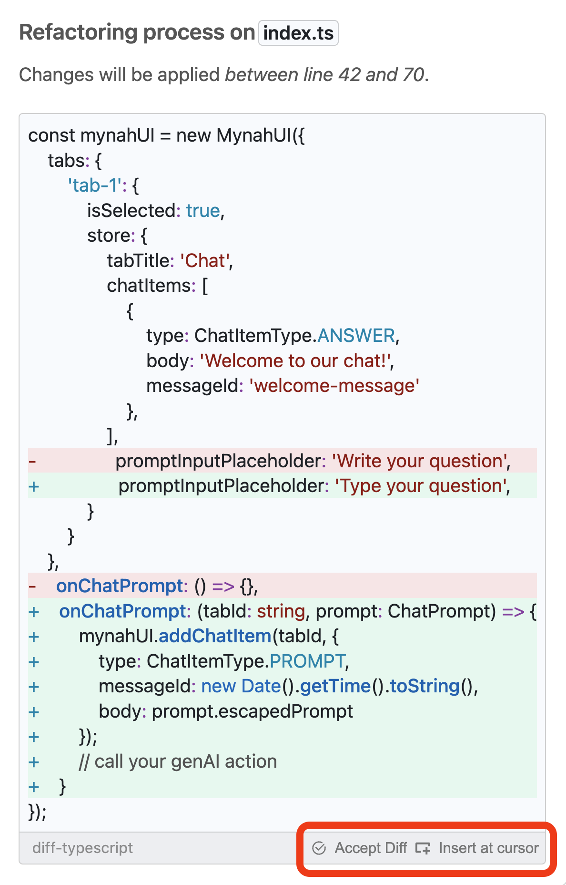
</p>

---

## `quickSettings`
This parameter allows you to add a dropdown selector to the footer of a chat item card. The `quickSettings` component provides a flexible dropdown interface that can be extended for different form item types in the future (radio buttons, checkboxes, etc.).

Currently, it supports the `select` type for single-selection dropdowns with visual feedback and customizable options.

The `DropdownList` component provides a customizable dropdown selector that allows users to choose from a list of options. It supports single selection with visual feedback and can be positioned relative to its parent elements.

```typescript
interface DropdownListOption {
  id: string;      // Unique identifier for the option
  label: string;   // Display text for the option
  value: string;   // Value associated with the option
  selected?: boolean; // Whether the option is initially selected
}

interface DropdownFactoryProps {
  type: 'select';              // Type of dropdown (currently only 'select', extensible for 'radio', 'checkbox', etc.)
  title: string;               // The title displayed in the dropdown header
  titleIcon?: MynahIcons;      // Icon displayed next to the title
  description?: string;        // Description text displayed below the title
  descriptionLink?: {          // Optional clickable link that appears within the description text
    id: string;                // Unique identifier for the link
    text: string;              // Display text for the link
    destination: string;       // Link destination
    onClick?: () => void;      // Optional callback function triggered when the link is clicked
  };
  options: DropdownListOption[]; // Array of options to display in the dropdown
  onChange?: (selectedOptions: DropdownListOption[]) => void; // Callback when selection changes
  tabId?: string;              // Tab identifier for event dispatching
  messageId?: string;          // Message identifier for event dispatching
  classNames?: string[];       // Additional CSS class names to apply
}
```

When a dropdown option is selected, the component dispatches a `MynahEventNames.DROPDOWN_OPTION_CHANGE` event with the selected options. You can handle this event by implementing the [`onDropDownOptionChange`](./PROPERTIES.md#ondropdownoptionchange) callback in your MynahUI constructor properties.

When a link in the dropdown description is clicked, the component dispatches a `MynahEventNames.DROP_DOWN_LINK_CLICK` event. You can handle this event by implementing the [`onDropDownLinkClick`](./PROPERTIES.md#ondropdownlinkclick) callback in your MynahUI constructor properties.

```typescript
const mynahUI = new MynahUI({
    tabs: {
        'tab-1': {
            ...
        }
    }
});

mynahUI.addChatItem('tab-1', {
    type: ChatItemType.ANSWER,
    messageId: 'dropdown-example',
    body: 'Please select your preferred option:',
    quickSettings: {
        type: 'select',
        title: 'Select an option',
        description: 'Choose one of the following options',
        tabId: 'tab-1',
        messageId: 'dropdown-example',
        options: [
            { id: 'option1', label: 'Option 1', value: 'option1', selected: false },
            { id: 'option2', label: 'Option 2', value: 'option2', selected: true },
            { id: 'option3', label: 'Option 3', value: 'option3', selected: false }
        ]
    }
});

// Example with descriptionLink
mynahUI.addChatItem('tab-1', {
    type: ChatItemType.ANSWER,
    messageId: 'dropdown-with-link-example',
    body: 'Configure your settings:',
    quickSettings: {
        type: 'select',
        title: 'Model Selection',
        description: 'Choose your preferred AI model. Need help choosing?',
        descriptionLink: {
            id: 'model-help-link',
            text: 'Learn more about models',
            onClick: () => {
                console.log('Help link clicked - opening model documentation');
                // Handle the link click, e.g., open documentation or show help dialog
            }
        },
        tabId: 'tab-1',
        messageId: 'dropdown-with-link-example',
        options: [
            { id: 'gpt4', label: 'GPT-4', value: 'gpt4', selected: true },
            { id: 'claude', label: 'Claude', value: 'claude', selected: false },
            { id: 'llama', label: 'Llama', value: 'llama', selected: false }
        ]
    }
});
```

<p align="center">
  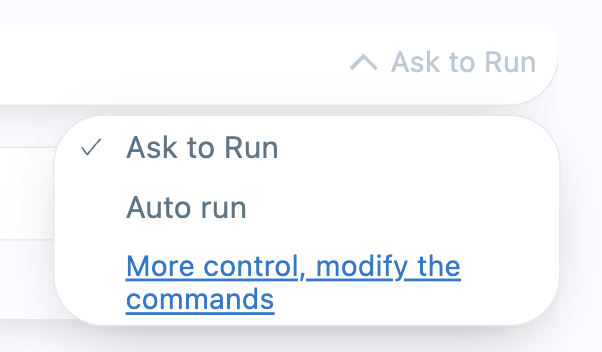
</p>

---

## `footer`
With this parameter, you can add another `ChatItem` only with contents to the footer of a ChatItem. 

```typescript
const mynahUI = new MynahUI({
    tabs: {
        'tab-1': {
            ...
        }
    }
});

mynahUI.addChatItem(tabId, {
  type: ChatItemType.ANSWER,
  body: `SOME CONTENT`,
  footer: {
    fileList: { // For example, want to show which file is used to generate that answer
      rootFolderTitle: undefined,
      fileTreeTitle: '',
      filePaths: ['./src/index.ts'],
      details: {
        './src/index.ts': {
          icon: MynahIcons.FILE,
          description: `SOME DESCRIPTION.`
        }
      }
    }
  }
});
```

<p align="center">
  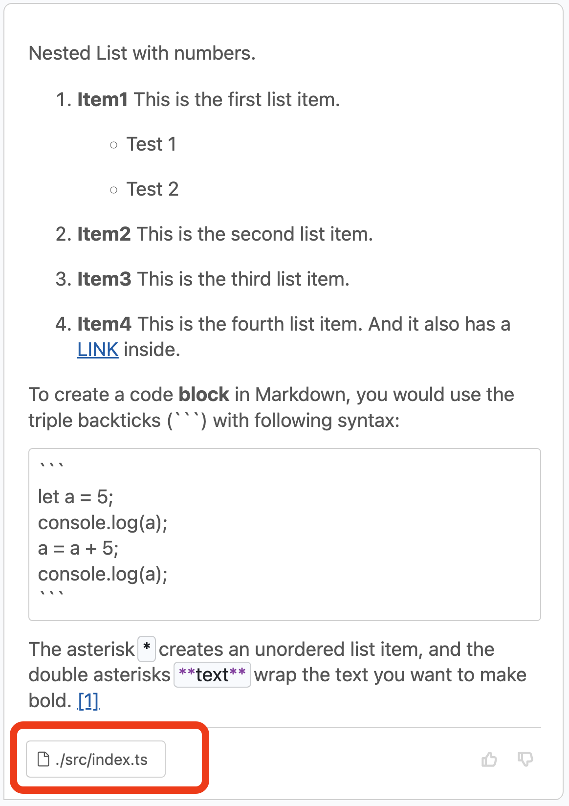
</p>
<p align="center">
  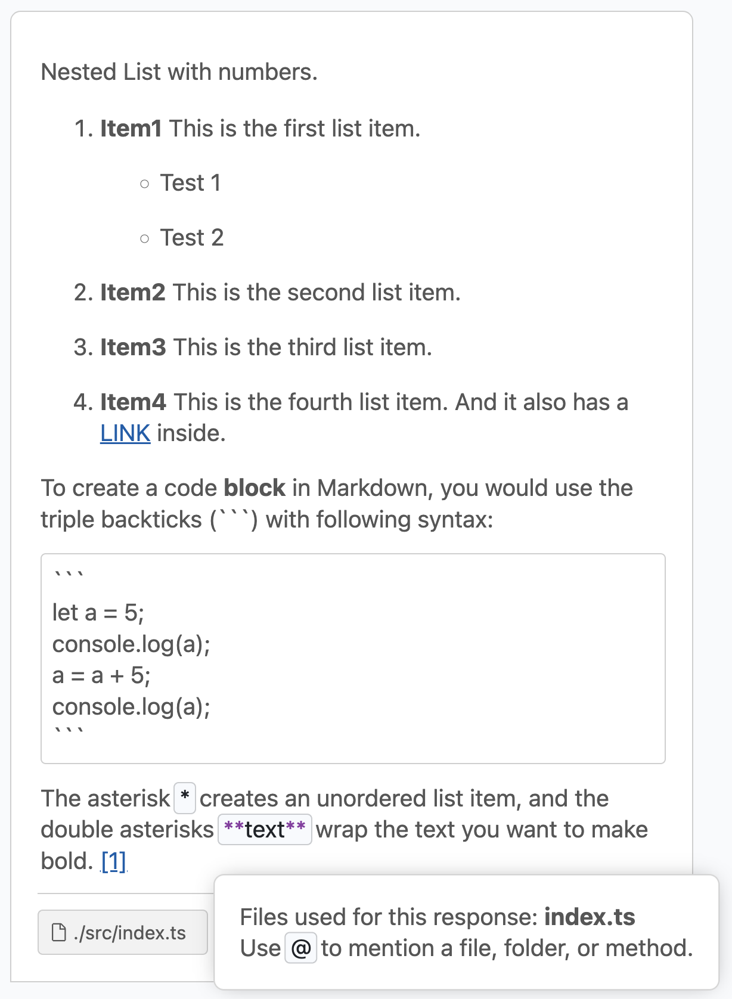
</p>

---

## `relatedContent`
It allows you to show some related links under the body of the chat item. It shows one item and if you provided more user can expand the list with the show more button. 

If you also provide a markdown body for the source link, it will generate a tooltip to show more details for it.

See the example below.

```typescript
const mynahUI = new MynahUI({
    tabs: {
        'tab-1': {
            ...
        }
    }
});

mynahUI.addChatItem('tab-1', {
    type: ChatItemType.ANSWER,
    messageId: '1', // Should be a unique one,
    body: "Here's a message with source links.",
    relatedContent: {
        title: 'Related Link',
        content: [
            {
                url: 'https://aws.com/deep/url/1',
                title: 'Related content 1',
                body: '## This is the body of the related\nAnd yes it also supports markdown!\n```typescript\nconst a = 5;\n```\n',
            },
            {
                url: 'https://aws.com/more/deeper/url/2',
                title: 'Related content 2',
            },
            {
                url: 'https://aws.com/deep/url/3',
                title: 'Related content 3',
            }
        ]
    }
});
```

<p align="center">
  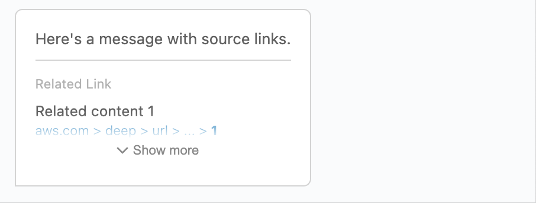
</p>
<p align="center">
  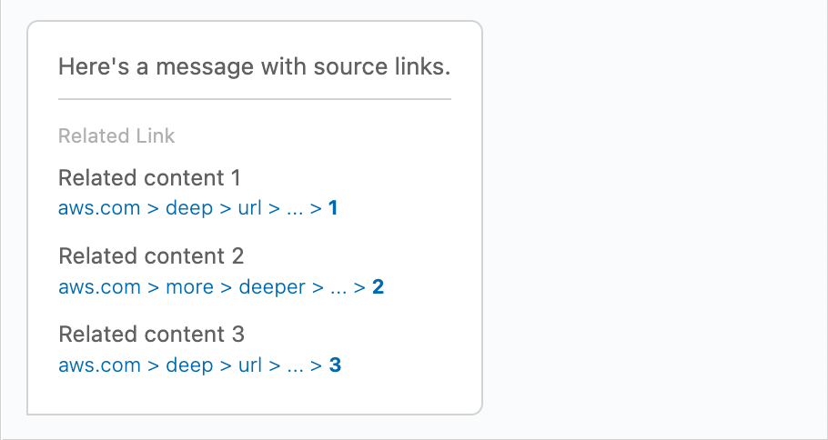
</p>
<p align="center">
  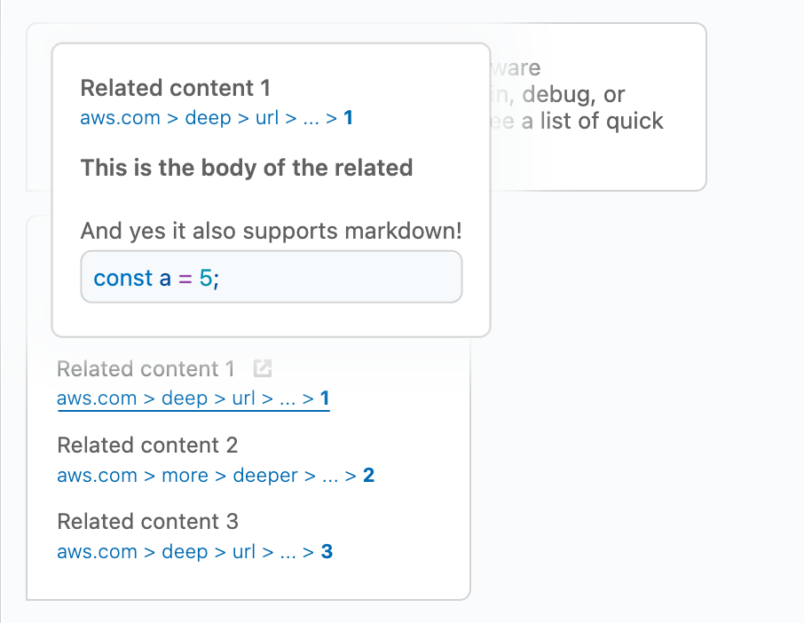
</p>

---

### `fileList`

Use for showing a file list. You have to set the `fileList` attribute. See the example below.

**IMPORTANT NOTICE**: Do not forget that file lists will always be shown at the bottom of the card in case if you combine it body or form items. (Buttons will be at the most bottom, don't worry!)

You can also provide custom titles for the file list card and the root folder has to be used to wrap the files and folders. If you don't set anything, they'll use the defaults from `config.texts`. See [Config Documentation](./CONFIG.md#texts)

```typescript
const mynahUI = new MynahUI({
    tabs: {
        'tab-1': {
            ...
        }
    }
});

mynahUI.addChatItem(tabId, {
  type: ChatItemType.ANWER,
  fileList: {
    filePaths: [ 'src/App.tsx', 'devfile.yaml', 'src/App.test.tsx' ],
    deletedFiles: ['src/devfile.yaml'],
    // fileTreeTitle: "Custom file tree card title";
    // rootFolderTitle: "Custom root folder title";
    // collapsed: true // Collapse the root folder by default
    // hideFileCount: true // Hide the file counter next to folders
    // flatList: true // Enable to generate a flat list with one parent folder and no sub folders
    // folderIcon: 'folder' // Specify a custom icon for folders
    actions: {
      'src/App.tsx': [
        {
          icon: MynahIcons.CANCEL_CIRCLE,
          status: 'error',
          name: 'reject-change',
          description: 'Reject change'
        },
        {
          icon: MynahIcons.COMMENT,
          name: 'comment-to-change',
          description: 'Comment'
        }
      ]
    },
    details:{
      'src/devfile.yaml': {
        status: 'error',
        label: "Change rejected",
        changes: {
          added: 36,
          deleted: 5,
          total: 41
        },
        icon: MynahIcons.REVERT,
        description: 'Markdown tooltip to show',
        clickable: true; // or false if you want to make the file not clickabke
      }
    }
  },
  codeReference: [
    {
      information: 'Reference code *under the MIT license* from repository `amazon`.'
    },
    {
      information: 'Reference code *under the MIT license* from repository `aws`.'
    }
  ],
  canBeVoted: true,
  messageId: 'file-list-message'
});
```

**NOTE 1:** Actions will be shown only when you hover to the file.

**NOTE 2:** You can add actions and details for each file (**but not for folders**). Beware that you need to add those actions for each specific file as a map which **the key needs to be the path of the file**.

**NOTE 3:** In case you want to show one single file (or folder by giving it a folder icon) and not make it clickable, use the `details` section with the file name and set the `clickable` to `false`.

**NOTE 4:** In case you want a flat list, where all subfolders are not rendered but just all the files, you can pass `true` to the `flatList` prop.

**NOTE 5:** When using `renderAsPills: true` in a header's fileList, files will be displayed as inline pills instead of a traditional file tree. This is useful for showing a compact list of files that were processed or referenced.

<p align="center">
  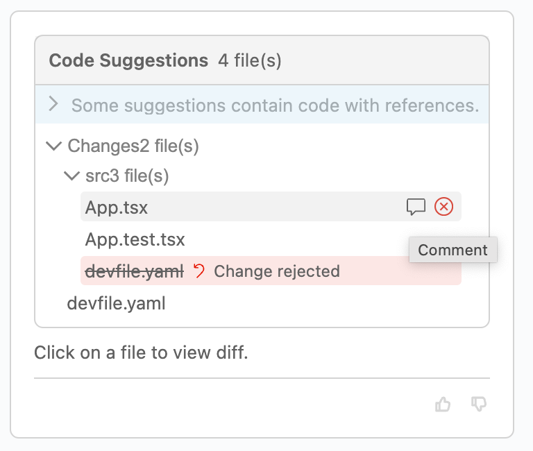
</p>

#### `renderAsPills` (default: `false`)
When set to `true` in a header's fileList, files will be rendered as inline pills next to the header text instead of a traditional file tree. This creates a compact display perfect for showing files that were read, processed, or referenced.

**Features:**
- Files appear as clickable pills inline with the header text and icon
- Uses `visibleName` from details as pill text (falls back to full file path)
- Deleted files get special styling with `mynah-chat-item-tree-file-pill-deleted` class
- Pills support hover tooltips when `description` is provided in details
- Header icon is automatically included in the custom renderer for proper alignment
- Pills dispatch `FILE_CLICK` events when clicked, same as regular file tree items
- Only works when `renderAsPills: true` is set in a header's fileList (not main fileList)

**Important Notes:**
- This feature only works within a `header.fileList`, not in the main chat item `fileList`
- When `renderAsPills: true`, the traditional file tree is replaced with inline pills
- The header's `body`, `icon`, and file pills are all rendered together in a custom renderer
- Empty `filePaths` array will result in no pills being rendered

```typescript
mynahUI.addChatItem('tab-1', {
  type: ChatItemType.ANSWER,
  header: {
    icon: MynahIcons.EYE,
    body: '5 files read',
    fileList: {
      filePaths: ['package.json', 'tsconfig.json', 'src/index.ts'],
      renderAsPills: true,
      details: {
        'package.json': {
          visibleName: 'package',
          description: 'Project configuration'
        },
        'tsconfig.json': {
          visibleName: 'tsconfig',
          description: 'TypeScript configuration'
        },
        'src/index.ts': {
          visibleName: 'index.ts',
          description: 'Main entry point'
        }
      },
      deletedFiles: ['src/index.ts'] // Will show with deleted styling
    }
  },
});
```

<p align="center">
  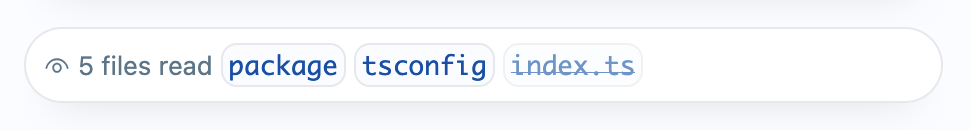
</p>

**Comparison with regular file tree:**

```typescript
// Regular file tree (renderAsPills: false or undefined)
mynahUI.addChatItem('tab-1', {
  type: ChatItemType.ANSWER,
  header: {
    icon: MynahIcons.EYE,
    body: 'Files analyzed',
    fileList: {
      filePaths: ['package.json', 'src/index.ts'],
      renderAsPills: false // or omit this property
    }
  }
});
```


#### File `details`

You can customize the details of a file. Like setting a custom icon, adding some informative text, a status color.

**icon:**
You can give a custom icon for each file, and you can even decided not to put an icon for that file by individually giving `null` as the icon value. 

**changes:**
In addition to the label field, you can also specificy addition, deletion and total counts for a change on that file. Those are specifically getting some status colors unlike the flat `label` field. 

Here's a sample;

```typescript
fileList: {
  fileTreeTitle: '',
  filePaths: ['package.json'],
  details: {
    'package.json': {
      icon: null,
      label: 'Created',
      changes: {
        added: 36,
        deleted: 0,
        total: 36
      }
    }
  }
}
```
<p align="center">
  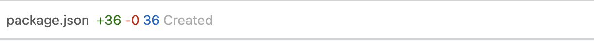
</p>

---

### `informationCard`

Show a styled card for e.g. introducing or highlighting a particular feature.

```typescript
mynahUI.addChatItem(tabId, {
    messageId: generateUID(),
    type: ChatItemType.ANSWER,
    informationCard: {
        title: 'Information card',
        description: 'With a description below the title and success status.',
        icon: MynahIcons.BUG,
        content: {
            body: 'Some card body here'
        },
        status: {
            status: 'success',
            icon: MynahIcons.THUMBS_UP,
            body: 'Successfully completed this task!'
        }
    },
});
```

Information cards have a top section, including a title, description, and icon. The content of the card can be defined in the `content.body`. 

A status can also be added to emphasize a particular state. The `status.status` supports either `success`, `warning`, or `error`. An icon and body message can also be defined.

<p align="center">
  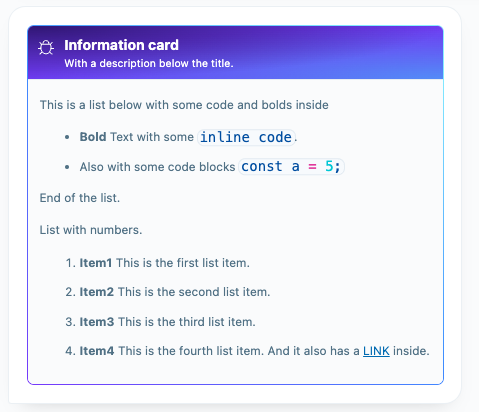
</p>

<p align="center">
  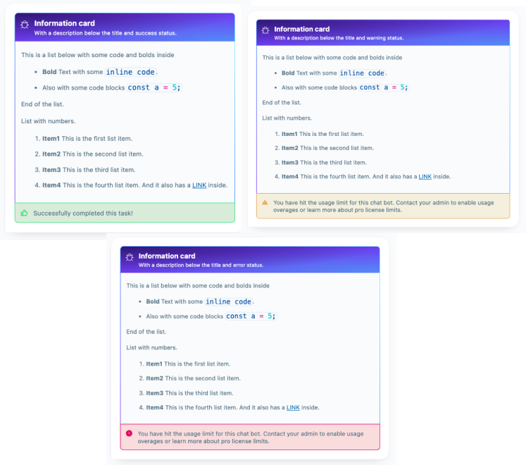
</p>

---

### `tabbedContent`

Show a card with switchable content based on navigation tabs.

```typescript
mynahUI.addChatItem(selectedTabId, {
  messageId: generateUID(),
  type: ChatItemType.ANSWER,
  tabbedContent: [
    {
      value: 'overview',
      label: 'Overview',
      icon: MynahIcons.COMMENT,
      selected: true,
      content: {
        body: 'Overview content'
      }
    },
    {
      value: 'examples',
      label: 'Examples',
      icon: MynahIcons.PLAY,
      selected: false,
      content: {
        body: 'Examples content'
      }
    }
  ]
});
```

Define a unique identifier for each tab in the `value` prop, and add a label and icon. Determine which tab is selected by default by using the `selected` boolean. The content is a `ChatItemContent`, which is the content shown when the tab is selected.

<p align="center">
  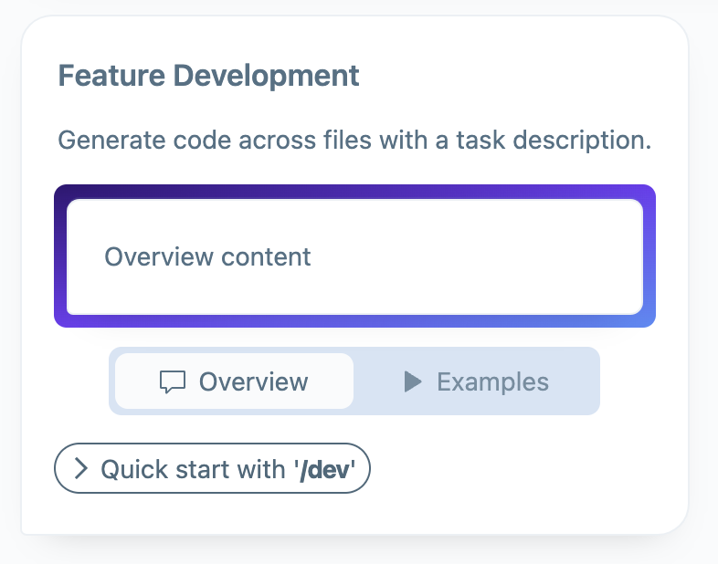
</p>

---

## `buttons`
It allows you to add actions inside a chat item card. **BUT, beware that when those actions are clicked if you set the `keepCardAfterClick` to false, they will remove the card they are in.**. 

**Another important point** for the buttons are related with the [`formItems`](#formItems), when a button is clicked and it keeps the card instead of removing it, **it will disable** all the form items and also the buttons inside that card.

Let's see the data type for buttons:
```typescript
interface ChatItemButton {
  keepCardAfterClick?: boolean; // default true, if you want the button to remove the card, set it to false
  waitMandatoryFormItems?: boolean; // Wait till the mandatory form items inside the same card to be filled to enable the button if there is any
  // Please see formItems section for a detailed usage
  text: string; // Text inside the button
  id: string; // id of the button, since when they are clicked they all call the same property onInBodyButtonClicked
  disabled?: boolean; // in any case if you want to make the button disabled (mandatory check will discard this)
  description?: string; // A text to be shown inside a tooltip and it can be markdown
  status?: 'main' | 'primary' | 'clear' | 'dimmed-clear' | Status;
  flash?: 'infinite' | 'once'; // Flashes the card
  fillState?: 'hover' | 'always'; // background is filled always or only when hover
  icon?: MynahIcons; // in case if you want to put an icon to the button.
  position?: 'inside' | 'outside'; // Whether the button shows up inside or oustide a card, default is 'inside'
}
```

See the example below.

```typescript
const mynahUI = new MynahUI({
    tabs: {
        'tab-1': {
            ...
        }
    }
});

mynahUI.addChatItem(tabId, {
    type: ChatItemType.ANSWER,
    messageId: new Date().getTime().toString(),
    body: `This is a card with actions inside!`,
    buttons: [
          {
              text: 'Action 1',
              id: 'action-1',
              status: 'info',
              icon: MynahIcons.CHAT
          },
          {
              text: 'Action 2',
              description: 'This action will not remove the card!',
              id: 'action-2',
              keepCardAfterClick: false, // So when this button is clicked, it will remove the whole card.
          },
          {
              text: 'Action 3',
              description: 'This is disabled for some reason!',
              id: 'action-3',
              disabled: true,
          },
          {
              text: 'Primary',
              description: 'This is colored!',
              id: 'action-3',
              status: 'primary',
          },
          {
              text: 'Main',
              description: 'This is more colored!',
              id: 'action-3',
              status: 'main',
          },
          {
              text: 'Clear',
              description: 'This is clear!',
              id: 'action-3',
              status: 'clear',
          },
      ],
});
```

<p align="center">
  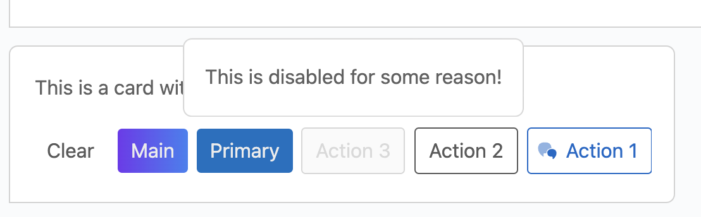
</p>

#### Outside buttons
You can make buttons appear after the container chat card. A common usage for this use case is to add confirmation and rejection buttons to a particular card.

```typescript
mynahUI.addChatItem(tabId, {
    type: ChatItemType.ANSWER,
    messageId: new Date().getTime().toString(),
    body: 'Do you wish to continue?',
    buttons: [
        {
            id: 'confirmation-buttons-cancel',
            text: 'Cancel',
            status: 'error',
            icon: MynahIcons.CANCEL_CIRCLE,
            position: 'outside'
        },
        {
            id: 'confirmation-buttons-confirm',
            text: 'Confirm',
            status: 'success',
            icon: MynahIcons.OK_CIRCLED,
            position: 'outside'
        },
    ]
});
```

<p align="center">
  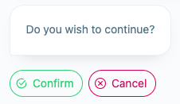
</p>

#### Button flash

You can also make the button flash once or foverer when user hovers the the containing card. Until user hovers to the button itself, whenever they hover to the card it will flash the button. It you set it to `once` it will only flash once for every hover to the container card, if you set it to `infinite` it will keep flashing forever every 3 seconds until user hovers to the button itself. Whe user hovers to the button, it will not flash again.

```typescript
mynahUI.addChatItem(tabId, {
    type: ChatItemType.ANSWER,
    ...
    buttons: [
    {
        ...
        flash: 'infinite',
        ...
    },
    ...,
    ],
});
```

<p align="center">
  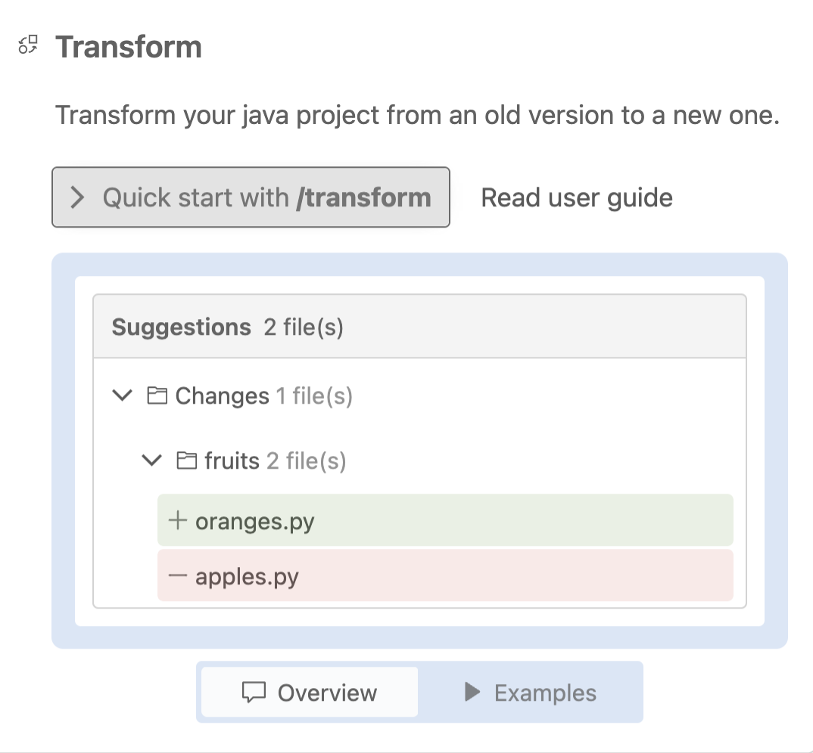
</p>

#### Button fillState

You can make the filled buttons filled always or filled only on hover.

```typescript
mynahUI.addChatItem(tabId, {
    type: ChatItemType.ANSWER,
    ...
    buttons: [
    {
        ...
        fillState: 'hover',
        ...
    },
    ...,
    ],
});
```

<p align="center">
  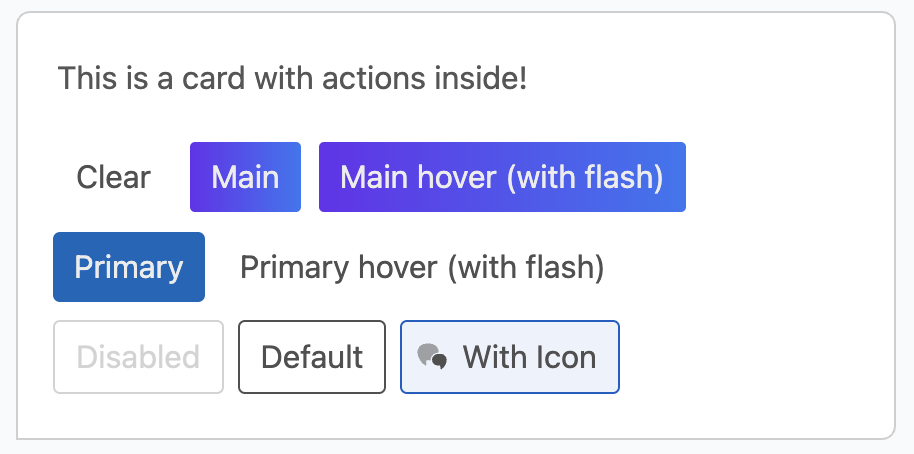
  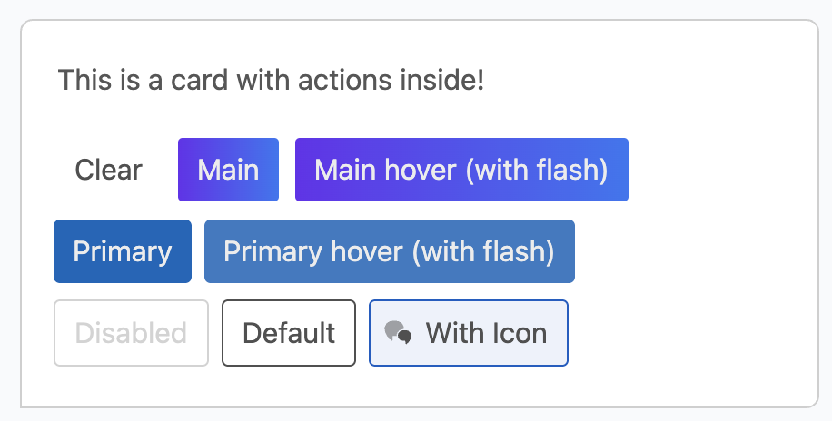
</p>

#### Button / Action confirmations
You can add confirmations on any `Action` by e.g. specifying the following for an Action:

```typescript
{
    id: 'mcp-delete-tool',
    icon: MynahIcons.TRASH,
    text: 'Delete',
    confirmation: {
        cancelButtonText: 'Cancel',
        confirmButtonText: 'Delete',
        title: 'Delete Filesystem MCP server',
        description:
            'This configuration will be deleted and no longer available in Q. \n\n **This cannot be undone.**',
    },
},
```
<p align="center">
  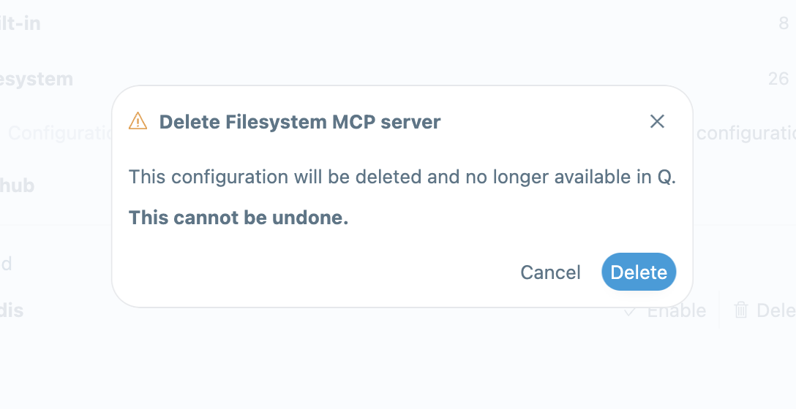
</p>

---

## `formItems`
It allows you to add some form elements inside a chat item card. Currently it supports `textarea`, `textinput`, `numericinput`, `stars`, `radiogroup` and `select` components. 

**Important notice:** You need to use [`buttons`](#buttons) to get the values set by the user for those options.

Let's take a look to the data type of a form item:
```typescript
interface ChatItemFormItem {
  id: string; // id is mandatory to understand to get the specific values for each form item when a button is clicked
  type: 'select' | 'textarea' | 'textinput' | 'numericinput' | 'stars' | 'radiogroup' | 'toggle' | 'checkbox' | 'switch' | 'pillbox' ; // type (see below for each of them)
  mandatory?: boolean; // If it is set to true, buttons in the same card with waitMandatoryFormItems set to true will wait them to be filled
  hideMandatoryIcon?: boolean; // If it is set to true, it won't render an asterisk icon next to the form label
  title?: string; // Label of the input
  autoFocus: boolean; // focus to the input when it is created, default=> false. (Only for textual form items)
  description?: string; // The description, showing under the input field itself
  tooltip?: string; // The tooltip, showing when you hover to the whole input field
  icon?: MynahIcons; // An icon displaying at the start of the input, renders on all inputs except for stars and radiogroup
  validationPatterns?: {
    operator?: 'and' | 'or';
    genericValidationErrorMessage?: string;
    patterns: ValidationPattern[];
  };
  placeholder?: string; // Placeholder for input, but only applicable to textarea, textinput and numericinput
  value?: string; // Initial value of the item. All types of form items will get and return string values, conversion of the value type is up to you
  checkModifierEnterKeyPress?: boolean; // Only applicable to textual inputs: whether the onFormModifierEnterPress event can be triggered from this input field
  validateOnChange?: boolean; // Only applicable to text input: whether the form should validate on this field's change. If this field is false (or not set), form will validate onBlur by default
  options?: Array<{ // Only applicable to select and radiogroup types
    value: string;
    label: string;
    description?: string; // Only applicable to select types. This will add a description below the label to add more context for the option
  }>;
  disabled?: boolean; // If set to true, the form item will be disabled and user cannot interact with it. Applicable to textinput, numericinput, email, radiogroup, and select types.
  boldTitle?: boolean; // this will make the title of the input bold
  selectTooltip?: string; // this is only applicable to DropDownFormItem. This will make the tooltip float right above the dropdown, not the wrapper object (or the title to be specific)
}
```

Since you can give unlimited form items with several different types, it might be good to know that some attributes are only applicable to some types. Like `options` attribute is only getting used by `select` and `radiogroup` items. Or `placeholder` is only getting used by `textarea`, `textinput` and `numericinput`.

`validationPattenrs` works only for textual inputs. You can define one or more validation regex patterns, use an operator between them as `AND` or `OR`. You can show individual error messages for each validation or use one generic message if the combined validation fails (Might be useful for `OR` operator).

**Another thing which might be interesting** is to know that if you set the `select` or the `radiogroup` mandatory, they'll be rendered as the first item's of them selected if you don't provide an initial value. And you cannot deselet a radio item in any case. For select, if it is mandatory there won't be the option `Please select...`. 

**Important note about the `disabled` property:** The `disabled` property can be set to `true` to disable form items and prevent user interaction. This is supported for the following form item types:
- `textinput` - Text input fields will be disabled
- `numericinput` - Numeric input fields will be disabled
- `email` - Email input fields will be disabled
- `radiogroup` - Radio button groups will be disabled
- `select` - Dropdown selectors will be disabled

When you have a default value and want to ensure it's always displayed, you can combine `mandatory: true` with `disabled: true` - this will automatically select and display the first value in `options` (for select/radiogroup types) while preventing user interaction.

_**NOTE**: If you set `options` for `textinput` for example, it won't affect the textinput to be rendered and work properly._

##### Let's see a very detailed example below.

```typescript
const mynahUI = new MynahUI({
    tabs: {
        'tab-1': {
            ...
        }
    }
});

mynahUI.addChatItem(tabId, {
    type: ChatItemType.ANSWER,
    messageId: new Date().getTime().toString(),
    body: 
    `Can you help us to improve our AI Assistant? Please fill the form below and hit **Submit** to send your feedback.
    _To send the form, mandatory items should be filled._`,
    formItems: [
        {
            id: 'expertise-area',
            type: 'select',
            title: `Area of expertise`,
            icon: 'search',
            description: 'Select your area of expertise',
            options: [
                {
                    label: 'Frontend',
                    value: 'frontend',
                },
                {
                    label: 'Backend',
                    value: 'backend',
                },
                {
                    label: 'Data Science',
                    value: 'datascience',
                },
                {
                    label: 'Other',
                    value: 'other',
                },
            ],
        },
        {
            id: 'preferred-ide',
            type: 'radiogroup',
            title: `Preferred IDE`,
            options: [
                {
                    label: 'VSCode',
                    value: 'vscode',
                },
                {
                    label: 'JetBrains IntelliJ',
                    value: 'intellij',
                },
                {
                    label: 'Visual Studio',
                    value: 'visualstudio',
                },
            ],
        },
        {
            id: 'remote-ide',
            type: 'toggle',
            value: 'remote',
            title: `Environment`,
            options: [
                {
                    label: 'Remote',
                    value: 'remote',
                    icon: MynahIcons.STAR
                },
                {
                    label: 'Local',
                    value: 'local',
                    icon: MynahIcons.SCROLL_DOWN
                },
                {
                    label: 'Both',
                    value: 'both',
                    icon: MynahIcons.STACK
                }
            ],
        },
        {
            id: 'is-online',
            type: 'checkbox',
            value: 'true',
            label: 'Yes',
            title: `Are you working online?`,
        },
        {
            id: 'is-monorepo',
            type: 'switch',
            label: 'Yes',
            icon: 'deploy',
            title: `Are you working in a monorepo project?`,
            tooltip: "If you're working more on monorepos, check this"
        },
        {
            id: 'working-hours',
            type: 'numericinput',
            title: `How many hours are you using an IDE weekly?`,
            placeholder: 'IDE working hours',
        },
        {
            id: 'email',
            type: 'email',
            mandatory: true,
            title: `Email`,
            description: 'Your email will be used to get back to you',
            placeholder: 'email',
            checkModifierEnterKeyPress: true
        },
        {
            id: 'name',
            type: 'textinput',
            mandatory: true,
            title: `Name (should contain "amazonq" and "aws" in the string)`,
            validationPatterns: {
                operator: 'and',
                patterns: [{
                    pattern: 'amazonq',
                    errorMessage: 'Should contain amazonq!'
                },{
                    pattern: 'aws',
                    errorMessage: 'Should contain aws!'
                }]
            },
            placeholder: 'Name and Surname',
        },
        {
            id: 'ease-of-usage-rating',
            type: 'stars',
            mandatory: true,
            title: `How easy is it to use our AI assistant?`,
        },
        {
            id: 'accuracy-rating',
            type: 'stars',
            mandatory: true,
            title: `How accurate are the answers you get from our AI assistant?`,
        },
        {
            id: 'general-rating',
            type: 'stars',
            title: `How do feel about our AI assistant in general?`,
        },
        {
            id: 'skills',
            type: 'pillbox',
            title: 'Programming Languages & Technologies',
            description: 'Add your programming languages and technologies (press Enter to add)',
            placeholder: 'Type a skill and press Enter',
            value: 'JavaScript,TypeScript,React,Node.js',
        },
        {
            id: 'description',
            type: 'textarea',
            title: `Any other things you would like to share? (should contain one of "amazonq" or "aws", capital or not)`,
            validationPatterns: {
                operator: 'or',
                genericValidationErrorMessage: 'Should contain one of "amazonq" or "aws"',
                patterns: [{
                    pattern: /amazonq/gi
                },{
                    pattern: /aws/gi
                }]
            },
            placeholder: 'Write your feelings about our tool. If the form is fully filled and valid, Enter will submit the form',
        },
    ],
    buttons: [
        {
            id: 'submit',
            text: 'Submit',
            status: 'primary',
        },
        {
            id: 'cancel-feedback',
            text: 'Cancel',
            keepCardAfterClick: false,
            waitMandatoryFormItems: false,
        },
    ],
});
```

<p align="center">
  
</p>

In it's current state, you'll see some asterisk icons on the left of the label fields if the items are mandatory. And as you can see according to the configuration we've prepared above, `Submit` button is currently disabled. Because it waits the `email`, `name`, `ease of use stars` and `accuracy stars` to be filled/selected.

Let's see what happens when we fill them:

<p align="center">
  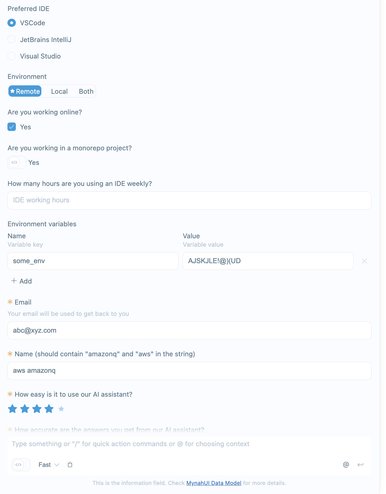
</p>

**Now our `Submit` button is activated**. But before submitting it, let's fill all the fields.

<p align="center">
  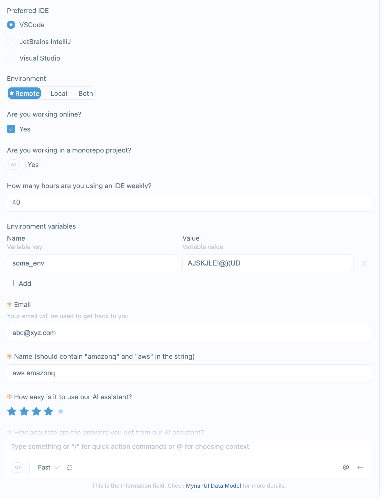
</p>


Ok, finally, when we click the `Submit` button, as it is configured that way, it will keep the card, but all the form fields and the buttons will be disabled. 

<p align="center">
  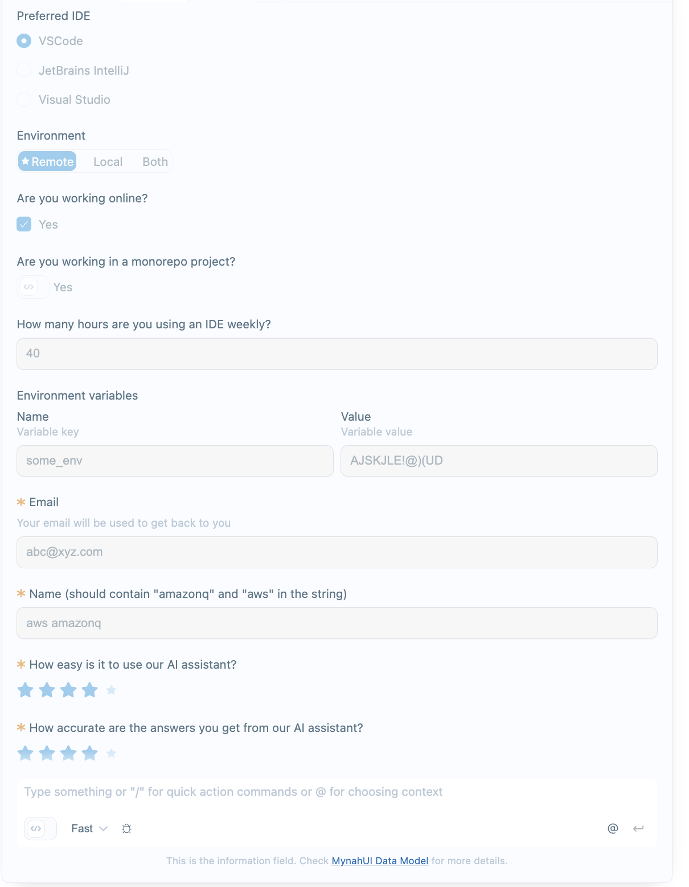
</p>


And how the tooltip looks like:

<p align="center">
  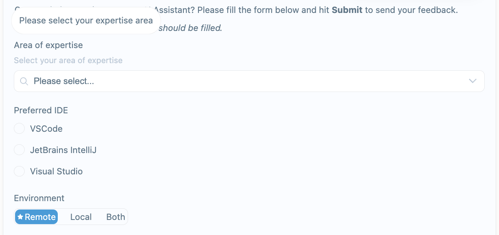
</p>


**Note:** As you can see. `Cancel` button has the value for `keepCardAfterClick` and `waitMandatoryItems` as `false` which means that `Cancel` button won't be disabled even if the form is not valid _(mandatory fields not filled)_ and when clicked it will remove the whole card.

A sample return to the [onInBodyButtonClicked](./PROPERTIES.md#oninbodybuttonclicked) function
```console
Body action clicked in message 1743163457971:
Action Id: submit
Action Text: Submit

Options:
expertise-area: frontend
preferred-ide: vscode
remote-ide: remote
is-online: false
is-monorepo: true
working-hours: 30
email: d@a.c
name: aws amazonq
ease-of-usage-rating: 4
accuracy-rating: 4
general-rating: 4
description: aws
```

---


## `status`
It allows you to set the border color of the card. Currently you can select one of the below status types: 

`success`, `info`, `error`, `warning`

See the example below.

```typescript
const mynahUI = new MynahUI({
    tabs: {
        'tab-1': {
            ...
        }
    }
});

mynahUI.addChatItem(tabId, {
    type: ChatItemType.ANSWER,
    messageId: new Date().getTime().toString(),
    body: `This is a card with status indication border!`,
    status: 'success',
});
```

<p align="center">
  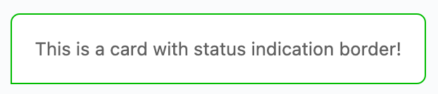
</p>

---

## `icon`
It allows you to set an icon on the left top corner of the card. You should use one from `MynahIcons`. 

See the example below.

```typescript
const mynahUI = new MynahUI({
    tabs: {
        'tab-1': {
            ...
        }
    }
});

// Just the icon
mynahUI.addChatItem(tabId, {
    type: ChatItemType.ANSWER,
    messageId: new Date().getTime().toString(),
    body: `This is a card with an icon!`,
    icon: MynahIcons.CHAT,
});

// Icon with status
mynahUI.addChatItem(tabId, {
    type: ChatItemType.ANSWER,
    messageId: new Date().getTime().toString(),
    body: `This is a card with an icon and a status!`,
    status: 'info',
    icon: MynahIcons.CHAT,
});
```

<p align="center">
  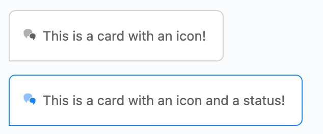
</p>

---

## `iconStatus`
It allows you give a background status color only to the icon. Can be given to both the `header` and main card icons. 

See the example below.

```typescript
const mynahUI = new MynahUI({
    tabs: {
        'tab-1': {
            ...
        }
    }
});

mynahUI.addChatItem(tabId, {
  type: ChatItemType.ANSWER,
  title: 'SAVE THE DATE',
  header: {
    icon: 'calendar',
    iconStatus: 'primary',
    body: '## Soon, a new version will be released!'
  },
  fullWidth: true,
  canBeDismissed: true,
  body: "We're improving the performance, adding new features or making new UX changes every week. Save the date for new updates!."
});
```

<p align="center">
  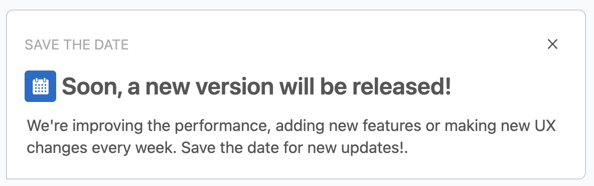
</p>

---


## `canBeDismissed`
It allows you put a close button on top of the card, which will remove the card once clicked. It will appear even above the `header` section.

See the example below.

```typescript
const mynahUI = new MynahUI({
    tabs: {
        'tab-1': {
            ...
        }
    }
});

mynahUI.addChatItem(tabId, {
  type: ChatItemType.ANSWER,
  title: 'SAVE THE DATE',
  header: {
    icon: 'calendar',
    iconStatus: 'primary',
    body: '## Soon, a new version will be released!'
  },
  fullWidth: true,
  canBeDismissed: true,
  body: "We're improving the performance, adding new features or making new UX changes every week. Save the date for new updates!."
});
```

<p align="center">
  
</p>

---

## `title`
It allows you give a dimmed color title to the card itself other than the `header` section. It is simple, just a string. And can be combined with the `canBeDismissed` too.

See the example below.

```typescript
const mynahUI = new MynahUI({
    tabs: {
        'tab-1': {
            ...
        }
    }
});

mynahUI.addChatItem(tabId, {
  type: ChatItemType.ANSWER,
  title: 'SAVE THE DATE',
  header: {
    icon: 'calendar',
    iconStatus: 'primary',
    body: '## Soon, a new version will be released!'
  },
  fullWidth: true,
  canBeDismissed: true,
  body: "We're improving the performance, adding new features or making new UX changes every week. Save the date for new updates!."
});
```

<p align="center">
  
</p>

---

## `followUp`
Followups allows you to add predefined direct triggers for the user for ease of use. Instead of typing a followup question, they can select from the provided ones. But you can also use them to get user input some from multiple choice options before going further for example. 

Here's the model for the `options` attribute for the `followUp`.

```typescript
interface ChatItemAction {
  type?: string;
  pillText: string;
  prompt?: string;
  disabled?: boolean;
  description?: string;
  status?: 'info' | 'success' | 'warning' | 'error';
  icon?: MynahIcons;
}
```

Let's see all the possible options you can do with the followups.

```typescript
const mynahUI = new MynahUI({
    tabs: {
        'tab-1': {
            ...
        }
    }
});

mynahUI.addChatItem('tab-1', {
    type: ChatItemType.ANSWER,
    followUp: {
        text: 'Followup All option types',
        options: [
            {
                pillText: 'Trigger automatically',
                prompt: 'This prompt will be triggered automatically',
            },
            {
                pillText: 'Followup with tooltip',
                description: 'This markdown will be shown **when you hover only**.'
            },
            {
                pillText: 'Status Danger',
                status: 'error',
                icon: MynahIcons.BLOCK,
            },
            {
                pillText: 'Status Warning',
                status: 'warning',
                icon: MynahIcons.WARNING,
            },
            {
                pillText: 'Status Ok',
                status: 'success',
                icon: MynahIcons.OK,
            },
            {
                pillText: 'Status Info',
                status: 'info',
            },
            {
                pillText: 'This is disabled',
                disabled: true,
            }
        ]
    }
});
```

<p align="center">
  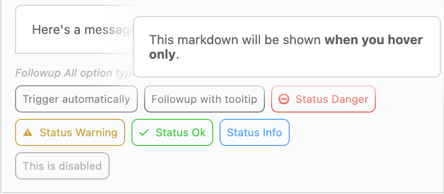
</p>


You can also make them appear on the right by just changing the type of the chat item.

```typescript
mynahUI.addChatItem('tab-1', {
    type: ChatItemType.SYSTEM_PROMPT,
    followUp: {
        ... // Same with above
    }
});
```

<p align="center">
  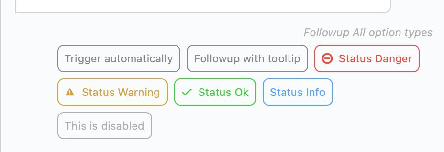
</p>

---

## `codeReference`
This is one of the most complex and hard to tell features you can use on `MynahUI`. But it basically allows you to add some highlights and let them show some tooltips when user hovers to them. 

They reflect their position according to the whole body

**BUT;** if they appear inside a code block, when user clicks one of the copy or the insert to cursor position buttons in the footer of the code block, that `codeReference` content span position will be recalculated according to the position inside the code block while sending it to the events `onCopyCodeToClipboard` or `onCodeInsertToCursorPosition` which can be binded through [Constructor properties](./PROPERTIES.md).

#### Note:
The position for the recommandation span has to be calculated considering all chars in the string. Even the back ticks etc.

```typescript
interface ReferenceTrackerInformation {
  licenseName?: string; // optional, not used on UI
  repository?: string; // optional, not used on UI
  url?: string; // optional, not used on UI
  recommendationContentSpan: {
    start: number;
    end: number;
  };
  information: string; // supports MARKDOWN, will be shown on tooltip
}
```

Let's see how it works and looks like.

To make it easy to read, let's assume that the below block is the body content for us and we've assigned it to a constant called **`bodyContent`**.

>\#\#\# How to create a React stateless function component\
\
*React .14* introduced a simpler way to define components called stateless functional components.\
\
First let's start generating a react \`functional\` component.
\
\
Functional components are just JavaScript functions. They take in an optional input which we call as \`props\`.
\
\
\`\`\`tsx\
import React from 'react';\
\
interface MyStatelessFunctionalComponentProps {\
    value: string;\
    onChange: (value: string) => void;\
}\
\
export const MyStatelessFunctionalComponent = (props: MyStatelessFunctionalComponentProps) => {\
    return <>\
        \<input\
            type="text"\
            placeholder="placeholder"\
            value={props.value}\
            onChange={props.onChange}/>\
    </>\
}\
\`\`\`\
\[Link inside body!\]\(https://google.com\).\
\
In this case, our input component will only use the given value through props which will come from the parent and it will not have any state. When you type into the input element, even it will change the value visually, it will not change the actual holded value. We should inform parent when the value is changed. We will use \`onChange\` prop here.\
&nbsp;

**And let's use that `bodyContent` now.**
```typescript
const mynahUI = new MynahUI({
    tabs: {
        'tab-1': {
            ...
        }
    }
});
const bodyContent = MARKDOWN; // above markdown text

mynahUI.addChatItem('tab-1', {
    type: ChatItemType.ANSWER,
    body: bodyContent,
    codeReference: [
        {
            recommendationContentSpan: {
                start: 362,
                end: 470
            },
            information: 'Reference code *under the MIT license* from repository `amazon`.'
        },
        {
            recommendationContentSpan: {
                start: 484,
                end: 514
            },
            information: '**Reference tracker information:**\n\rReference code *under the MIT license* from repository `aws`.'
        }
    ]
});
```

<p align="center">
  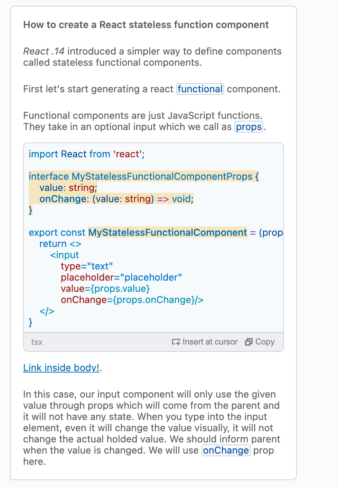
</p>

Here's what you'll see when you hover to them.

<p align="center">
  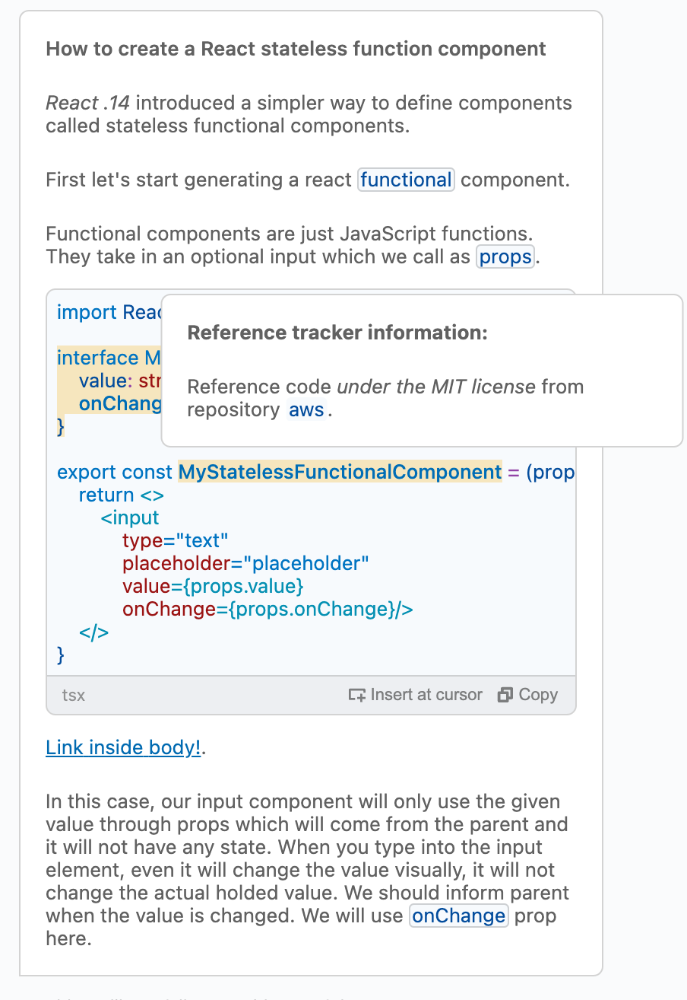
</p>

<p>
  <br />
</p>

---

<p>
  <br />
</p>

## `NotificationProps`

To show a notification inside the `MynahUI` block, you can use the notify function, and here's how they look like.

```typescript
enum NotificationType {
  INFO = ...,
  SUCCESS = ...,
  WARNING = ...,
  ERROR = ...,
}

interface NotificationProps {
  duration?: number;
  type?: NotificationType;
  title?: string;
  content: NotificationContentType | NotificationContentType[]; // Can be a string or HTMLElement
  onNotificationClick?: () => void;
  onNotificationHide?: () => void;
}
```

Here are some examples:

```typescript
const mynahUI = new MynahUI(...);
mynahUI.notify({
    content: 'Content block', // not optional
    duration: -1, // will stay forever until user cliks,
    type: NotificationType.INFO, // This is the default
    title: 'Notification',
});
```
<p align="center">
  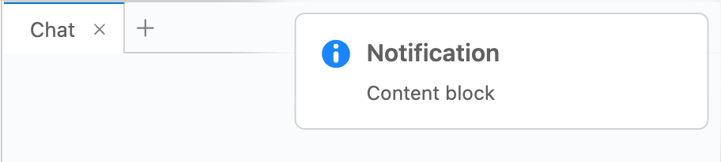
</p>

```typescript
const mynahUI = new MynahUI(...);
mynahUI.notify({
    content: 'An error occured.',
    duration: 5000, // will stay 5 seconds on the screen
    type: NotificationType.ERROR,
    title: 'Error',
});
```

<p align="center">
  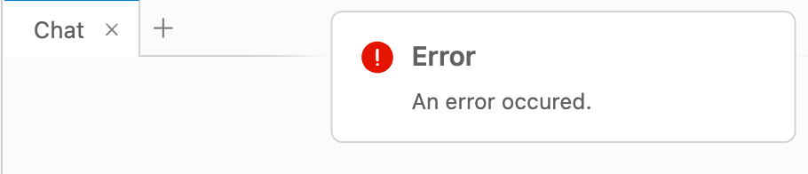
</p>

```typescript
const mynahUI = new MynahUI(...);
mynahUI.notify({
    content: 'This is the last warning!',
    duration: 5000,
    type: NotificationType.WARNING,
    title: 'Warning!',
});
```

<p align="center">
  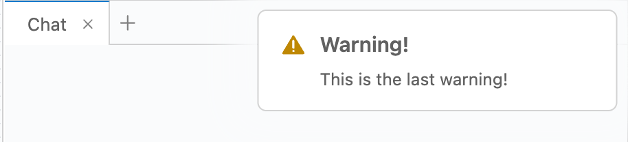
</p>

```typescript
const mynahUI = new MynahUI(...);
mynahUI.notify({
    content: 'You\'ve succeeded!',
    duration: 5000,
    type: NotificationType.SUCCESS,
    title: 'Congrats!',
});
```

<p align="center">
  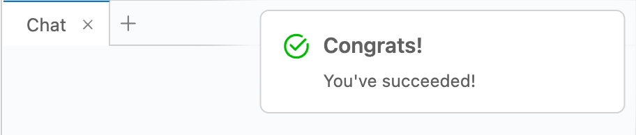
</p>


---

## ChatPrompt
This is the object model which will be sent along with the `onChatPrompt` event.

```typescript
export interface ChatPrompt {
  prompt?: string;
  escapedPrompt?: string; // Generally being used to send it back to mynah-ui for end user prompt rendering
  command?: string;
  context?: string[];
}
```

---

# `DetailedListItem`

DetailedList items can be rendered in an `DetailedListItemGroup` within a `DetailedList`. These items are full width information displays, with an optional icon on the left, and room for a title, description, and a list of actions. Items with children display an arrow icon by default, but when disabled they can display custom text such as "pending" instead of the arrow icon.

```typescript
export interface DetailedList {
  filterOptions?: FilterOption[] | null;
  list?: DetailedListItemGroup[];
  header?: {
    title?: string;
    icon?: MynahIcons | MynahIconsType;
    description?: string;
  };
}

export interface DetailedListItemGroup {
  groupName?: string;
  actions?: Action[];
  icon?: MynahIcons | MynahIconsType;
  children?: DetailedListItem[];
}

export interface DetailedListItem {
  title?: string;
  name?: string;
  id?: string;
  icon?: MynahIcons | MynahIconsType;
  description?: string;
  disabled?: boolean;
  followupText?: string;
  clickable?: boolean;
  actions?: ChatItemButton[];
  children?: DetailedListItemGroup[];
  keywords?: string[];
  disabledText?: string;
}
```

---

### `quickActionCommandsHeader` (default: `{}`)
Quick action commands header displays an informational banner above the quick action commands list when users hit `/` in the input. This is useful for providing additional context, warnings, or guidance about the available commands.

The header supports various status styles (info, success, warning, error) and can include an icon, title, and description.

```typescript
const mynahUI = new MynahUI({
    tabs: {
        'tab-1': {
            ...
        }
    }
});

mynahUI.updateStore('tab-1', {
    quickActionCommands: [
        // ... your commands here
    ],
    quickActionCommandsHeader: {
        status: 'warning',
        icon: MynahIcons.INFO,
        title: 'New agentic capabilities',
        description: 'You can now ask Q directly in the chat. You don\'t need to explicitly use /dev, /test, or /doc commands anymore.',
    }
})
```

<p align="center">
  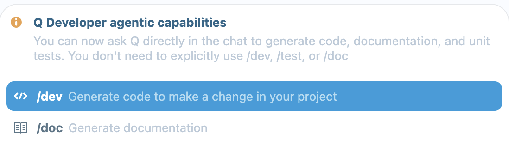
</p>

The header will appear above the quick action commands list and provides information to users about new features.

---
