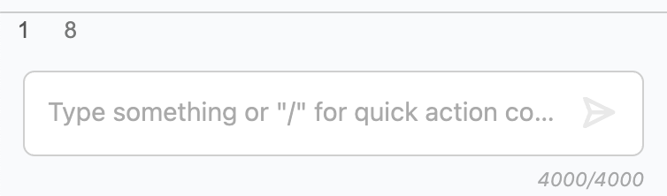
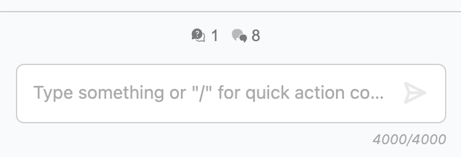
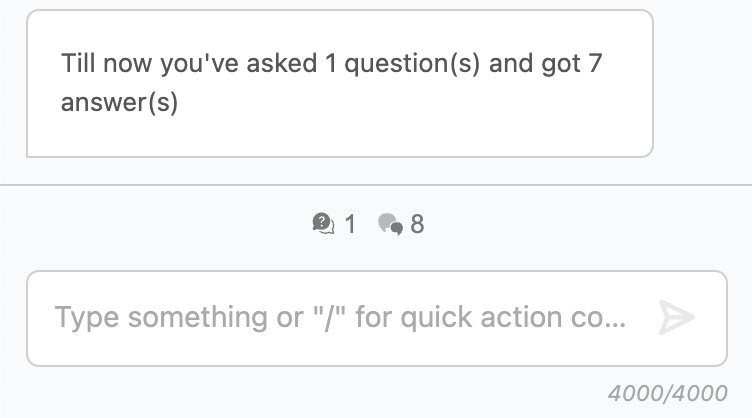

## Hey developer!

Would you like to improve, or add new components to `mynah-ui`? Then here's a guide for you, which will both tell the basics, rules and a complete guide to a functional component additions.

### Before you start!

__There are a few key things you need to keep in mind all the time.__

- As you can see from the project type on github _(which is a guess by github)_, it might look like `mynah-ui` is an `SCSS` project. And to be fair, it is not completely wrong. We're trying to solve as much as we can with css. On the typescript/code side, we're just generating dom elements, making calculations and more importantly: toggling css classes on and off for the elements we create. 
  - If you don't feel confident with css/scss, please start to dive deep to the sources and start to learn as much as you can. But you can always follow other components' scss files to have an idea about our approach.
  - Inside `mynah-ui` **we DON'T use any single static value for any css property**. We have a list of variables, and surprise, those are not scss variables but css custom properties. If you couldn't find the value you're looking for in the variables, add yours, but for sizings you shouldn't.
  - No inline styles or style injections!
- Another key thing is the DOM generation process. Never use custom implementations while creating your dom element. We have the lovely singleton class called [`DomBuilder`](https://github.com/aws/mynah-ui/blob/387ffb8942de5376b5ef02a9cffce623c8fbb34b/src/helper/dom.ts#L73). 
  - `DomBuilder` gives us two important ability;
    -  First of it is to have an `ExtendedHTMLElement` instead of a normal `HTMLElement` which gives you functions like `addClass`, `removeClass`, `toggleClass`, `insertChild`, `remove`, `clear` and most important one: `update`. We'll see the example of it a little later on this document. Keep reading ;)
    - Second one is to have one contol point for all dom elements. For example, assume that we're running inside a different platform, and that platform has some problems with `click` events for some reason. We need to add an additional controller or check for all the `click` events which are binded to all kind of elements. Which one is faster? find/replace all events or do it from one single function?. Or adding accessibility implementations which we can control from one single place.
- And, take a deep look to the `MynahUITabsStore` and global event handling. They are the core parts of `mynah-ui` and you'll use them more often then you think.
- One of the most important part of `mynah-ui` is the documentation of it. So if you do some additions, a new attribute on `ChatItem` data model or add a new public function to main class which can be used by the user of `mynah-ui`, **you have to  add the documentation**. If we don't see the additon of the documentation, your PR will be blocked.

<br/>

-----------------------------------

<br/>

# Let's write a new component from scratch!

### Component definition
We want to show how many questions they've asked and how many answers they've got for the active tab to the users. There might be only one tab, which means that no visible tabs available, but there is still at least a tab. But user should also be able to trigger an action by clicking one of these get a detailed report as a new answer on the chat.

First, let's go to the right folder. Navigate to `src/components` folder. Since it will be a simple component, you can directly put it under the `components`. Our file name will be **`question-and-answer-count.ts`**.

### The properties


```typescript
export interface QuestionAndAnswerCountProps {
  tabId: string; // since we're doing it for a tab, it is mandatory to provide the tabId
  // we can also add the click handler here, however we'll use a global event to guide you through everthing
}
```

### The Component
There are a few strict rules we're already talked about above, but for components, the main element has to be in a variable called **`render`** and it has to be public.

```typescript
export class QuestionAndAnswerCount {
  render: ExtendedHTMLElement; // this will be our main wrapper element for this component
  private readonly questionsRender: ExtendedHTMLElement;
  private readonly answersRender: ExtendedHTMLElement;
  private readonly tabId: string;
  private questionCount: number = 0;
  private answerCount: number = 0;

  constructor (props: QuestionAndAnswerCountProps) {
    this.tabId = props.tabId;

    this.questionsRender = DomBuilder.getInstance().build({
      type: 'span',
      children: [ this.questionCount.toString() ]
    });
    this.answersRender = DomBuilder.getInstance().build({
      type: 'span',
      children: [ this.answerCount.toString() ]
    });

    this.render = DomBuilder.getInstance().build({
      type: 'div',
      classNames: [ 'mynah-ui-question-answer-count-wrapper' ],
      children: [
        new Button({
          onClick: () => {},
          children: [ this.questionsRender ],
          primary: false,
        }).render,
        new Button({
          onClick: () => {},
          children: [ this.answersRender ],
          primary: false,
        }).render,
      ]
    });
  }
}
```

Now, we have the general stucture of the component. But there are still a lot missing. First let's start with getting the initial data from the tab.

```typescript
export class QuestionAndAnswerCount {
  render: ExtendedHTMLElement; // this will be our main wrapper element for this component
  private readonly questionsRender: ExtendedHTMLElement;
  private readonly answersRender: ExtendedHTMLElement;
  private readonly tabId:string;
  private questionCount: number;
  private answerCount: number;

  constructor (props: QuestionAndAnswerCountProps) {
    this.tabId = props.tabId;

    // Let's use the MynahUITabStore for the first time and grab all the chat items for that tab during initialization.
    const allChatItemsOfTab = MynahUITabsStore.getInstance().getTabDataStore(props.tabId).getValue('chatItems');
    
    // And send them to the calculation method
    this.calculateAnswersAndQuestions(allChatItemsOfTab);

    this.questionsRender = DomBuilder.getInstance().build({
      type: 'span',
      children: [ this.questionCount.toString() ]
    });
    this.answersRender = DomBuilder.getInstance().build({
      type: 'span',
      children: [ this.answerCount.toString() ]
    });

    this.render = DomBuilder.getInstance().build({
      type: 'div',
      classNames: [ 'mynah-ui-question-answer-count-wrapper' ],
      children: [
        new Button({
          onClick: () => {},
          children: [ this.questionsRender ],
          primary: false,
        }).render,
        new Button({
          onClick: () => {},
          children: [ this.answersRender ],
          primary: false,
        }).render,
      ]
    });
  }

  // Let's calculate them and set the answer and question values
  private readonly calculateAnswersAndQuestions = (chatItems: ChatItem[]): void => {
    this.answerCount = chatItems.filter(chatItem => {
      // Let's check the answer has a real content or not?
      return [ ChatItemType.ANSWER, ChatItemType.ANSWER_STREAM ].includes(chatItem.type) &&
        (chatItem.body != null || chatItem.customRenderer != null || chatItem.formItems != null);
    }).length;

    this.questionCount = chatItems.filter(chatItem => chatItem.type === ChatItemType.PROMPT).length;
  };
}
```


Now we have the initial values with a helper function. For the first time we used the `MynahUITabStore`. You can assume it like a global state manager. But state managers also have their subscribers right? How we'll understand when a new answer or question is rendered for that tab then? Let's add those as well.

```typescript
export class QuestionAndAnswerCount {
  ...

  constructor (props: QuestionAndAnswerCountProps) {
    ...

    this.render = DomBuilder.getInstance().build({
      ...
    });

    // Here's our listener
    MynahUITabsStore.getInstance().addListenerToDataStore(props.tabId, 'chatItems', (newChatItems: ChatItem[]) => {
      // Send the new values to calculation and update the count variables.
      this.calculateAnswersAndQuestions(newChatItems);

      // Now we're using the update function of the DomBuilder
      this.answersRender.update({
        children: [ this.answerCount.toString() ]
      });
      this.questionsRender.update({
        children: [ this.questionCount.toString() ]
      });
    });
  }

  ...
}
```


Instead of the listener additon above you can also use the example below, but we believe that the one above is more readable.
```typescript
MynahUITabsStore.getInstance().getTabDataStore(props.tabId).subscribe('chatItems', (newChatItems: ChatItem[]) => {
    ...
});
```

### Styling

Ok, let's put this component somewhere to see how it looks? Let's put it just before the prompt input field.

navigate to `src/components/chat-item/chat-wrapper.ts` and find the `render` generation part.

```typescript
constructor (props: ChatWrapperProps){
  ...

  this.render = DomBuilder.getInstance().build({
    type: 'div',
    classNames: [ 'mynah-chat-wrapper' ],
    attributes: {
      'mynah-tab-id': this.props.tabId,
    },
    persistent: true,
    children: [
      ...
      this.intermediateBlockContainer,
      // Let's add it before the sticky card location
      new QuestionAndAnswerCount({ tabId: this.props.tabId }).render,
      this.promptStickyCard,
      ...
    ]
  });

  ...
}
```

<p align="center">
  
</p>

As you can see, we have the values, however it looks pretty ugly right? Let's style it!

Now it is time to add our component's style files, navigate to `src/styles/components` and create a new scss file called `_question-answer-count.scss`. And before start to write our styles, add this file to the `styles.scss`.

```scss
// Components
...
@import './components/button';
// Here it is
@import './components/question-answer-count';
@import './components/form-input';
...
```

Now it is time to write our styles

```scss
// Questions and Answers count for tab
.mynah-ui-question-answer-count-wrapper{
    // let's align the spacing with the others
    padding: var(--mynah-sizing-3) var(--mynah-sizing-4) 0 var(--mynah-sizing-4);

    // Show everything horizontally and vertically aligned on center
    display: flex;
    flex-flow: row nowrap;
    align-items: center;
    justify-content: center;
}
```

Ok, now it is getting better but let's also add some icons. For the answer's we can use some we already have, but for questions let's add a new one. This way you'll also learn how to add a new icon to the `mynah-ui` and how it works actually.

Assuming that you alread find your `svg` file which is the only supported type for `mynah-ui` because of the responsive design concerns. Then navigate to folder `src/components/icon/icons` and rename your file to match the pattern with others, no spaces allowed.

And then open the `icon-importer.ts` placed in one parent folder and add your import and name with the same pattern with others.

```typescript
// ICONS
...
import LIST_ADD from './icons/list-add.svg';
import TABS from './icons/tabs.svg';
import PENCIL from './icons/pencil.svg';

import QUESTION from './icons/question.svg';


import COMMENT from './icons/comment.svg';
import LINK from './icons/link.svg';
....


// And also add it to the mappers inside the constructor

export class MynahUIIconImporter {
  private static instance: MynahUIIconImporter;
  private constructor () {
    const mynahIconMappings = {
      ...
      LIST_ADD,
      TABS,
      PENCIL,
      ...
      // Here it is
      QUESTION,
      ...
    };
    ...
  }

  ...
}
```

Last step is to adding it into the ICONS enum. Open the file `src/components/icon.ts`. **Value of the enum should be the file name without the svg extension addition.**

```typescript
export enum MynahIcons {
  ...

  // Here it is
  QUESTION = 'question',
  
  ...
}
```


Ok, we're ready to use our new icon. So let's add the icons to our component. Navigate back to your component.


```typescript
export class QuestionAndAnswerCount {
  ...

  constructor (props: QuestionAndAnswerCountProps) {
    ...

    this.render = DomBuilder.getInstance().build({
      type: 'div',
      classNames: [ 'mynah-ui-question-answer-count-wrapper' ],
      children: [
        new Button({
          onClick: () => {},
          children: [ this.questionsRender ],
          primary: false,
          // Our new icon is here
          icon: new Icon({ icon: MynahIcons.QUESTION }).render
        }).render,
        new Button({
          onClick: () => {},
          children: [ this.answersRender ],
          primary: false,
          // Button component supports icon field by default
          // But you can use icon component anywhere you like
          icon: new Icon({ icon: MynahIcons.CHAT }).render
        }).render,
      ]
    });

    ...
  }

  ...
}
```


Here's the final state of our component. 

<p align="center">
  
</p>


### Adding actions

You're not disallowed to add an event to the component properties and pass the event to the consumer component. However we want to showcase you the global event handling here. Because of that we'll trigger some new custom global events.

First of all, let's define our new event in the global events enum. Navigate to `src/static.ts` and find `MynahEventNames` enum.

```typescript
export enum MynahEventNames {
  RESET_STORE = 'resetStore',
  FEEDBACK_SET = 'feedbackSet',
  ...

  QUESTION_ANSWER_COUNT_CLICK = 'questionAnswerCountClick',
  
  ...
};
```

Now fire this event when any of our buttons clicked.

```typescript
import { DomBuilder, ExtendedHTMLElement } from '../helper/dom';
import { MynahUIGlobalEvents } from '../helper/events';
import { MynahUITabsStore } from '../helper/tabs-store';
import { ChatItem, ChatItemType, MynahEventNames } from '../static';
import { Button } from './button';
import { Icon, MynahIcons } from './icon';

export interface QuestionAndAnswerCountProps {
  tabId: string; // since we're doing it for a tab, it is mandatory to provide the tabId
  // we can also add the click handler here, however we'll use a global event to guide you through everthing
}

export class QuestionAndAnswerCount {
  render: ExtendedHTMLElement; // this will be our main wrapper element for this component
  private readonly questionsRender: ExtendedHTMLElement;
  private readonly answersRender: ExtendedHTMLElement;
  private readonly tabId: string;
  private questionCount: number = 0;
  private answerCount: number = 0;

  constructor (props: QuestionAndAnswerCountProps) {
    ...

    this.render = DomBuilder.getInstance().build({
      type: 'div',
      classNames: [ 'mynah-ui-question-answer-count-wrapper' ],
      children: [
        new Button({
          onClick: this.handleButtonClick,
          ...
        }).render,
        new Button({
          onClick: this.handleButtonClick,
          ...
        }).render,
      ]
    });

    ...
  }

  private readonly handleButtonClick = (): void => {
    MynahUIGlobalEvents.getInstance().dispatch(MynahEventNames.QUESTION_ANSWER_COUNT_CLICK, {
      tabId: this.tabId,
      questions: this.questionCount,
      answers: this.answerCount,
    });
  };

  ...
}

```


Ok, finally, we need to subscribe to this event. Let's do it on the `src/main.ts` and add a chat answer with the incoming data we have.


```typescript
export class MynahUI {
  private readonly render: ExtendedHTMLElement;
  ...

  constructor (props: MynahUIProps) {
    ...
  }

  ...

  private readonly addGlobalListeners = (): void => {
    ...

    MynahUIGlobalEvents.getInstance().addListener(MynahEventNames.QUESTION_ANSWER_COUNT_CLICK, (data) => {
      this.addChatItem(data.tabId, {
        type: ChatItemType.ANSWER_STREAM,
        body: `Till now, you've asked ${data.questions as string} question(s) and got ${data.answers as string} answer(s).`
      });
    });
  };

  ...
}
```


Ok, when we click, expect to see something like below.

<p align="center">
  
</p>


<br/>
<br/>

----------------

<br/>
<br/>

## Congratulations!

You've created an actuall and usable component. To remind you again about what is not allowed and what you need to take into account while contributing, here's a short list:

- **Styling**
  - No inline styles
  - No style injections (unless it is mandatory, please discuss)
  - No static values for css properties
- **Code**
  - Never create doms other with methods than `DomBuilder`
  - Use `MynahUITabsStore` data store carefully, do not duplicate anything and never use it for non tab or chat content related things.
  - Always clearly define your types
- **Tests (see `TESTING.MD`)**
  - Add your unit tests to check the basic functionality of it works or not
  - Add E2E tests to test the user flows
- **Documentation**
  - Each change on `mynah-ui` has to go into the related documentation if it adds/changes/removes anything exposed. 

<br/>
<br/>


*For further questions, please create a request!*