# Mynah UI Constructor Properties
You can configure your Chat UI's initial render and defaults through these properties as well as connecting the events which will trigger after user interactions. Since all of the props are optional, feel free to assign only the ones you need.
```typescript
export interface MynahUIProps {
  rootSelector?: string;
  defaults?: MynahUITabStoreTab;
  tabs?: MynahUITabStoreModel;
  config?: Partial<ConfigModel>;
  splashScreenInitialStatus?: {
    visible: boolean;
    text?: string;
    actions?: Action[];
  };
  onShowMoreWebResultsClick?: (
    tabId: string,
    messageId: string,
    eventId?: string) => void;
  onReady?: () => void;
  onFocusStateChanged?: (focusState: boolean) => void;
  onVote?: (
    tabId: string,
    messageId: string,
    vote: RelevancyVoteType,
    eventId?: string) => void;
  onStopChatResponse?: (
    tabId: string,
    eventId?: string) => void;
  onResetStore?: (tabId: string) => void;
  onChatPrompt?: (
    tabId: string,
    prompt: ChatPrompt,
    eventId?: string) => void;
  onFollowUpClicked?: (
    tabId: string,
    messageId: string,
    followUp: ChatItemAction,
    eventId?: string) => void;
  onInBodyButtonClicked?: (
    tabId: string,
    messageId: string,
    action: {
      id: string;
      text?: string;
      formItemValues?: Record<string, string>;
    },
    eventId?: string) => void;
  onTabChange?: (
    tabId: string,
    eventId?: string) => void;
  onTabAdd?: (
    tabId: string,
    eventId?: string) => void;
  onContextSelected?: (
    contextItem: QuickActionCommand,
  ) => boolean;
  onTabRemove?: (
    tabId: string,
    eventId?: string) => void;
  /**
   * @param tabId tabId which the close button triggered
   * @returns boolean -> If you want to close the tab immediately send true
   */
  onBeforeTabRemove?: (
    tabId: string,
    eventId?: string) => boolean;
  onChatItemEngagement?: (
    tabId: string,
    messageId: string,
    engagement: Engagement) => void;
  onCodeBlockActionClicked?: (
    tabId: string,
    messageId: string,
    actionId: string,
    data?: string,
    code?: string,
    type?: CodeSelectionType,
    referenceTrackerInformation?: ReferenceTrackerInformation[],
    eventId?: string,
    codeBlockIndex?: number,
    totalCodeBlocks?: number,) => void;
  onCopyCodeToClipboard?: (
    tabId: string,
    messageId: string,
    code?: string,
    type?: CodeSelectionType,
    referenceTrackerInformation?: ReferenceTrackerInformation[],
    eventId?: string,
    codeBlockIndex?: number,
    totalCodeBlocks?: number,
    data?: string,) => void;
  onCodeInsertToCursorPosition?: (
    tabId: string,
    messageId: string,
    code?: string,
    type?: CodeSelectionType,
    referenceTrackerInformation?: ReferenceTrackerInformation[],
    eventId?: string,
    codeBlockIndex?: number,
    totalCodeBlocks?: number,
    data?: string,) => void;
  onSourceLinkClick?: (
    tabId: string,
    messageId: string,
    link: string,
    mouseEvent?: MouseEvent,
    eventId?: string) => void;
  onLinkClick?: (
    tabId: string,
    messageId: string,
    link: string,
    mouseEvent?: MouseEvent,
    eventId?: string) => void;
  onFormLinkClick?: (
    link: string,
    mouseEvent?: MouseEvent,
    eventId?: string) => void;
  onInfoLinkClick?: (
    tabId: string,
    link: string,
    mouseEvent?: MouseEvent,
    eventId?: string) => void;
  onSendFeedback?: (
    tabId: string,
    feedbackPayload: FeedbackPayload,
    eventId?: string) => void;
  onFormModifierEnterPress?: (
    formData: Record<string, string>,
    tabId: string,
    eventId?: string) => void;
  onFormTextualItemKeyPress?: (
    event: KeyboardEvent,
    formData: Record<string, string>,
    itemId: string;
    tabId: string,
    eventId?: string) => boolean;
  onFormChange?: (
    formData: Record<string, any>,
    isValid: boolean,
    tabId: string) => void;
  onCustomFormAction?: (
    tabId: string,
    action: {
      id: string;
      text?: string;
      formItemValues?: Record<string, string>;
    },
    eventId?: string) => void;
  onPromptInputOptionChange?: (
    tabId: string,
    optionsValues: Record<string, string>,
    eventId?: string) => void;
  /**
   * @deprecated since version 4.6.3. Will be dropped after version 5.x.x. Use {@link onFileClick} instead
   */
  onOpenDiff?: (
    tabId: string,
    filePath: string,
    deleted: boolean,
    messageId?: string,
    eventId?: string) => void;
  onFileClick?: (
    tabId: string,
    filePath: string,
    deleted: boolean,
    messageId?: string,
    eventId?: string) => void;
  onFileActionClick?: (
    tabId: string,
    messageId: string,
    filePath: string,
    actionName: string,
    eventId?: string) => void;
  onTabBarButtonClick?: (
    tabId: string,
    buttonId: string,
    eventId?: string) => void;
  onSplashLoaderActionClick?: (
    action: Action,
    eventId?: string) => void;
  onPromptTopBarItemAdded?: (
    tabId: string,
    topBarItem: ChatItemButton,
    eventId?: string) => void;
  onPromptTopBarItemRemoved?: (
    tabId: string,
    topBarItemId: string,
    eventId?: string) => void;
  onPromptTopBarButtonClick?: (
    tabId: string,
    topBarButton: ChatItemButton,
    eventId?: string) => void;
  onOpenFileDialogClick?: (
    tabId: string,
    fileType: string,
    insertPosition: number
  ) => void;
  onFilesDropped?: (
    tabId: string,
    files: FileList,
    insertPosition: number
  ) => void;
}
```
_Let's deep dive into each property you can set._

### But before that, what is `eventId`?
You may notice that a vast majority of the event functions have `eventId` property. We're sending a unique `eventId` **for all real intended user actions** like clicks, prompts or tab related actions. 
It is mandatory to send it as an argument for some functions like `mynahUI.selectTab`.You need to send the incoming `eventId` from the connected event function to change a tab programmatically. Because without a user intent, you cannot change a tab. 

And those kind of functions **will only work** with the last `eventId`. So you cannot store an id and send it after several different user actions. 

---------
### `rootSelector`
_(default: `"body"`)_

rootSelector simply allows you to set which dom element you want to render the whole chat interface including the tabs and the chat prompt block and also the chat items. It will also create temporary or portal elements inside the same element such as notifications, custom dropdown blocks and also tooltips with rich content. However, they'll exceed the views boundaries.

```typescript
...
rootSelector: "#chat-wrapper", // default: "body"
...
```
---------

### `defaults`
_(default: `undefined`)_

defaults is here for you to set the default content and parameters for every new tab will be opened by the end user or created on the runtime without giving a specific data. You can set the prompt related fields, initial chat bubbles, or any parameter on a tab's [data model](./DATAMODEL.md).

```typescript
...
defaults: {
    store:{
        // ...
    }
}, // default: undefined
...
```
**For more information about what is the data model for the store attribute please refer to [Data Model Documentation](./DATAMODEL.md)**

---

### splashScreenInitialStatus
_(default: `undefined`)_

To initially show the splash loader with some text and actions, you can use this property. Even before the rest of the data is initialized, it will show you the splash loader.

```typescript
...
splashScreenInitialStatus?: {
  visible: boolean;
  text?: string;
  actions?: Action[];
}, // default: undefined
...
```

---

### `tabs`
_(default: `undefined`)_

tabs is here for you to set the initial tabs with their initial content while initializing and rendering the UI for the first time. You can set anything related with the tab and or any parameter on a tab's [data model](./DATAMODEL.md).

It is pretty handy to keep the state of the whole UI and send it back while reinitializing after a refresh for example.

_Note: You cannot set it on the runtime, it is just for initialization._

```typescript
...
tabs: {
    "Unique_Tab_Id": {
        isSelected: true | false, // default: false
        store:{
            // ...
        }
    },
    ...
}, // default: undefined
...
```
**For more information about what is the data model for the store attribute please refer to [Data Model Documentation](./DATAMODEL.md)**

---

### `config`
_(default: `undefined`)_

You can set the config here.

_Note: You cannot set it on the runtime, it is just for initialization._

```typescript
...
config: {
    // Do not forget that you have to provide all of them
    // Config doesn't allow partial set of texts
    texts: {
        mainTitle: string;
        feedbackFormTitle: string;
        feedbackFormOptionsLabel: string;
        feedbackFormCommentLabel: string;
        feedbackThanks: string;
        feedbackReportButtonLabel: string;
        codeSuggestions: string;
        files: string;
        insertAtCursorLabel: string;
        copy: string;
        showMore: string;
        save: string;
        cancel: string;
        submit: string;
        stopGenerating: string;
        copyToClipboard: string;
        noMoreTabsTooltip: string;
        codeSuggestionWithReferenceTitle: string;
        spinnerText: string;
    };
    // Options to show up on the overlay feedback form
    // after user clicks to downvote on a chat item
    // and clicks 'Report' again
    feedbackOptions: Array<{
        label: string;
        value: string;
    }>;
    maxTabs: number;
}, // default: undefined
...
```
**Refer to the [configuration](./CONFIG.md) for more details**

---
<p><br/></p>

# Events
_Now let's dive deep into the events you can catch from the UI_

---

### `onShowMoreWebResultsClick`

This event will be fired when end user clicks to show all resources down arrow button and pass the arguments `tabId` and `messageId`.

<p align="center">
  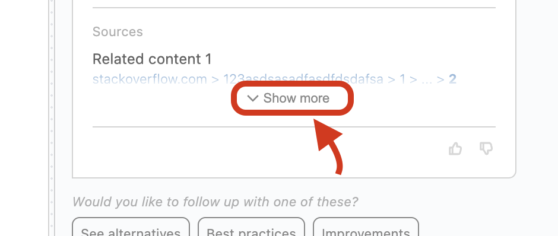
</p>

```typescript
...
onShowMoreWebResultsClick: (
    tabId: string,
    messageId: string) => {
      console.log(`Sent from tab: ${tabId}`);
      console.log(`From message card: ${messageId}`);
    };
...
```

---

### `onReady`

This event will be fired when the UI is initialized and rendered without any arguments.

```typescript
...
onReady: () => {
      console.log('UI is ready');
    };
...
```

---

### `onFocusStateChanged`

This event will be fired whenever user targets to MynahUI or wents away.

```typescript
...
onFocusStateChanged: (focusState: boolean) => {
      console.log(`MynahUI is ${focusState ? 'focused' : 'not focused'}.`);
    };
...
```

---

### `onVote`

This event will be fired when end user clicks one of the thumbs up or down buttons to vote the answer. It will pass the arguments `tabId`, `messageId` and the `vote`.

_Please refer to the [data model](./DATAMODEL.md) to learn how to enable vote buttons for chat answers_

<p align="center">
  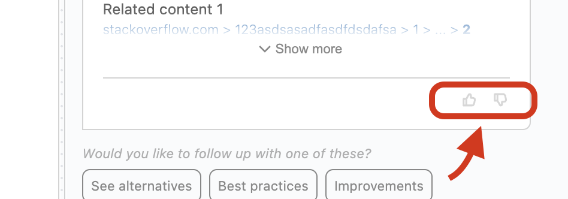
</p>

```typescript
...
onVote: (
    tabId: string,
    messageId: string,
    vote: RelevancyVoteType) => {
      console.log(`Sent from tab: ${tabId}`);
      console.log(`Vote for message: ${messageId}`);
      console.log(`Vote: ${vote}`); // 'upvote' | 'downvote'
    };
...
```

---

### `onStopChatResponse`

This event will be fired when end user clicks to `Stop generating` button. It will pass only the `tabId` argument. To enable this feature globally, you need to set this function

_Please refer to the [data model](./DATAMODEL.md) to learn how to enable/disable onStopChatResponse for individual tabs_

<p align="center">
  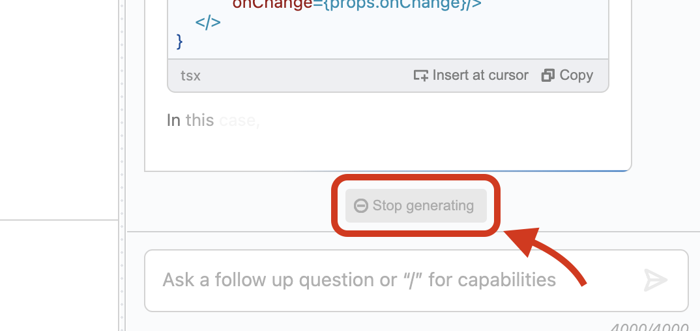
</p>

```typescript
...
onStopChatResponse: (tabId: string):void => {
      console.log(`Sent from tab: ${tabId}`);
    };
...
```

---

### `onResetStore`

This event will be fired when the store is reset for that specific tab. It will pass only the `tabId` argument.

```typescript
...
onResetStore: (tabId: string):void => {
      console.log(`Store reset for tab: ${tabId}`);
    };
...
```

---

### `onChatPrompt`

This event will be fired when user hits enter or clicks to send button on the prompt input field. It will pass `tabId` and the `prompt` object as arguments. 

_Please refer to the [data model](./DATAMODEL.md) to learn more about the `ChatPrompt` object type._

<p align="center">
  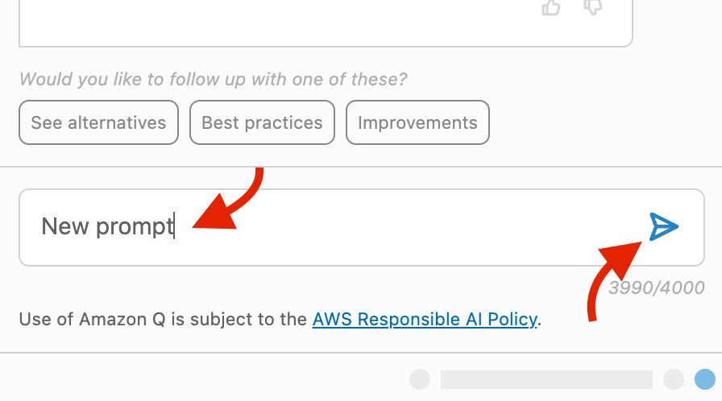
</p>

```typescript
...
onChatPrompt?: (
    tabId: string,
    prompt: ChatPrompt):void => {
      console.log(`Sent from tab: ${tabId}`);
      console.log(`Prompt text (as written): ${prompt.prompt}`);
      console.log(`Prompt text (HTML escaped): ${prompt.escapedPrompt}`);
      console.log(`Command (if selected from quick actions): ${prompt.command}`);
      console.log(`Options {${Object.keys(prompt.options??{}).map(op=>`'${op}': '${prompt.options?.[op] as string}'`).join(',') ?? ''}}`);
      console.log(`Context (if selected from context selector): ${(prompt.context??[]).join(', ')}`);
      console.log(`Attachment (feature not available yet): ${prompt.attachment}`);
    };
...
```

### Very important note
You have to manually add the chat item for the prompt with the given ways on the **[How to use](./USAGE.md)** document.

---

### `onFollowUpClicked`

This event will be fired when user selects one of the available followups. It will pass `tabId`, `messageId` and the clicked `followUp` object as arguments.

**Important note:** If the clicked followup item contains `prompt` attribute, MynahUI will automatically add the `ChatItem` to the chat stack and will render it as a user prompt chat bubble with the `prompt` attributes text (on the right side). If you want to avoid this and manually control what will be added as a chat item or not adding anything at all after the selection of the followup, leave the `prompt` attribute undefined.

**Important note:** Followup texts show up at most 40 chars in the followup pill. If the length is more than 40 chars it will pop up a tooltip to show the rest of the text. However, it will not break the `description` to show up as a tooltip, instead if there is also the `description` attribute, it will append that to a new line in the tooltip.

_Please refer to the [data model](./DATAMODEL.md) to learn more about the `ChatItemAction` object type._

<p align="center">
  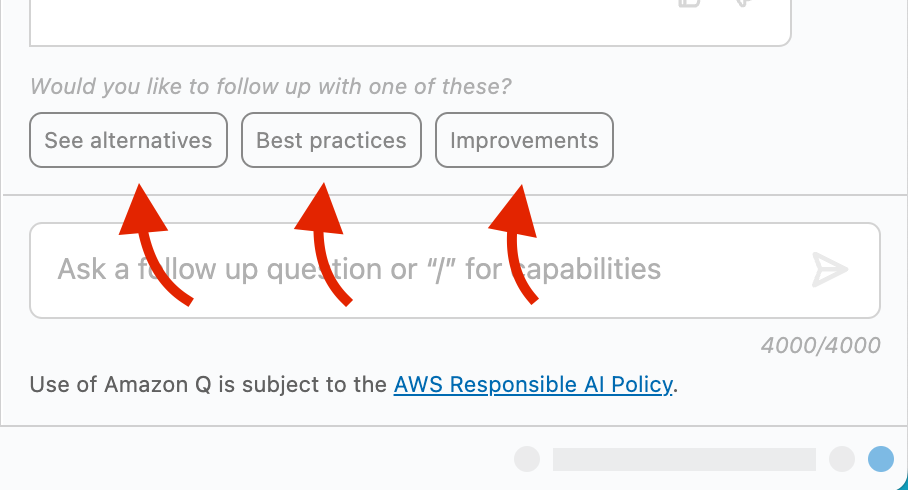
</p>

```typescript
...
onFollowUpClicked?: (
    tabId: string,
    messageId: string,
    followUp: ChatItemAction):void => {
      console.log(`Sent from tab: ${tabId}`);
      console.log(`For the message: ${messageId}`);
      console.log(`Followup type (free text): ${followUp.type}`);
      console.log(`Followup text (visible on screen): ${followUp.pillText}`);
    };
...
```

---

### `onInBodyButtonClicked`

This event will be fired when user clicks one of the available followups.

It will pass you the `tabId`, `messageId` and information about the clicked `action`.

And the last argument `action` will contain:
```
id: string; // Id of the action clicked
text?: string; // Label text of the action
formItemValues?: Record<string, string>; // Form item values if you add any using the formItems
```
Please refer to [formItems](./DATAMODEL.md#formItems) for combining actions and form items in a card.

**Important note:** If you clicked an action item which doesn't have the value `true` for `keepCardAfterClick` attribute, that click will remove the whole card. Otherwise it will disable all the actions and the form items inside that card.

_Please refer to the [data model](./DATAMODEL.md) to learn more about the `ChatItemButton` object type._

<p align="center">
  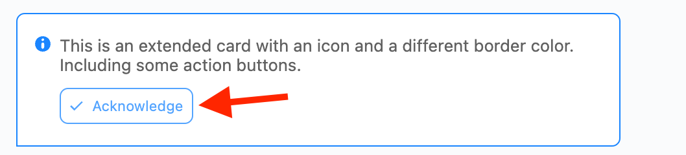
</p>

```typescript
...
onInBodyButtonClicked?: (
    tabId: string,
    messageId: string,
    action):void => {
      console.log(`Sent from tab: ${tabId}`);
      console.log(`For the message: ${messageId}`);
      console.log(`Action id: ${action.id}`);
      console.log(`Action text: ${action.text ?? ''}`);
      console.log(`Form item values: ${JSON.stringify(action.formItemValues ?? {})}`);
    };
...
```

---

### `onTabChange`

This event will be fired when user changes the tab. It will only pass `tabId` for the new selected tab as argument.

<p align="center">
  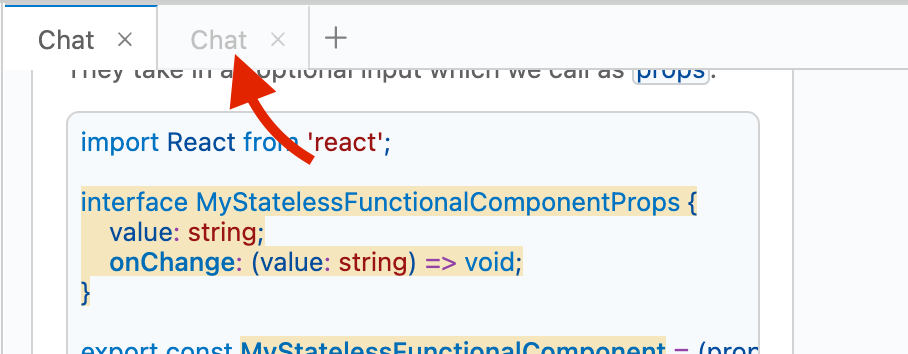
</p>

```typescript
...
onTabChange?: (tabId: string):void => {
      console.log(`New selected tabId: ${tabId}`);
    };
...
```

---

### `onTabAdd`

This event will be fired when user clicks the add tab button or double clicks to an empty space on the tab bar to open a new tab. It will only pass `tabId` for the new tab as argument.

<p align="center">
  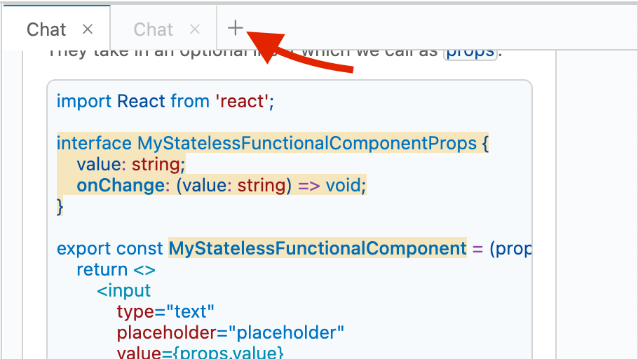
</p>

```typescript
...
onTabAdd?: (tabId: string):void => {
      console.log(`New tabId: ${tabId}`);
    };
...
```

---

### `onContextSelected`

This event will be fired whenever a user selects an item from the context (`@`) list either using mouse click or keyboard actions. It is only triggered for items without children, i.e. only leaves in the tree. The data of the selected context item can be accessed through the `contextItem`. This event handler expects a boolean return:
- Returning `true` indicates that the context item should be added to the prompt input text.
- Returning `false` indicates that nothing should be added to the prompt input, and the triggering string should be cleared. E.g. if a user types `@wor` and presses tab on the `@workspace` action, the `@wor` would be removed from the prompt input and no context item will be added.

```typescript
...
onContextSelected(contextItem: QuickActionCommand) {
  if (contextItem.command === 'Add Prompt') {
    Log('Custom context action triggered for adding a prompt!')
    return false;
  }
  return true;
},
...
```

---

### `onBeforeTabRemove`

This event will be fired when user clicks the close button but before actually closing the tab. You have **partial control over the tab close**. If you return false to this function, it will not immediately close the tab and will ask an approval from the user. Otherwise it will close the tab. You can set the texts which will be appeared on the confirmation overlay on **[Config/TEXTS](./CONFIG.md#texts)**. It will only pass `tabId` for the closed tab as argument.

<p align="center">
  
</p>

```typescript
...
onBeforeTabRemove: (tabId: string):boolean => {
  // For example you can check if the tab is in loading state or not.
  const isTabLoading = mynahUI.getAllTabs()[tabId].store?.loadingChat;
  return !isTabLoading;
}
...
```

<p align="center">
  
</p>

---

### `onTabRemove`

This event will be fired when user clicks the close button on a tab or middle clicks to the tab to close it but if `onBeforeTabRemove` is not attached or attached but returned `true`. It will only pass `tabId` for the closed tab as argument.

<p align="center">
  
</p>

```typescript
...
onTabRemove?: (tabId: string):void => {
      console.log(`Closed tabId: ${tabId}`);
    };
...
```
---

### `onChatItemEngagement`

This event will be fired when user engages with a system generated chat bubble in various ways like moving/holding the mouse over it more than 3 seconds or selects some text inside the chat message bubble or clicks anywhere inside it. It will pass `tabId`, `messageId` for the engaged chat message bubble and also the `engagement` for the engagement details as arguments.

_Please refer to the [data model](./DATAMODEL.md) to learn more about the `Engagement` object type._

**Note:** This event will be only activated if you bind a function to it. It means that if you leave it undefined it will not listen/track any mouse movement at all for the chat message bubbles. 

<p align="center">
  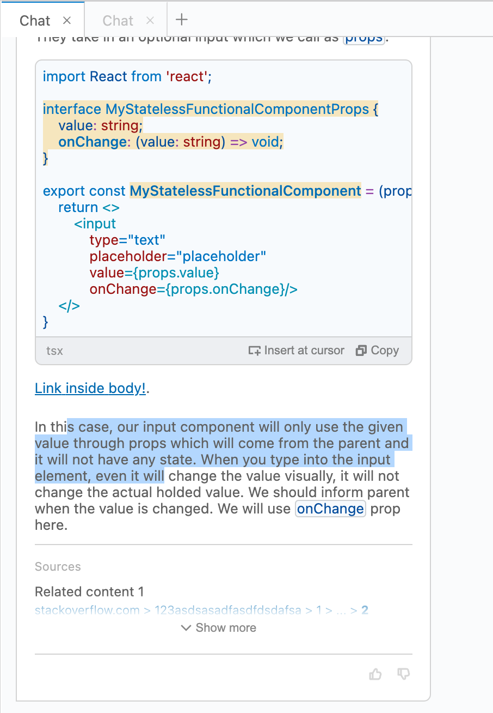
</p>

```typescript
...
onChatItemEngagement?: (
    tabId: string,
    messageId: string,
    engagement: Engagement):void => {
      console.log(`Sent from tab: ${tabId}`);
      console.log(`Engaged message: ${messageId}`);
      console.log(`Engagement type: ${engagement.engagementType}`); // interaction | timespend
      console.log(`Engagement duration: ${engagement.engagementDurationTillTrigger}`);
      console.log(`Engagement total mouse distance travelled: ${engagement.totalMouseDistanceTraveled}`);
      console.log(`Engagement selection:
      x movement: ${engagement.selectionDistanceTraveled?.x}
      y movement: ${engagement.selectionDistanceTraveled?.y}
      selected text: ${engagement.selectionDistanceTraveled?.selectedText}
      `);
    };
...
```
---

### `onCodeBlockActionClicked`

This event will be fired when user clicks one of the buttons from custom added `codeBlockActions` button on the footer of a code block. It will pass `tabId`, `actionId`, `data`, `messageId`, `code` for the copied code to theclipboard as a text, `type` for the type of the code copied (block or selection) and the `referenceTrackerInformation` if the copied code block contains some code reference as the arguments. Finally after the `eventId` attribute, you can get the index of the code block inside that message with `codeBlockIndex` together with total number of code blocks again inside that message with `totalCodeBlocks`.

**Note:** even though the `referenceTrackerInformation` comes to the message with `codeReference` attribute with the index position depending on the whole content of the body of the message, the return of it as an attribute from this event gives the indexes according to position inside that code block.

_Please refer to the [data model](./DATAMODEL.md#codeblockactions) to learn more about the `codeBlockActions`._
_Please refer to the [data model](./DATAMODEL.md#codereference) to learn more about the `ReferenceTrackerInformation` object type._


<p align="center">
  
</p>

```typescript
...
onCodeBlockActionClicked: (
  tabId, 
  messageId, 
  actionId, 
  data, 
  code, 
  type, 
  referenceTrackerInformation, 
  eventId, 
  codeBlockIndex, 
  totalCodeBlocks) => {
    Log(`Code action <b>${actionId}</b> clicked on tab <b>${tabId}</b> inside message <b>${messageId}</b><br/>
      type: <b>${type ?? 'unknown'}</b><br/>
      data: <b>${JSON.stringify(data ?? {})}</b><br/>
      code: <b>${escapeHTML(code ?? '')}</b><br/>
      referenceTracker: <b>${referenceTrackerInformation?.map(rt => rt.information).join('<br/>') ?? ''}</b><br/>
      codeBlockIndex: <b>${(codeBlockIndex ?? 0) + 1}</b> of ${totalCodeBlocks}
    `);
},
...
```
---

### `onCopyCodeToClipboard`

This event will be fired when user clicks the copy button on the footer of a code block or selects some text inside a code block and triggers keyboard shortcuts for copying. It will pass `tabId`, `messageId`, `code` for the copied code to theclipboard as a text, `type` for the type of the code copied (block or selection) and the `referenceTrackerInformation` if the copied code block contains some code reference as the arguments. Finally after the `eventId` attribute, you can get the index of the code block inside that message with `codeBlockIndex` together with total number of code blocks again inside that message with `totalCodeBlocks`.

**Note:** even though the `referenceTrackerInformation` comes to the message with `codeReference` attribute with the index position depending on the whole content of the body of the message, the return of it as an attribute from this event gives the indexes according to position inside that code block.

_Please refer to the [data model](./DATAMODEL.md) to learn more about the `ReferenceTrackerInformation` object type._


<p align="center">
  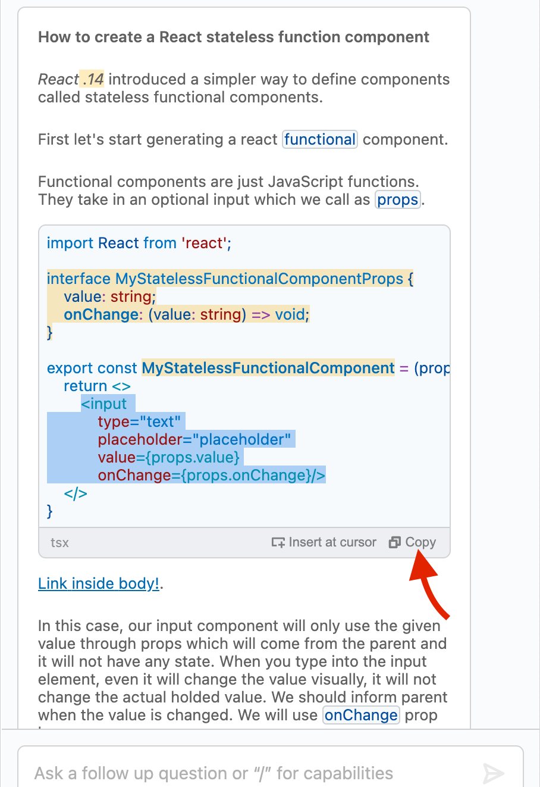
</p>

```typescript
...
onCopyCodeToClipboard?: (
    tabId: string,
    messageId: string,
    code?: string,
    type?: CodeSelectionType,
    referenceTrackerInformation?: ReferenceTrackerInformation[],
    eventId:string,
    codeBlockIndex?: number,
    totalCodeBlocks?: number):void => {
      console.log(`Sent from tab: ${tabId}`);
      console.log(`Code inside message: ${messageId}`);
      console.log(`Copied code: ${code}`);
      console.log(`Copy type: ${type}`); // selection | block
      console.log(`Reference tracker info: ${referenceTrackerInformation?.map(rti=>`${rti.licenseName} ${rti.repository}`).join(', ')}`);
      console.log(`Code block index: ${codeBlockIndex + 1} of ${totalCodeBlocks}`);
    };
...
```
---

### `onCodeInsertToCursorPosition`

This event will be fired when user clicks the copy button on the footer of a code block or selects some text inside a code block and triggers keyboard shortcuts for copying. It will pass `tabId`, `messageId`, `code` for the copied code to theclipboard as a text, `type` for the type of the code copied (block or selection) and the `referenceTrackerInformation` if the copied code block contains some code reference as the arguments. Finally after the `eventId` attribute, you can get the index of the code block inside that message with `codeBlockIndex` together with total number of code blocks again inside that message with `totalCodeBlocks`

**Note:** even though the `referenceTrackerInformation` comes to the message with `codeReference` attribute with the index position depending on the whole content of the body of the message, the return of it as an attribute from this event gives the indexes according to position inside that code block.

_Please refer to the [data model](./DATAMODEL.md) to learn more about the `ReferenceTrackerInformation` object type._


<p align="center">
  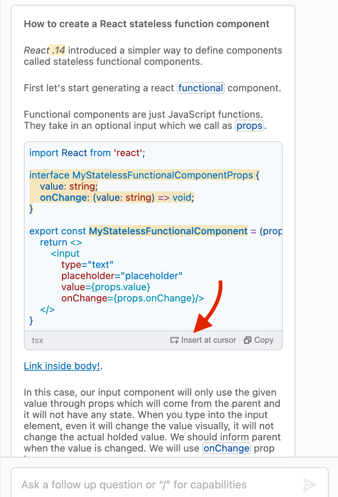
</p>

```typescript
...
onCodeInsertToCursorPosition?: (
    tabId: string,
    messageId: string,
    code?: string,
    type?: CodeSelectionType,
    referenceTrackerInformation?: ReferenceTrackerInformation[],
    eventId:string,
    codeBlockIndex?: number,
    totalCodeBlocks?: number):void => {
      console.log(`Sent from tab: ${tabId}`);
      console.log(`Code inside message: ${messageId}`);
      console.log(`Code to insert: ${code}`);
      console.log(`Copy type: ${type}`); // selection | block
      console.log(`Reference tracker info: ${referenceTrackerInformation?.map(rti=>`${rti.licenseName} ${rti.repository}`).join(', ')}`);
      console.log(`Code block index: ${codeBlockIndex + 1} of ${totalCodeBlocks}`);
    };
...
```
---

### `onSourceLinkClick`

This event will be fired when user clicks one the the sources links after the body of a chat message body. It will pass `tabId`, `messageId`, `link` for the clicked link and the `mouseEvent` for the event object in case if it needs to be prevented as the arguments.

**Note:** For example, JetBrains JCEF WebView opens the links in a new browser view of its own. However to prevent this action and navigate to user's own preferred browser to open the links, you may want to cancel the default behaviour and run your own function to open the OS default browser.


<p align="center">
  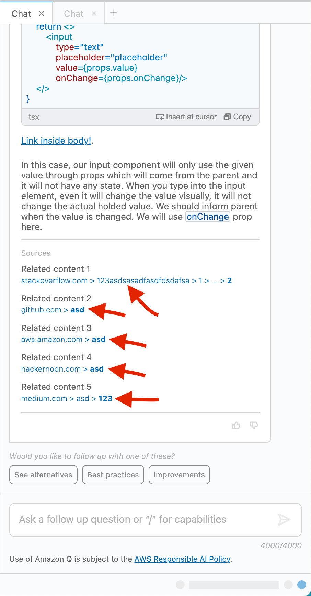
</p>

```typescript
...
onSourceLinkClick?: (
    tabId: string,
    messageId: string,
    link: string,
    mouseEvent?: MouseEvent):void => {
      console.log(`Sent from tab: ${tabId}`);
      console.log(`Source link of message: ${messageId}`);
      console.log(`link: ${link}`);
      // mouseEvent.preventDefault();
    };
...
```
---

### `onLinkClick`

This event will be fired when user clicks a link inside the body of a chat message. It will pass `tabId`, `messageId`, `link` for the clicked link and the `mouseEvent` for the event object in case if it needs to be prevented as the arguments.

**Note:** For example, JetBrains JCEF WebView opens the links in a new browser view of its own. However to prevent this action and navigate to user's own preferred browser to open the links, you may want to cancel the default behaviour and run your own function to open the OS default browser.


<p align="center">
  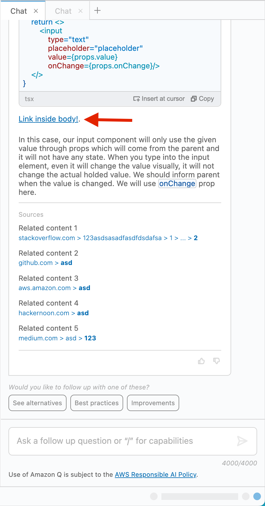
</p>

```typescript
...
onLinkClick?: (
    tabId: string,
    messageId: string,
    link: string,
    mouseEvent?: MouseEvent):void => {
      console.log(`Sent from tab: ${tabId}`);
      console.log(`Source link of message: ${messageId}`);
      console.log(`link: ${link}`);
      // mouseEvent.preventDefault();
    };
...
```
---

### `onFormLinkClick`

This event will be fired when user clicks a link inside the description field on feedback or custom forms. It will pass `link`, for the clicked link and the `mouseEvent` and the to check userIntent the `eventId`.

**Note:** For example, JetBrains JCEF WebView opens the links in a new browser view of its own. However to prevent this action and navigate to user's own preferred browser to open the links, you may want to cancel the default behaviour and run your own function to open the OS default browser.


<p align="center">
  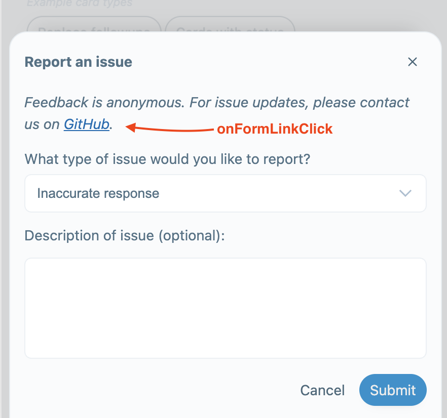
</p>

```typescript
...
onFormLinkClick?: (
    link: string,
    mouseEvent?: MouseEvent):void => {
      console.log(`Sent from Form`);
      console.log(`link: ${link}`);
      // mouseEvent.preventDefault();
    }
...
```
---

### `onInfoLinkClick`

This event will be fired when user clicks a link inside the footer information message below the prompt input field for that tab. It will pass `tabId`, `link` for the clicked link and the `mouseEvent` for the event object in case if it needs to be prevented as the arguments.

**Note:** For example, JetBrains JCEF WebView opens the links in a new browser view of its own. However to prevent this action and navigate to user's own preferred browser to open the links, you may want to cancel the default behaviour and run your own function to open the OS default browser.


<p align="center">
  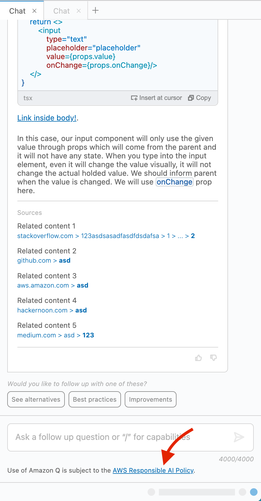
</p>

```typescript
...
onInfoLinkClick?: (
    tabId: string,
    link: string,
    mouseEvent?: MouseEvent):void => {
      console.log(`Sent from tab: ${tabId}`);
      console.log(`link: ${link}`);
      // mouseEvent.preventDefault();
    };
...
```
---

### `onSendFeedback`

This event will be fired when user sends a feedback from the feedback panel which opens after giving a negative vote to a message and follow it with a send feedback button click. It will pass `tabId` and `feedbackPayload` for the feedback details as the arguments.

**Note:** The options for the feedback type are coming from the configuration.

_Please refer to the [configuration](./CONFIG.md) to learn more about the feedback type options._


<p align="center">
  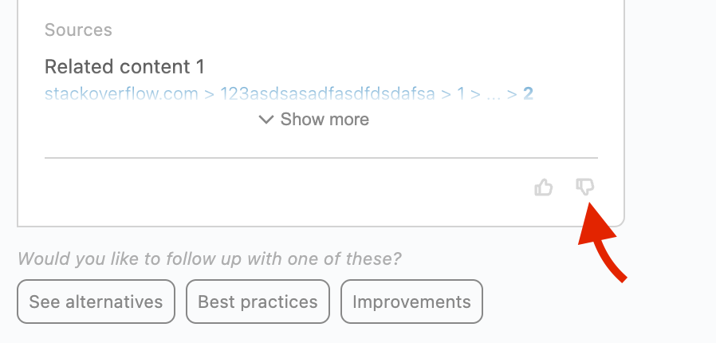
  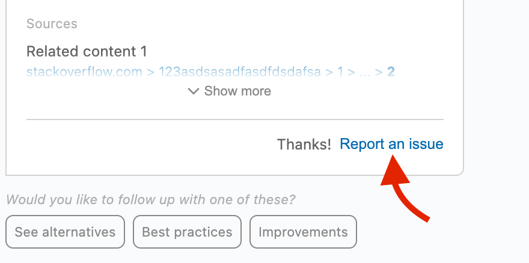
  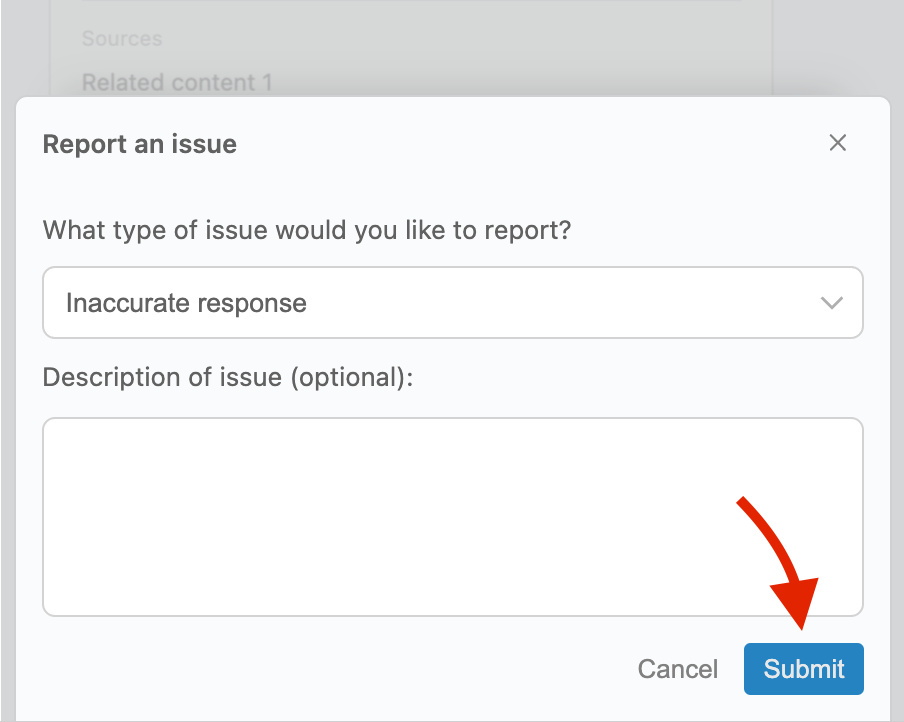
</p>

```typescript
...
onSendFeedback?: (
    tabId: string,
    feedbackPayload: FeedbackPayload):void => {
      console.log(`Sent from tab: ${tabId}`);
      console.log(`Feedback for message: ${feedbackPayload.messageId}`);
      console.log(`Feedback type: ${feedbackPayload.selectedOption}`);
      console.log(`Feedback comment: ${feedbackPayload.comment}`);
      // mouseEvent.preventDefault();
    };
...
```

---

### `onFormModifierEnterPress`

This event will be fired when the user presses the modifier key (`cmd` on macOS, and `ctrl` on Windows / Linux) and the `enter` key at the same time, while focused on a textual form input field. The event will only be triggered for input fields that have set `checkModifierEnterKeyPress: true`, and it will only be triggered if the form is valid and can be submitted. An example use case for this would be submitting the form through a keyboard hotkey action.

```typescript
...
onFormModifierEnterPress?: (
    formData: Record<string, string>,
    tabId: string,
    eventId?: string): void => {
      console.log(`Form modifier enter pressed on tab <b>${tabId}</b>:<br/>
      Form data: <b>${JSON.stringify(formData)}</b><br/>
      `);
    },
...
```

---

### `onFormTextualItemKeyPress`

This event will be fired when the user presses any key on their keyboard for textual form input items **if the form is valid**.

**Important note**: 
- This handler also expects a return as a boolean. If you return **`true`** then the form will be disabled including the following buttons. Also if they are in a custom form overlay panel, that panel will be closed. If you return **`false`**, everything will remain as is. 
- Another important key point is having the `event` object as a KeyboardEvent. With that, you can prevent the default action of the keypress event. See the example below.


```typescript
...
onFormTextualItemKeyPress?: (
    event: KeyaboardEvent
    formData: Record<string, string>,
    itemId: string,
    tabId: string,
    eventId?: string): boolean => {
      console.log(`Form keypress on tab <b>${tabId}</b>:<br/>
      Item id: <b>${itemId}</b><br/>
      Key: <b>${event.keyCode}</b><br/>
      `);
      if((itemId === 'description' || itemId === 'comment') && event.keyCode === 13 && event.ctrlKey !== true && event.shiftKey !== true) {
        event.preventDefault(); // To stop default behavior
        event.stopImmediatePropagation(); // To stop event to bubble to parent or other elements
        // Do your magic, and submit your form data
        return true; // return true to disable the form like a submit button do. It will also close the customForm overlay panel if the items are inside one.
      }
      return false; // Keep the form enabled and if applicable customForm overlay panel open
    },
...
```

---

### `onFormChange`

This event will be fired whenever any value of any input in a form changes. This happens regardless of the validity of the form. 

```typescript
...
onFormChange?: (
    formData: Record<string, string>,
    isValid: boolean,
    tabId: string): void => {
      console.log(`Form change detected on tab <b>${tabId}</b>:<br/>
      Form data: <b>${JSON.stringify(formData)}</b><br/>
      Form valid: <b>${isValid}</b>
      `);
    },
...
```

---

### `onDropDownOptionChange`

This event will be fired when a user selects an option from a dropdown list. It passes the `tabId`, `messageId`, and the selected options.

```typescript
...
onDropDownOptionChange?: (
    tabId: string,
    messageId: string,
    selectedOptions: DropdownListOption[]): void => {
      console.log(`Dropdown selection changed in tab: ${tabId}`);
      console.log(`From message: ${messageId}`);
      console.log(`Selected option: ${selectedOptions[0].label}`);
    };
...
```

<p align="center">
  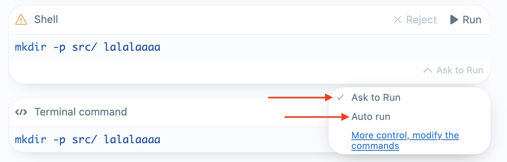
</p>

---

### `onDropDownLinkClick`

This event will be fired when a user clicks on a link within a dropdown list's description. It passes the `tabId` and the `actionId` of the clicked link.

```typescript
...
onDropDownLinkClick?: (
    tabId: string,
    destination: string,
    actionId: string): void => {
      console.log(`Dropdown link clicked in tab: ${tabId}`);
      console.log(`Link action ID: ${actionId}`);
      console.log(`Destination ID: ${destination}`);
    };
...
```

<p align="center">
  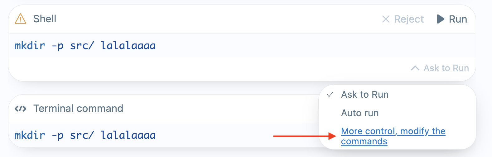
</p>


---

### `onCustomFormAction`

This event will be fired when user clicks one of the buttons inside a custom popup form. It will pass `tabId` and `action`. But `action` argument contains the `id` and `text` of the action clicked and the values for each form item with string values. 


<p align="center">
  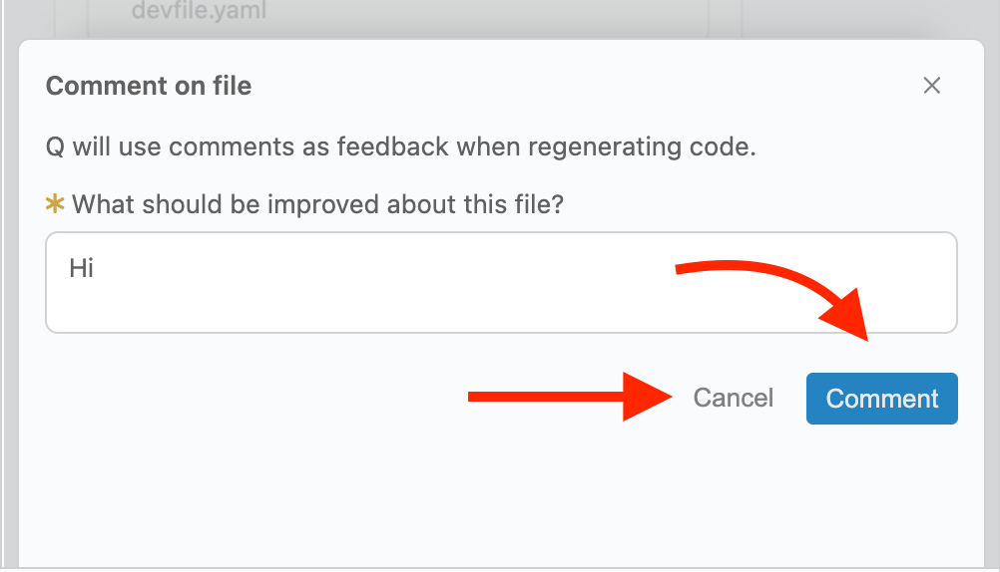
</p>

```typescript
...
onCustomFormAction?: (
    tabId: string,
    action):void => {
      console.log(`Sent from tab: ${tabId}`);
      console.log(`Action id: ${action.id}`);
      console.log(`Action text: ${action.text ?? ''}`);
      console.log(`Form item values: ${JSON.stringify(action.formItemValues ?? {})}`);
    };
...
```
---

### `onPromptInputOptionChange`

This event will be fired when user changes any of the prompt input options. It will pass `tabId` and `optionsValues`. Those options values are string key value pairs for any given form item in the promptInputOptions. 


<p align="center">
  
</p>

```typescript
...
onPromptInputOptionChange: (tabId, optionsValues)=>{
  Log(`Prompt options change for tab <b>${tabId}</b>:<br/>
    ${optionsValues
        ? `<br/>Options:<br/>${Object.keys(optionsValues)
          .map(optionId => {
            return `<b>${optionId}</b>: ${(optionsValues as Record<string, string>)[optionId] ?? ''}`;
          })
          .join('<br/>')}`
        : ''
      }
    `);
},
...
```
---


### `onPromptInputButtonClick`

This event will be fired when user clicks any of the prompt input buttons. It will pass `tabId` and button's `id`. 


<p align="center">
  
</p>

```typescript
...
onPromptInputButtonClick: (tabId, buttonId)=>{
  Log(`Prompt input button ${buttonId} clicked on tab <b>${tabId}</b>`);
},
...
```
---


### `onOpenDiff` [DEPRECATED: will be dropped after version 5.x.x]

This event will be fired when user clicks to a file name on the file list inside a chat message body. It will pass `tabId`, `filePath` for the clicked file, `deleted` to identify if the file is deleted and `messageId` as the arguments.


<p align="center">
  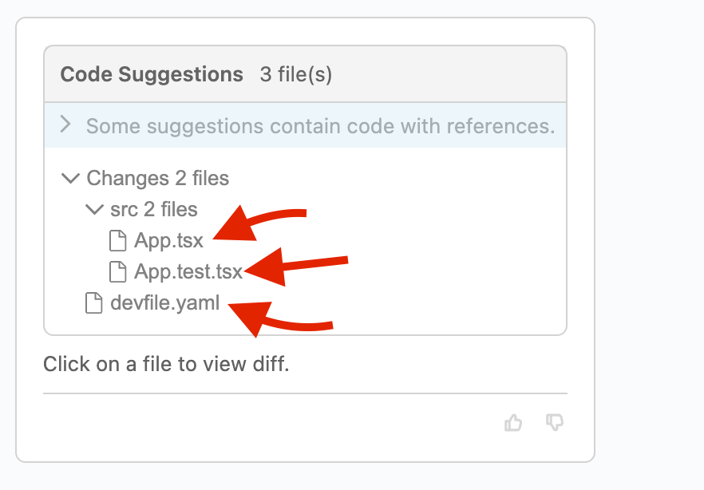
</p>

```typescript
...
onOpenDiff?: (
    tabId: string,
    filePath: string,
    deleted: boolean,
    messageId?: string):void => {
      console.log(`Sent from tab: ${tabId}`);
      console.log(`For message: ${messageId}`);
      console.log(`File to open diff view: ${filePath}`);
      console.log(`Is file deleted: ${deleted}`);
    };
...
```

---


### `onFileClick`

This event will be fired when user clicks to a file name on the file list inside a chat message body. It will pass `tabId`, `filePath` for the clicked file, `deleted` to identify if the file is deleted and `messageId` as the arguments.


<p align="center">
  
</p>

```typescript
...
onFileClick?: (
    tabId: string,
    filePath: string,
    deleted: boolean,
    messageId?: string):void => {
      console.log(`Sent from tab: ${tabId}`);
      console.log(`For message: ${messageId}`);
      console.log(`File to open diff view: ${filePath}`);
      console.log(`Is file deleted: ${deleted}`);
    };
...
```

---

### `onFileActionClick`

This event will be fired when user clicks to an action button for a specific file in a file node tree. It will pass `tabId`, `messageId`, `filePath` and the `actionName`. 

**TIP:** To do further updates on the file tree card, hold the `messageId` then you can use the [updateChatAnswerWithMessageId](./USAGE.md#updateChatAnswerWithMessageId) function to update that specific card.


<p align="center">
  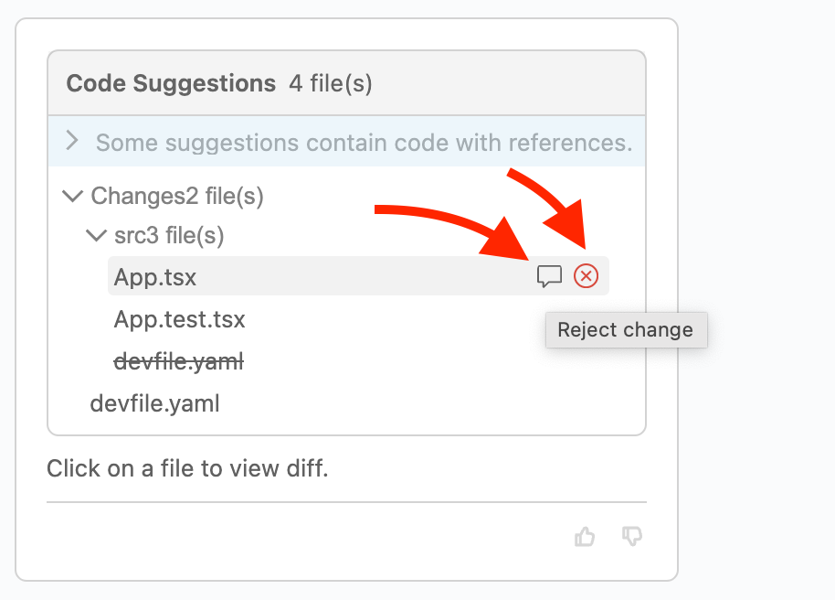
</p>

```typescript
...
onFileActionClick?: (
    tabId: string,
    messageId?: string,
    filePath: string,
    actionName: string):void => {
      console.log(`Sent from tab: ${tabId}`);
      console.log(`For message: ${messageId}`);
      console.log(`File name which the action clicked: ${filePath}`);
      console.log(`The action id/name clicked: ${actionName}`);
    };
...
```

---

### `onTabBarButtonClick`

This event will be fired when user clicks to a button inside the tab tab or a button under a menu item inside the tab bar. 

**TIP:** To configure tab buttons according to a tab please see [DATAMODEL Documentation](./DATAMODEL.md#tabbarbuttons). Or for global tab bar button settings please see [Config Documentation](./CONFIG.md#tabbarbuttons).


<p align="center">
  
  
</p>

```typescript
...
onTabBarButtonClick?: (
    tabId: string,
    buttonId: string,
    eventId?: string):void => {
      console.log(`Sent from tab: ${tabId}`);
      console.log(`Button ID: ${buttonId}`);
    };
...
```


---

### onSplashLoaderActionClick

This event will be fired when user clicks to an action inside the splash loader. 


<p align="center">
  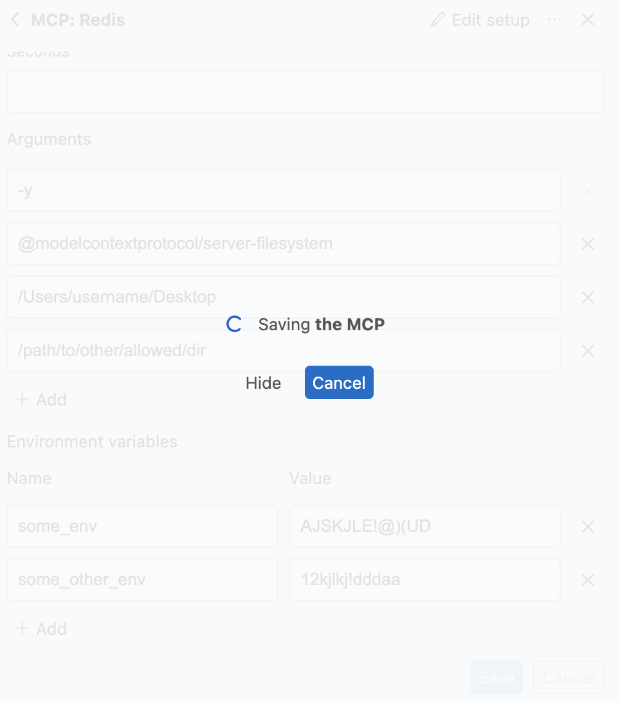
</p>

```typescript
...
onSplashLoaderActionClick?: (
    action: Action,
    eventId?: string)):void => {
      console.log(`Splash loader action click ${action.id}`);
    };
...
```

---

### onPromptTopBarItemAdded

This event will be fired when a new item is added to the prompt top bar. It passes the `tabId`, the added `topBarItem` object, and the `eventId`.

```typescript
...
onPromptTopBarItemAdded?: (
    tabId: string,
    topBarItem: ChatItemButton,
    eventId?: string):void => {
      console.log(`Top bar item added to tab: ${tabId}`);
      console.log(`Item ID: ${topBarItem.id}`);
      console.log(`Item text: ${topBarItem.text}`);
    };
...
```

---

### onPromptTopBarItemRemoved

This event will be fired when an item is removed from the prompt top bar. It passes the `tabId`, the `topBarItemId` of the removed item, and the `eventId`.

```typescript
...
onPromptTopBarItemRemoved?: (
    tabId: string,
    topBarItemId: string,
    eventId?: string):void => {
      console.log(`Top bar item removed from tab: ${tabId}`);
      console.log(`Removed item ID: ${topBarItemId}`);
    };
...
```

---

### onPromptTopBarButtonClick

This event will be fired when a user clicks on a button in the prompt top bar. It passes the `tabId`, the clicked `topBarButton` object, and the `eventId`.

```typescript
...
onPromptTopBarButtonClick?: (
    tabId: string,
    topBarButton: ChatItemButton,
    eventId?: string):void => {
      console.log(`Top bar button clicked on tab: ${tabId}`);
      console.log(`Button ID: ${topBarButton.id}`);
      console.log(`Button text: ${topBarButton.text}`);
    };
...
```

---

### `onOpenFileDialogClick`

This event will be fired when the user triggers the open file dialog action (for example, by typing `@image:`). It passes the `tabId` of the current tab, the `fileType` (such as 'image', 'file', etc.), and the `insertPosition` indicating where in the prompt input the file should be inserted.

```typescript
...
onOpenFileDialogClick?: (
  tabId: string,
  fileType: string,
  insertPosition: number
) => void;
...
```

**Example:**
```typescript
onOpenFileDialogClick: (tabId, fileType, insertPosition) => {
  console.log(`Open file dialog for type '${fileType}' in tab '${tabId}' at position ${insertPosition}`);
  // You can open your own file picker here
},
```

---

### `onFilesDropped`

This event will be fired when the user drops files into the chat window. It passes the `tabId` of the current tab, the `files` (as a FileList), and the `insertPosition` indicating where in the prompt input the files should be inserted.

```typescript
...
onFilesDropped?: (
  tabId: string,
  files: FileList,
  insertPosition: number
) => void;
...
```

**Example:**
```typescript
onFilesDropped: (tabId, files, insertPosition) => {
  console.log(`Files dropped in tab '${tabId}' at position ${insertPosition}`);
  for (const file of files) {
    console.log(`File: ${file.name}`);
  }
  // Handle the dropped files as needed
},
```

---

### `onSearchShortcut`

This event will be fired when the user presses Command+F (Mac) or Ctrl+F (Windows/Linux). It passes the `tabId` of the current tab and the `eventId` for tracking user intent. This allows the consumer to implement custom search functionality when the standard browser search shortcut is pressed.

```typescript
...
onSearchShortcut?: (
    tabId: string,
    eventId?: string) => void;
...
```

**Example:**
```typescript
onSearchShortcut: (tabId, eventId) => {
  console.log(`Search shortcut triggered in tab: ${tabId}`);
  // Implement custom search functionality, such as opening a history sheet
},
```