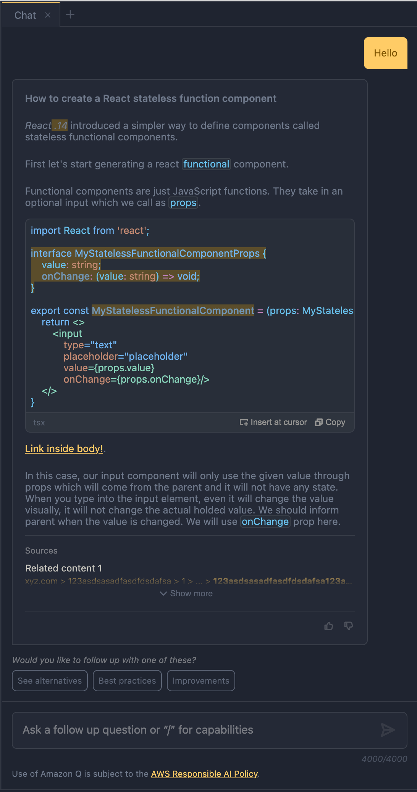
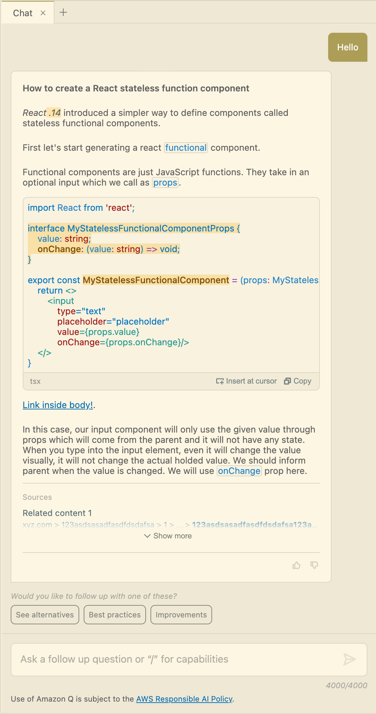

# MynahUI Styling Configuration

Since `MynahUI` uses css custom properties for almost all possible value inside the style declarations, it is pretty easy to adjust your own look & feel and styling to it.

**Note:** `MynahUI` custom properties are mapped to **VSCode css custom properties** which works directly properly with the theme selected for VSCode (in case if you'll use it inside a VSCode extension.)

Let's see what kind of custom properties you can set and how to set them?

```css
:root {
    --mynah-font-family: var(--vscode-font-family), system-ui, -apple-system, BlinkMacSystemFont, "Segoe UI",
        "Amazon Ember", Roboto, Oxygen, Ubuntu, Cantarell, "Open Sans", "Helvetica Neue", sans-serif;
    font-size: var(--vscode-font-size, 13px);
    font-family: var(--mynah-font-family, "system-ui");
    --mynah-max-width: 2560px;
    --mynah-sizing-base: 0.25rem;
    --mynah-sizing-half: calc(var(--mynah-sizing-base) / 2);
    --mynah-sizing-1: var(--mynah-sizing-base);
    --mynah-sizing-2: calc(var(--mynah-sizing-base) * 2);
    --mynah-sizing-3: calc(var(--mynah-sizing-base) * 3);
    --mynah-sizing-4: calc(var(--mynah-sizing-base) * 4);
    --mynah-sizing-5: calc(var(--mynah-sizing-base) * 5);
    --mynah-sizing-6: calc(var(--mynah-sizing-base) * 6);
    --mynah-sizing-7: calc(var(--mynah-sizing-base) * 7);
    --mynah-sizing-8: calc(var(--mynah-sizing-base) * 8);
    --mynah-sizing-9: calc(var(--mynah-sizing-base) * 9);
    --mynah-sizing-10: calc(var(--mynah-sizing-base) * 10);
    --mynah-sizing-11: calc(var(--mynah-sizing-base) * 11);
    --mynah-sizing-12: calc(var(--mynah-sizing-base) * 12);
    --mynah-sizing-13: calc(var(--mynah-sizing-base) * 13);
    --mynah-sizing-14: calc(var(--mynah-sizing-base) * 14);
    --mynah-sizing-15: calc(var(--mynah-sizing-base) * 15);
    --mynah-sizing-16: calc(var(--mynah-sizing-base) * 16);
    --mynah-sizing-17: calc(var(--mynah-sizing-base) * 17);
    --mynah-sizing-18: calc(var(--mynah-sizing-base) * 18);
    --mynah-chat-wrapper-spacing: var(--mynah-sizing-4);
    --mynah-button-border-width: 1px;
    --mynah-border-width: 1px;

    --mynah-color-text-default: var(--vscode-foreground);
    --mynah-color-text-strong: var(--vscode-input-foreground);
    --mynah-color-text-weak: var(--vscode-disabledForeground);
    --mynah-color-text-link: var(--vscode-textLink-foreground);
    --mynah-color-text-input: var(--vscode-input-foreground);

    --mynah-color-bg: var(--vscode-sideBar-background);
    --mynah-color-tab-active: var(--vscode-tab-activeBackground, var(--vscode-editor-background, var(--mynah-card-bg)));
    --mynah-color-light: rgba(0, 0, 0, 0.05);

    --mynah-color-border-default: var(--vscode-panel-border, var(--vscode-tab-border, rgba(0, 0, 0, 0.1)));

    --mynah-color-highlight: rgba(255, 179, 0, 0.25);
    --mynah-color-highlight-text: #886411;

    --mynah-color-toggle: var(--vscode-sideBar-background);
    --mynah-color-toggle-reverse: rgba(0, 0, 0, 0.5);

    --mynah-color-syntax-bg: var(--vscode-terminal-dropBackground);
    --mynah-color-syntax-variable: var(--vscode-debugTokenExpression-name);
    --mynah-color-syntax-function: var(--vscode-gitDecoration-modifiedResourceForeground);
    --mynah-color-syntax-operator: var(--vscode-debugTokenExpression-name);
    --mynah-color-syntax-attr-value: var(--vscode-debugIcon-stepBackForeground);
    --mynah-color-syntax-attr: var(--vscode-debugTokenExpression-string);
    --mynah-color-syntax-property: var(--vscode-terminal-ansiCyan);
    --mynah-color-syntax-comment: var(--vscode-debugConsole-sourceForeground);
    --mynah-color-syntax-code: var(--vscode-terminal-ansiBlue);
    --mynah-syntax-code-font-family: var(--vscode-editor-font-family);
    --mynah-syntax-code-font-size: var(--vscode-editor-font-size, var(--mynah-font-size-medium));
    --mynah-syntax-code-block-max-height: calc(25 * var(--mynah-syntax-code-line-height));

    --mynah-color-status-info: var(--vscode-editorInfo-foreground);
    --mynah-color-status-success: var(--vscode-terminal-ansiGreen);
    --mynah-color-status-warning: var(--vscode-editorWarning-foreground);
    --mynah-color-status-error: var(--vscode-editorError-foreground);

    --mynah-color-button: var(--vscode-button-background);
    --mynah-color-button-reverse: var(--vscode-button-foreground);

    --mynah-color-alternate: var(--vscode-button-secondaryBackground);
    --mynah-color-alternate-reverse: var(--vscode-button-secondaryForeground);

    --mynah-card-bg: var(--vscode-editor-background);

    --mynah-shadow-button: none; //0 10px 20px -15px rgba(0, 0, 0, 0.25);
    --mynah-shadow-card: none; //0 10px 20px -15px rgba(0, 0, 0, 0.25);
    --mynah-shadow-overlay: 0 0px 15px -5px rgba(0, 0, 0, 0.4);

    --mynah-font-size-xxsmall: 0.75rem;
    --mynah-font-size-xsmall: 0.85rem;
    --mynah-font-size-small: 0.95rem;
    --mynah-font-size-medium: 1rem;
    --mynah-font-size-large: 1.125rem;
    --mynah-line-height: 1.25rem;
    --mynah-syntax-code-line-height: 1.25rem;

    --mynah-card-radius: var(--mynah-sizing-2);
    --mynah-input-radius: var(--mynah-sizing-1);
    --mynah-card-radius-corner: 0;
    --mynah-button-radius: var(--mynah-sizing-1);

    --mynah-bottom-panel-transition: all 850ms cubic-bezier(0.25, 1, 0, 1);
    --mynah-very-short-transition: all 600ms cubic-bezier(0.25, 1, 0, 1);
    --mynah-very-long-transition: all 1650ms cubic-bezier(0.25, 1, 0, 1);
    --mynah-short-transition: all 550ms cubic-bezier(0.85, 0.15, 0, 1);
    --mynah-short-transition-rev: all 580ms cubic-bezier(0.35, 1, 0, 1);
    --mynah-short-transition-rev-opacity: opacity 750ms cubic-bezier(0.35, 1, 0, 1);
    --mynah-text-flow-transition: all 800ms cubic-bezier(0.35, 1.2, 0, 1),
        transform 800ms cubic-bezier(0.2, 1.05, 0, 1);
}

```
---

## Applying your own color set (or other values as well)

First of all, create your own `css` and load it to your html. (Be sure that you're loading it after the `MynahUI`).

Here are some examples and how they look:

```css
:root {
    --mynah-color-text-default: #707a8c;
    --mynah-color-text-strong: #cccac2;
    --mynah-color-text-weak: rgba(204, 204, 204, 0.5);
    --mynah-color-text-link: #ffcc66;
    --mynah-color-text-input: #cccac2;
    --mynah-color-bg: #1f2430;
    --mynah-color-tab-active: #242936;
    --mynah-color-border-default: #171b24;
    --mynah-color-toggle: #1f2430;
    --mynah-color-syntax-bg: rgba(83, 89, 93, 0.5);
    --mynah-color-syntax-variable: #c586c0;
    --mynah-color-syntax-function: rgba(128, 191, 255, 0.7);
    --mynah-color-syntax-operator: #c586c0;
    --mynah-color-syntax-attr-value: #75beff;
    --mynah-color-syntax-attr: #ce9178;
    --mynah-color-syntax-property: #90e1c6;
    --mynah-color-syntax-comment: #707a8c;
    --mynah-color-syntax-code: #6dcbfa;
    --mynah-color-status-info: #3794ff;
    --mynah-color-status-success: #87d96c;
    --mynah-color-status-warning: #ffcc66;
    --mynah-color-status-error: #ff6666;
    --mynah-color-button: #ffcc66;
    --mynah-color-button-reverse: #805500;
    --mynah-color-alternate: rgba(112, 122, 140, 0.2);
    --mynah-color-alternate-reverse: #cccac2;
    --mynah-card-bg: #242936;
}
```

And how it looks
<p align="center">
  
</p>

---

And just for reference, here's another one

```css
:root {
    --mynah-color-text-default: #616161;
    --mynah-color-text-strong: #586e75;
    --mynah-color-text-weak: rgba(97, 97, 97, 0.5);
    --mynah-color-text-link: #006ab1;
    --mynah-color-text-input: #586e75;

    --mynah-color-bg: #eee8d5;
    --mynah-color-tab-active: #fdf6e3;
    --mynah-color-border-default: #ddd6c1;
    --mynah-color-toggle: #eee8d5;
    --mynah-color-syntax-bg: rgba(221, 214, 193, 0.67);
    --mynah-color-syntax-variable: #9b46b0;
    --mynah-color-syntax-function: #895503;
    --mynah-color-syntax-operator: #9b46b0;
    --mynah-color-syntax-attr-value: #007acc;
    --mynah-color-syntax-attr: #a31515;
    --mynah-color-syntax-property: #2aa198;
    --mynah-color-syntax-comment: #616161;
    --mynah-color-syntax-code: #268bd2;
    --mynah-color-status-info: #1a85ff;
    --mynah-color-status-success: #859900;
    --mynah-color-status-warning: #bf8803;
    --mynah-color-status-error: #e51400;
    --mynah-color-button: #ac9d57;
    --mynah-color-button-reverse: #ffffff;
    --mynah-color-alternate: #5f6a79;
    --mynah-color-alternate-reverse: #ffffff;
    --mynah-card-bg: #fdf6e3;
}
```

<p align="center">
  
</p>